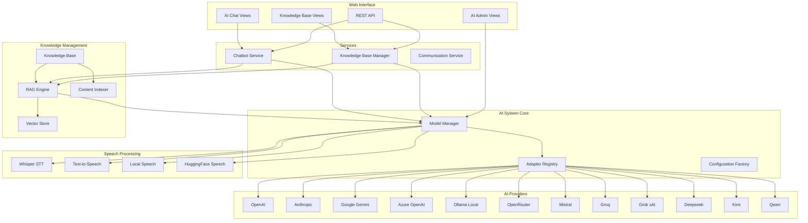

# AI System Architecture

The PgAppForge AI system provides a unified interface for integrating multiple AI providers, speech processing, and intelligent knowledge management into your applications.

## 🏗️ Architecture Overview



## 🧩 Core Components

### 1. Model Manager (`ModelManager`)

The central orchestrator for all AI operations.

**Key Responsibilities:**
- Provider registration and management
- Adapter lifecycle management
- Capability discovery and routing
- Configuration validation
- Error handling and fallbacks

**Location:** `pgappforge/collaborative/ai/ai_models.py:2416`

```python
from pgappforge.collaborative.ai.ai_models import ModelManager

# Initialize with app configuration
model_manager = ModelManager(app=app)

# Register provider adapters
model_manager.register_adapter('openai', openai_adapter)
model_manager.register_adapter('anthropic', anthropic_adapter)

# Generate responses
response = await model_manager.generate_response(
    messages=[ChatMessage(role="user", content="Hello")],
    provider="openai"
)
```

### 2. Provider Adapters

Unified interfaces for different AI providers, implementing the `AIModelAdapter` abstract base class.

**Supported Providers:**
- **OpenAI** - GPT models with function calling
- **Anthropic** - Claude models with advanced reasoning
- **Google Gemini** - Multimodal capabilities
- **Azure OpenAI** - Enterprise-grade OpenAI
- **Ollama** - Local model hosting
- **OpenRouter** - Model aggregator (100+ models)
- **Mistral** - European AI models
- **Groq** - Fast inference hardware
- **Grok** - xAI's conversational AI
- **Deepseek** - Chinese AI provider
- **Kimi** - Moonshot AI conversational models
- **Qwen** - Alibaba's AI models

**Common Interface:**
```python
class AIModelAdapter(ABC):
    async def generate_response(self, messages: List[ChatMessage], **kwargs) -> ModelResponse
    async def generate_stream(self, messages: List[ChatMessage], **kwargs) -> AsyncIterator[str]
    async def generate_embeddings(self, texts: List[str], **kwargs) -> List[List[float]]
    async def speech_to_text(self, audio_data: bytes, **kwargs) -> str
    async def text_to_speech(self, text: str, **kwargs) -> bytes
```

### 3. Speech Processing

Comprehensive speech-to-text and text-to-speech capabilities.

**Speech-to-Text Options:**
- **OpenAI Whisper API** - Cloud-based, high accuracy
- **Local Whisper** - Offline processing with multiple model sizes
- **HuggingFace Models** - Advanced transformer models

**Text-to-Speech Options:**
- **OpenAI TTS** - Natural voices with emotion
- **pyttsx3** - System-native TTS
- **gTTS** - Google Text-to-Speech
- **HuggingFace SpeechT5** - Neural TTS models

### 4. RAG Engine (Retrieval-Augmented Generation)

Advanced knowledge retrieval system for context-aware AI responses.

**Components:**
- **Vector Store** - FAISS-based similarity search
- **Content Indexer** - Automatic document processing
- **Query Engine** - Semantic search with ranking
- **Context Manager** - Relevant context injection

**Location:** `pgappforge/collaborative/ai/rag_engine.py`

```python
from pgappforge.collaborative.ai.rag_engine import RAGEngine
from pgappforge.collaborative.ai.faiss_vector_store import FAISSVectorStore

# Initialize RAG system
vector_store = FAISSVectorStore()
rag_engine = RAGEngine(vector_store, model_manager)

# Index content
await rag_engine.index_content(
    content_id="doc_1",
    content="Your document content here",
    metadata={"source": "user_upload", "type": "documentation"}
)

# Retrieve context
context = await rag_engine.retrieve_context(
    query="How do I configure authentication?",
    top_k=5
)
```

### 5. Knowledge Base Manager

High-level service for managing organizational knowledge.

**Features:**
- Automatic content indexing
- Multi-source content aggregation
- Permission-based access control
- Analytics and insights
- Content lifecycle management

**Location:** `pgappforge/collaborative/ai/knowledge_base.py`

## 🔧 Configuration

### Environment Variables

All AI providers support configuration via environment variables with automatic detection:

```bash
# OpenAI Configuration
OPENAI_API_KEY=sk-your-openai-key
OPENAI_MODEL=gpt-4
OPENAI_MAX_TOKENS=2048
OPENAI_TEMPERATURE=0.7

# Anthropic Configuration
ANTHROPIC_API_KEY=sk-ant-your-key
ANTHROPIC_MODEL=claude-3-sonnet-20240229

# Google Gemini
GOOGLE_API_KEY=AIza-your-google-key
GOOGLE_MODEL=gemini-1.5-pro

# Local Models (Ollama)
OLLAMA_HOST=http://localhost:11434
OLLAMA_MODEL=llama2

# Speech Processing
WHISPER_MODEL_SIZE=base
TTS_VOICE=alloy
```

### PgAppForge Integration

The AI system integrates seamlessly with PgAppForge's configuration system:

```python
# config.py
# AI Model Configurations (see examples/quickhowto/config.py for full examples)

# Enable multiple providers simultaneously
OPENAI_API_KEY = "sk-your-openai-key"
ANTHROPIC_API_KEY = "sk-ant-your-anthropic-key"
OLLAMA_HOST = "http://localhost:11434"

# The system will auto-detect and register all configured providers
```

## 🔒 Security

### Credential Management

- **Environment Variable Priority** - Secure credential handling
- **Key Rotation Support** - Hot-swappable API keys
- **Rate Limiting** - Provider-specific throttling
- **Audit Logging** - Complete interaction tracking

### Access Control

- **Role-Based Permissions** - Integration with PgAppForge RBAC
- **Feature Flags** - Granular capability control
- **Multi-Tenant Isolation** - Secure workspace separation

## 🚀 Performance

### Optimization Features

- **Connection Pooling** - Efficient HTTP client management
- **Response Caching** - Intelligent cache invalidation
- **Async Processing** - Non-blocking operations
- **Graceful Degradation** - Provider failover support

### Monitoring

- **Provider Health Checks** - Automatic status monitoring
- **Performance Metrics** - Response time tracking
- **Usage Analytics** - Token consumption analysis
- **Error Rate Monitoring** - Proactive issue detection

## 🔗 Integration Points

### PgAppForge Views

The AI system provides ready-to-use web interfaces:

- **AI Chat Interface** (`/ai-chat`) - Interactive chatbot
- **Knowledge Base Management** (`/ai-knowledge`) - Content administration
- **Model Configuration** (`/ai-admin/models`) - Provider settings
- **System Monitoring** (`/ai-admin`) - Health dashboard

### REST API

Complete API for external integrations:

```bash
# Generate AI response
POST /api/v1/ai/chat
{
  "messages": [{"role": "user", "content": "Hello"}],
  "provider": "openai",
  "model": "gpt-4"
}

# Index content
POST /api/v1/ai/knowledge/index
{
  "content": "Document content",
  "metadata": {"source": "api", "type": "documentation"}
}

# Search knowledge base
GET /api/v1/ai/knowledge/search?q=authentication&limit=5
```

## 📊 Usage Patterns

### Basic Chat Integration

```python
from pgappforge.collaborative.ai.chatbot_service import ChatbotService

chatbot = ChatbotService(model_manager=model_manager)

# Start conversation
conversation = await chatbot.start_conversation(
    user_id=user.id,
    personality='technical'
)

# Send message
response = await chatbot.send_message(
    conversation_id=conversation.id,
    message="How do I set up authentication?"
)
```

### Knowledge-Augmented Responses

```python
# Enable RAG for context-aware responses
chatbot = ChatbotService(
    model_manager=model_manager,
    rag_engine=rag_engine
)

# Responses will automatically include relevant context
response = await chatbot.send_message(
    conversation_id=conversation.id,
    message="Explain the approval workflow system",
    use_knowledge_base=True
)
```

### Multi-Provider Fallback

```python
# Configure provider fallback chain
model_manager.set_fallback_chain([
    'openai',      # Primary
    'anthropic',   # Fallback 1
    'ollama'       # Fallback 2 (local)
])

# System will automatically try fallbacks on failure
response = await model_manager.generate_response(messages)
```

## 🎯 Next Steps

1. **Provider Setup** - Configure your preferred AI providers
2. **Integration** - Add AI features to your PgAppForge app
3. **Customization** - Extend adapters for specialized use cases
4. **Monitoring** - Set up logging and analytics
5. **Scaling** - Configure load balancing and caching

For detailed implementation guides, see:
- [AI Provider Configuration](ai_providers.md)
- [API Reference](ai_api_reference.md)
- [Integration Tutorials](../tutorials/ai_chatbot.md)