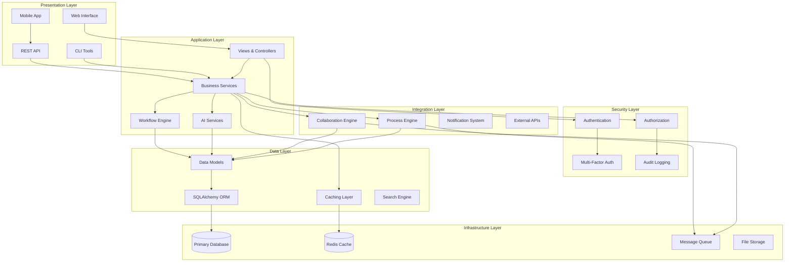
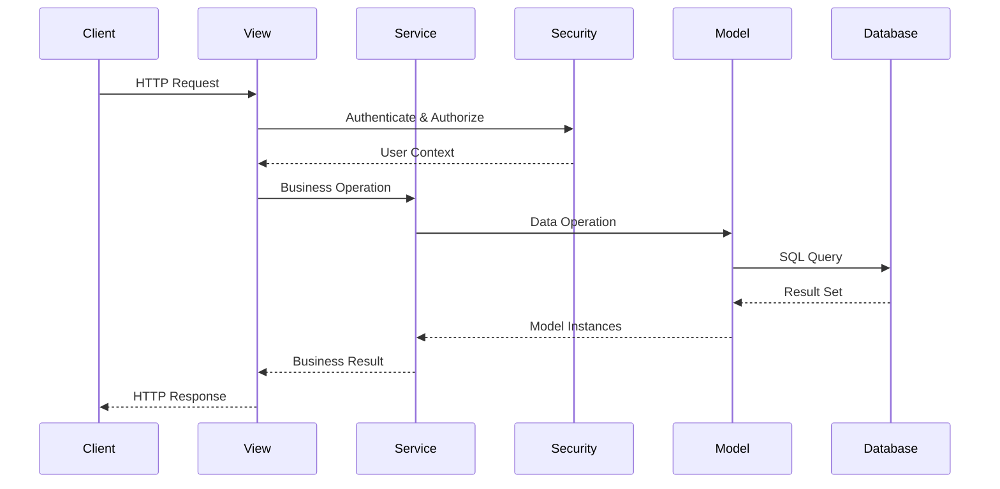
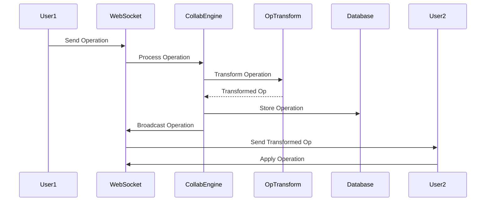
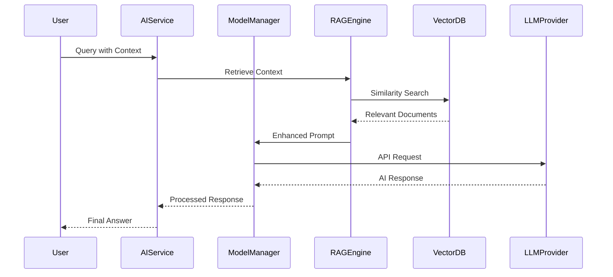

# System Architecture

Comprehensive architecture overview of Flask-AppBuilder enhanced with advanced features including AI, collaboration, process automation, and security systems.

## 🏗️ Architecture Overview

Flask-AppBuilder follows a layered architecture pattern with clear separation of concerns and modular design for scalability and maintainability.



## 🎯 Core Architectural Principles

### 1. Separation of Concerns

Each layer has distinct responsibilities:

- **Presentation Layer**: User interface and API endpoints
- **Application Layer**: Business logic and orchestration
- **Security Layer**: Authentication, authorization, and auditing
- **Integration Layer**: External system integration and communication
- **Data Layer**: Data modeling and persistence
- **Infrastructure Layer**: Supporting services and storage

### 2. Modular Design

```python
# Core modules structure
flask_appbuilder/
├── base.py                    # Core AppBuilder class
├── views/                     # View layer
│   ├── __init__.py
│   ├── base.py               # Base view classes
│   └── api.py                # API views
├── models/                    # Data layer
│   ├── sqla/                 # SQLAlchemy integration
│   └── mixins.py             # Model mixins
├── security/                  # Security layer
│   ├── manager.py            # Security manager
│   ├── views.py              # Auth views
│   └── mfa/                  # Multi-factor auth
├── collaborative/            # Collaboration features
│   ├── ai/                   # AI integration
│   ├── realtime/             # Real-time features
│   └── communication/        # Communication services
├── process/                  # Process automation
│   ├── engine.py             # Process engine
│   ├── workflow.py           # Workflow management
│   └── approval/             # Approval system
└── widgets/                  # UI components
```

### 3. Dependency Injection

```python
# Dependency injection pattern
class AppBuilder:
    def __init__(
        self,
        app: Flask = None,
        session: Session = None,
        security_manager_class: BaseSecurityManager = None,
        update_perms: bool = True
    ):
        self.app = app
        self.session = session
        self.sm = security_manager_class or SecurityManager(self)

        # Initialize subsystems
        self.ai_manager = AIManager(self) if self.has_ai_features() else None
        self.process_engine = ProcessEngine(self) if self.has_process_features() else None
        self.collaboration_manager = CollaborationManager(self) if self.has_collab_features() else None
```

### 4. Event-Driven Architecture

```python
# Event system for loose coupling
from flask_appbuilder.events import EventManager

# Event definitions
class UserEvents:
    USER_CREATED = 'user.created'
    USER_UPDATED = 'user.updated'
    USER_LOGIN = 'user.login'
    USER_LOGOUT = 'user.logout'

# Event handlers
@event_manager.on(UserEvents.USER_CREATED)
def on_user_created(user):
    # Send welcome email
    email_service.send_welcome_email(user)
    # Create default workspace
    collaboration_manager.create_user_workspace(user)
    # Log audit event
    audit_logger.log_user_creation(user)

# Event emission
event_manager.emit(UserEvents.USER_CREATED, user=new_user)
```

## 🏛️ Layer Architecture

### Presentation Layer

#### Web Interface
- **Technology**: Jinja2 templates, Bootstrap CSS, jQuery
- **Components**: Views, forms, widgets, dashboards
- **Responsibilities**: User interaction, data presentation, client-side validation

```python
# View layer architecture
class BaseView:
    """Foundation for all views."""

    @expose('/')
    @has_access
    def index(self):
        return self.render_template('index.html')

class ModelView(BaseView):
    """CRUD operations for models."""

    datamodel = SQLAInterface(Model)

    @expose('/list/')
    @has_access
    def list(self):
        # Apply filters, pagination, security
        items = self.datamodel.query(
            filters=self.get_filters(),
            order_column=self.get_order_column(),
            page=self.get_page()
        )
        return self.render_template('list.html', items=items)
```

#### REST API
- **Technology**: Flask-RESTful, Marshmallow, OpenAPI/Swagger
- **Components**: API endpoints, serializers, validators
- **Responsibilities**: Data exchange, external integrations, mobile support

```python
# API layer architecture
class ModelRestApi(BaseApi):
    """Automatic REST API for models."""

    resource_name = 'model'
    datamodel = SQLAInterface(Model)

    @expose('/', methods=['GET'])
    @protect()
    def get_list(self):
        # Handle pagination, filtering, serialization
        items = self.datamodel.query(**self.get_query_params())
        return self.response(200, result=self.serialize_items(items))
```

### Application Layer

#### Business Services
- **Pattern**: Service layer pattern
- **Responsibilities**: Business logic, data orchestration, workflow coordination

```python
# Service layer architecture
class EmployeeService:
    def __init__(self, db_session, audit_logger, notification_service):
        self.db = db_session
        self.audit = audit_logger
        self.notifications = notification_service

    def create_employee(self, employee_data):
        # Business logic
        employee = Employee(**employee_data)
        self.validate_employee(employee)

        # Persist
        self.db.add(employee)
        self.db.commit()

        # Side effects
        self.audit.log_creation(employee)
        self.notifications.send_welcome_email(employee)

        return employee

    def validate_employee(self, employee):
        # Business rules
        if not employee.email.endswith('@company.com'):
            raise ValidationError('Must use company email')
```

#### AI Services
- **Pattern**: Strategy pattern for different AI providers
- **Responsibilities**: AI model management, inference, knowledge base

```python
# AI service architecture
class AIManager:
    def __init__(self, config):
        self.model_manager = ModelManager(config)
        self.knowledge_base = KnowledgeBaseManager(config)
        self.rag_engine = RAGEngine(config)

    async def generate_response(self, messages, context=None):
        # Route to appropriate AI service
        if context and context.get('use_knowledge_base'):
            return await self.rag_engine.generate_with_context(messages, context)
        else:
            return await self.model_manager.generate_response(messages)
```

### Security Layer

#### Authentication & Authorization
- **Pattern**: Strategy pattern for auth methods, RBAC for authorization
- **Components**: Security manager, auth providers, permission system

```python
# Security architecture
class SecurityManager:
    def __init__(self, appbuilder):
        self.appbuilder = appbuilder
        self.auth_providers = self.load_auth_providers()
        self.permission_manager = PermissionManager()
        self.mfa_manager = MFAManager()

    def authenticate_user(self, username, password, provider='db'):
        provider_instance = self.auth_providers[provider]
        user = provider_instance.authenticate(username, password)

        if user and self.mfa_manager.is_required(user):
            return self.mfa_manager.initiate_challenge(user)

        return user

    def has_access(self, permission, view_menu):
        return self.permission_manager.check_permission(
            g.user, permission, view_menu
        )
```

### Integration Layer

#### Collaboration Engine
- **Pattern**: Event sourcing for real-time updates
- **Components**: WebSocket manager, presence service, document sync

```python
# Collaboration architecture
class CollaborationManager:
    def __init__(self, websocket_manager, presence_service):
        self.websocket = websocket_manager
        self.presence = presence_service
        self.operational_transform = OperationalTransform()

    async def apply_operation(self, workspace_id, operation):
        # Apply operational transform
        transformed_op = self.operational_transform.apply(operation)

        # Persist operation
        await self.store_operation(workspace_id, transformed_op)

        # Broadcast to collaborators
        await self.websocket.broadcast_to_workspace(
            workspace_id, 'operation_applied', transformed_op
        )
```

#### Process Engine
- **Pattern**: State machine for workflow execution
- **Components**: Workflow builder, task executor, approval system

```python
# Process engine architecture
class ProcessEngine:
    def __init__(self, db_session, task_queue):
        self.db = db_session
        self.task_queue = task_queue
        self.workflow_executor = WorkflowExecutor()
        self.approval_engine = ApprovalEngine()

    async def start_process(self, definition_id, context):
        # Create process instance
        instance = ProcessInstance(
            definition_id=definition_id,
            context=context,
            status='running'
        )

        # Execute first step
        next_step = await self.workflow_executor.get_next_step(instance)
        await self.execute_step(instance, next_step)

        return instance
```

### Data Layer

#### Data Models
- **Pattern**: Active Record with Repository pattern for complex queries
- **Components**: SQLAlchemy models, mixins, interfaces

```python
# Data layer architecture
class Model(DeclarativeBase):
    """Enhanced base model with Flask-AppBuilder features."""

    @declared_attr
    def __tablename__(cls):
        return cls.__name__.lower()

    def to_dict(self):
        """Serialize model to dictionary."""
        return {c.name: getattr(self, c.name) for c in self.__table__.columns}

class Repository:
    """Repository pattern for complex queries."""

    def __init__(self, model_class, session):
        self.model = model_class
        self.session = session

    def find_by_criteria(self, criteria):
        query = self.session.query(self.model)
        for key, value in criteria.items():
            query = query.filter(getattr(self.model, key) == value)
        return query.all()
```

## 🔄 Data Flow Architecture

### Request Processing Flow



### Real-time Collaboration Flow



### AI Processing Flow



## 🏗️ Component Architecture

### Security Components

```python
# Security component architecture
class SecurityArchitecture:
    """Security subsystem architecture."""

    components = {
        'authentication': {
            'providers': ['db', 'ldap', 'oauth', 'saml'],
            'mfa': ['totp', 'sms', 'email', 'webauthn'],
            'session_management': 'flask_login'
        },
        'authorization': {
            'rbac': 'role_based_access_control',
            'permissions': 'fine_grained_permissions',
            'row_level_security': 'data_isolation'
        },
        'audit': {
            'logging': 'security_events',
            'monitoring': 'anomaly_detection',
            'compliance': 'gdpr_sox_compliance'
        }
    }
```

### AI Components

```python
# AI component architecture
class AIArchitecture:
    """AI subsystem architecture."""

    components = {
        'model_management': {
            'providers': ['openai', 'anthropic', 'google', 'azure'],
            'local_models': ['ollama', 'huggingface'],
            'model_routing': 'intelligent_routing'
        },
        'knowledge_base': {
            'vector_store': 'faiss_or_pinecone',
            'embeddings': 'openai_embeddings',
            'chunking': 'intelligent_text_splitting'
        },
        'rag_engine': {
            'retrieval': 'semantic_search',
            'generation': 'context_aware_llm',
            'evaluation': 'response_quality_metrics'
        }
    }
```

### Collaboration Components

```python
# Collaboration component architecture
class CollaborationArchitecture:
    """Collaboration subsystem architecture."""

    components = {
        'real_time': {
            'websockets': 'socket_io',
            'operational_transform': 'conflict_resolution',
            'presence': 'user_awareness'
        },
        'communication': {
            'chat': 'real_time_messaging',
            'comments': 'contextual_discussions',
            'notifications': 'multi_channel_alerts'
        },
        'team_management': {
            'workspaces': 'isolated_environments',
            'permissions': 'team_based_access',
            'activity_feeds': 'change_tracking'
        }
    }
```

## 🔧 Configuration Architecture

### Environment-Based Configuration

```python
# Configuration architecture
class ConfigurationArchitecture:
    """Environment-based configuration management."""

    environments = {
        'development': {
            'debug': True,
            'database': 'sqlite:///:memory:',
            'ai_providers': ['openai_dev'],
            'features': ['all_enabled']
        },
        'testing': {
            'testing': True,
            'database': 'sqlite:///:memory:',
            'ai_providers': ['mock_provider'],
            'features': ['minimal_set']
        },
        'production': {
            'debug': False,
            'database': 'postgresql://prod_db',
            'ai_providers': ['openai', 'anthropic'],
            'features': ['optimized_set']
        }
    }
```

### Feature Flags

```python
# Feature flag architecture
class FeatureFlags:
    """Feature flag management for gradual rollouts."""

    def __init__(self, config):
        self.flags = config.get('FEATURE_FLAGS', {})

    def is_enabled(self, feature, user=None, context=None):
        flag = self.flags.get(feature, {})

        # Default state
        if not flag.get('enabled', False):
            return False

        # User-based rollout
        if user and 'user_percentage' in flag:
            user_hash = hash(user.id) % 100
            return user_hash < flag['user_percentage']

        # Context-based rollout
        if context and 'context_rules' in flag:
            return self.evaluate_context_rules(flag['context_rules'], context)

        return flag.get('enabled', False)

# Usage in views
class ModelView(BaseView):
    def list(self):
        if feature_flags.is_enabled('enhanced_list_view', g.user):
            return self.enhanced_list()
        else:
            return self.standard_list()
```

## 🚀 Scalability Architecture

### Horizontal Scaling

```python
# Scalability patterns
class ScalabilityArchitecture:
    """Horizontal scaling architecture."""

    scaling_strategies = {
        'web_tier': {
            'load_balancer': 'nginx_or_haproxy',
            'app_servers': 'multiple_gunicorn_instances',
            'session_storage': 'redis_shared_sessions'
        },
        'database_tier': {
            'read_replicas': 'postgresql_streaming_replication',
            'connection_pooling': 'pgbouncer',
            'caching': 'redis_query_cache'
        },
        'ai_tier': {
            'model_serving': 'kubernetes_deployments',
            'request_routing': 'intelligent_load_balancing',
            'caching': 'response_caching'
        },
        'collaboration_tier': {
            'websocket_scaling': 'redis_pub_sub',
            'presence_scaling': 'distributed_presence_service',
            'message_queuing': 'rabbitmq_or_kafka'
        }
    }
```

### Microservices Architecture

```python
# Microservices decomposition
class MicroservicesArchitecture:
    """Service decomposition strategy."""

    services = {
        'user_service': {
            'responsibilities': ['authentication', 'user_management', 'profiles'],
            'database': 'user_db',
            'api': 'rest_api'
        },
        'ai_service': {
            'responsibilities': ['model_inference', 'knowledge_base', 'embeddings'],
            'database': 'vector_db',
            'api': 'grpc_api'
        },
        'collaboration_service': {
            'responsibilities': ['real_time_sync', 'presence', 'messaging'],
            'database': 'collaboration_db',
            'api': 'websocket_api'
        },
        'process_service': {
            'responsibilities': ['workflow_execution', 'task_management', 'approvals'],
            'database': 'process_db',
            'api': 'event_driven_api'
        }
    }
```

## 📊 Monitoring Architecture

### Observability Stack

```python
# Monitoring and observability
class ObservabilityArchitecture:
    """Comprehensive monitoring architecture."""

    monitoring_stack = {
        'metrics': {
            'application_metrics': 'prometheus',
            'business_metrics': 'custom_metrics',
            'infrastructure_metrics': 'node_exporter'
        },
        'logging': {
            'structured_logging': 'json_logs',
            'log_aggregation': 'elasticsearch',
            'log_analysis': 'kibana'
        },
        'tracing': {
            'distributed_tracing': 'jaeger',
            'application_tracing': 'opentelemetry',
            'performance_monitoring': 'apm_tools'
        },
        'alerting': {
            'rule_engine': 'prometheus_alertmanager',
            'notification_channels': 'slack_pagerduty',
            'escalation_policies': 'oncall_rotation'
        }
    }
```

## 🔐 Security Architecture

### Defense in Depth

```python
# Security architecture layers
class SecurityLayers:
    """Multi-layered security architecture."""

    layers = {
        'perimeter': {
            'waf': 'web_application_firewall',
            'ddos_protection': 'rate_limiting',
            'ssl_termination': 'tls_encryption'
        },
        'network': {
            'vpc': 'isolated_network',
            'security_groups': 'firewall_rules',
            'private_subnets': 'database_isolation'
        },
        'application': {
            'authentication': 'multi_factor_auth',
            'authorization': 'rbac_permissions',
            'input_validation': 'sanitization'
        },
        'data': {
            'encryption_at_rest': 'database_encryption',
            'encryption_in_transit': 'tls_everywhere',
            'data_masking': 'pii_protection'
        }
    }
```

For more detailed information, see:
- [Deployment Guide](../deployment/production_deployment.md)
- [Security Architecture](../security/security_architecture.md)
- [Performance Optimization](performance_optimization.md)