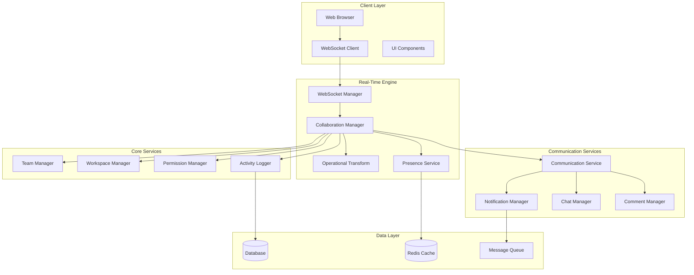

# Real-Time Collaboration

PgAppForge's real-time collaboration system enables multiple users to work together seamlessly with live updates, conflict resolution, and comprehensive activity tracking.

## 🌟 Overview

The collaboration system provides Google Docs-style real-time editing capabilities with:

- **Live Updates** - Real-time synchronization across all connected clients
- **Conflict Resolution** - Operational Transform-based conflict resolution
- **Activity Streams** - Live activity feeds and presence indicators
- **Multi-User Support** - Unlimited concurrent collaborators
- **Permission Control** - Fine-grained access control integration

## 🏗️ Architecture



## 🔧 Core Components

### WebSocket Manager

Handles all real-time WebSocket connections and message routing.

**Location:** `pgappforge/collaborative/realtime/websocket_manager.py`

```python
from pgappforge.collaborative.realtime.websocket_manager import WebSocketManager

# Initialize WebSocket manager
ws_manager = WebSocketManager(app)

# Handle connection
@ws_manager.on('connect')
async def handle_connect(session_id, data):
    user_id = data.get('user_id')
    workspace_id = data.get('workspace_id')

    # Add user to workspace
    await ws_manager.join_room(session_id, f"workspace_{workspace_id}")

    # Broadcast user joined
    await ws_manager.emit_to_room(
        f"workspace_{workspace_id}",
        'user_joined',
        {'user_id': user_id, 'timestamp': time.time()}
    )
```

**Key Methods:**

#### `join_room(session_id: str, room: str) -> None`

Add user session to a collaboration room.

#### `leave_room(session_id: str, room: str) -> None`

Remove user session from a room.

#### `emit_to_room(room: str, event: str, data: dict) -> None`

Send message to all users in a room.

#### `emit_to_user(user_id: int, event: str, data: dict) -> None`

Send message to specific user.

### Collaboration Engine

Core collaboration logic with operational transforms.

**Location:** `pgappforge/collaborative/core/collaboration_engine.py`

```python
from pgappforge.collaborative.core.collaboration_engine import CollaborationEngine

# Initialize collaboration engine
collab_engine = CollaborationEngine(ws_manager, db.session)

# Apply operation
operation = {
    'type': 'insert',
    'position': 10,
    'content': 'Hello World',
    'user_id': 123,
    'timestamp': time.time()
}

await collab_engine.apply_operation(workspace_id, operation)
```

**Operation Types:**

- **Insert** - Add content at position
- **Delete** - Remove content range
- **Format** - Apply formatting
- **Move** - Move content blocks
- **Replace** - Replace content range

### Operational Transform

Handles conflict resolution when multiple users edit simultaneously.

```python
# Example: Two users edit the same document
user1_op = {'type': 'insert', 'position': 5, 'content': 'Hello'}
user2_op = {'type': 'insert', 'position': 7, 'content': 'World'}

# Transform operations to resolve conflicts
transformed_ops = operational_transform.transform([user1_op, user2_op])
# Result: Properly ordered operations that maintain intent
```

**Transformation Rules:**

1. **Insert vs Insert** - Adjust positions based on priority
2. **Insert vs Delete** - Adjust for content changes
3. **Delete vs Delete** - Handle overlapping deletions
4. **Format vs Content** - Preserve formatting intent

## 🌐 WebSocket Events

### Client-to-Server Events

#### `join_workspace`

Join a workspace for collaboration.

```javascript
socket.emit('join_workspace', {
    workspace_id: 'workspace_123',
    user_id: 456
});
```

#### `operation`

Send an edit operation.

```javascript
socket.emit('operation', {
    workspace_id: 'workspace_123',
    operation: {
        type: 'insert',
        position: 10,
        content: 'Hello World',
        timestamp: Date.now()
    }
});
```

#### `cursor_position`

Update cursor position for presence.

```javascript
socket.emit('cursor_position', {
    workspace_id: 'workspace_123',
    position: 25,
    selection: {start: 20, end: 30}
});
```

#### `typing_start` / `typing_stop`

Indicate typing status.

```javascript
socket.emit('typing_start', {workspace_id: 'workspace_123'});
socket.emit('typing_stop', {workspace_id: 'workspace_123'});
```

### Server-to-Client Events

#### `operation_applied`

Broadcast applied operation to all collaborators.

```javascript
socket.on('operation_applied', (data) => {
    const {operation, user_info} = data;
    // Apply operation to local document
    document.applyOperation(operation);
    // Show user indicator
    showUserActivity(user_info);
});
```

#### `user_joined` / `user_left`

User presence updates.

```javascript
socket.on('user_joined', (data) => {
    const {user_id, user_info} = data;
    addUserToPresenceList(user_info);
});

socket.on('user_left', (data) => {
    const {user_id} = data;
    removeUserFromPresenceList(user_id);
});
```

#### `cursor_update`

Cursor position updates from other users.

```javascript
socket.on('cursor_update', (data) => {
    const {user_id, position, selection} = data;
    updateUserCursor(user_id, position, selection);
});
```

#### `typing_indicator`

Typing indicators from other users.

```javascript
socket.on('typing_indicator', (data) => {
    const {user_id, is_typing} = data;
    showTypingIndicator(user_id, is_typing);
});
```

## 👥 Presence System

Track and display user presence in real-time.

### Presence Service

```python
from pgappforge.collaborative.realtime.presence_service import PresenceService

presence_service = PresenceService(redis_client)

# Update user presence
await presence_service.set_user_presence(
    user_id=123,
    workspace_id='workspace_456',
    status='active',
    metadata={
        'cursor_position': 25,
        'last_seen': time.time(),
        'device': 'web'
    }
)

# Get workspace presence
active_users = await presence_service.get_workspace_presence('workspace_456')
```

### Presence Data Structure

```python
{
    'user_id': 123,
    'username': 'john_doe',
    'display_name': 'John Doe',
    'avatar_url': '/static/avatars/john.jpg',
    'status': 'active',  # active, idle, away, offline
    'last_seen': 1634567890,
    'cursor_position': 25,
    'selection': {'start': 20, 'end': 30},
    'is_typing': False,
    'device': 'web',
    'color': '#FF5733'  # User-specific color for cursors
}
```

## 💬 Real-Time Communication

### Chat System

Integrated chat for workspace communication.

```python
from pgappforge.collaborative.communication.chat_manager import ChatManager

chat_manager = ChatManager(ws_manager, db.session)

# Send chat message
await chat_manager.send_message(
    workspace_id='workspace_123',
    user_id=456,
    message='Hello everyone!',
    message_type='text'
)

# Send file attachment
await chat_manager.send_message(
    workspace_id='workspace_123',
    user_id=456,
    message='document.pdf',
    message_type='file',
    metadata={
        'file_url': '/uploads/document.pdf',
        'file_size': 1024000,
        'mime_type': 'application/pdf'
    }
)
```

### Comment System

Contextual comments linked to specific content.

```python
from pgappforge.collaborative.communication.comment_manager import CommentManager

comment_manager = CommentManager(ws_manager, db.session)

# Add comment to specific position
await comment_manager.add_comment(
    workspace_id='workspace_123',
    user_id=456,
    position=100,
    content='This section needs clarification',
    context={
        'line_number': 10,
        'selected_text': 'configuration options'
    }
)

# Reply to comment
await comment_manager.reply_to_comment(
    comment_id='comment_789',
    user_id=789,
    content='I can help explain this section'
)
```

## 🔄 Activity Streams

Real-time activity feeds for workspace awareness.

### Activity Types

```python
ACTIVITY_TYPES = {
    'document.created': 'Document created',
    'document.edited': 'Document edited',
    'document.shared': 'Document shared',
    'user.joined': 'User joined workspace',
    'user.left': 'User left workspace',
    'comment.added': 'Comment added',
    'file.uploaded': 'File uploaded',
    'permission.changed': 'Permissions updated'
}
```

### Activity Logger

```python
from pgappforge.collaborative.utils.activity_logger import ActivityLogger

activity_logger = ActivityLogger(ws_manager, db.session)

# Log activity
await activity_logger.log_activity(
    workspace_id='workspace_123',
    user_id=456,
    activity_type='document.edited',
    target_id='document_789',
    metadata={
        'changes': ['title', 'content'],
        'change_count': 15
    }
)

# Get activity feed
activities = await activity_logger.get_workspace_activities(
    workspace_id='workspace_123',
    limit=50
)
```

## 🔧 Configuration

### WebSocket Configuration

```python
# config.py

# WebSocket settings
WEBSOCKET_ENABLED = True
WEBSOCKET_PING_INTERVAL = 25
WEBSOCKET_PING_TIMEOUT = 60
WEBSOCKET_MAX_CONNECTIONS = 1000

# Redis for presence and state
REDIS_URL = 'redis://localhost:6379/0'
REDIS_PRESENCE_TTL = 300  # 5 minutes

# Message queue for scaling
CELERY_BROKER_URL = 'redis://localhost:6379/1'
```

### Collaboration Settings

```python
# Operational Transform settings
OT_MAX_OPERATIONS_PER_SECOND = 100
OT_CONFLICT_RESOLUTION_STRATEGY = 'timestamp_priority'

# Presence settings
PRESENCE_UPDATE_INTERVAL = 30  # seconds
PRESENCE_TIMEOUT = 300  # 5 minutes

# Activity logging
ACTIVITY_RETENTION_DAYS = 90
ACTIVITY_BATCH_SIZE = 100
```

## 🛡️ Security

### Authentication

WebSocket connections require authentication:

```python
@ws_manager.on('connect')
async def handle_connect(session_id, data):
    # Verify JWT token
    token = data.get('token')
    user = verify_jwt_token(token)

    if not user:
        await ws_manager.disconnect(session_id, 'unauthorized')
        return

    # Store user info for session
    await ws_manager.set_session_data(session_id, {'user_id': user.id})
```

### Permission Checks

All operations verify permissions:

```python
async def apply_operation(self, workspace_id, operation):
    user_id = operation['user_id']

    # Check workspace permissions
    if not await self.permission_manager.can_edit_workspace(user_id, workspace_id):
        raise PermissionError("User cannot edit this workspace")

    # Apply operation
    await self._apply_operation_internal(workspace_id, operation)
```

### Rate Limiting

Prevent abuse with rate limiting:

```python
# Rate limiting per user per workspace
RATE_LIMITS = {
    'operations_per_minute': 60,
    'messages_per_minute': 20,
    'connections_per_ip': 10
}
```

## 🎯 Frontend Integration

### JavaScript Client

```javascript
import { CollaborationClient } from './collaboration-client.js';

// Initialize collaboration client
const client = new CollaborationClient({
    socketUrl: '/socket.io',
    token: userToken,
    workspaceId: 'workspace_123'
});

// Connect to workspace
await client.connect();

// Listen for operations
client.on('operation', (operation) => {
    document.applyOperation(operation);
});

// Send operation
client.sendOperation({
    type: 'insert',
    position: cursor.position,
    content: 'Hello World'
});

// Handle presence updates
client.on('presence_update', (users) => {
    updatePresenceIndicators(users);
});
```

### React Components

```jsx
import { useCollaboration } from './hooks/useCollaboration';

function CollaborativeEditor({ workspaceId }) {
    const {
        content,
        activeUsers,
        sendOperation,
        isConnected
    } = useCollaboration(workspaceId);

    return (
        <div className="collaborative-editor">
            <PresenceBar users={activeUsers} />
            <Editor
                content={content}
                onChange={sendOperation}
                readonly={!isConnected}
            />
            <ChatPanel workspaceId={workspaceId} />
        </div>
    );
}
```

## 📊 Monitoring

### Performance Metrics

```python
# Monitor collaboration performance
metrics = await collab_engine.get_metrics()
print(f"Active connections: {metrics['active_connections']}")
print(f"Operations per second: {metrics['ops_per_second']}")
print(f"Average latency: {metrics['avg_latency']}ms")
```

### Health Checks

```python
@app.route('/health/collaboration')
async def collaboration_health():
    health = await ws_manager.get_health_status()
    return {
        'status': 'healthy' if health['all_systems_ok'] else 'degraded',
        'connections': health['active_connections'],
        'uptime': health['uptime_seconds'],
        'memory_usage': health['memory_mb']
    }
```

## 🔍 Troubleshooting

### Common Issues

**1. Connection Drops**
```python
# Implement reconnection logic
client.on('disconnect', async () => {
    console.log('Connection lost, attempting to reconnect...');
    await sleep(1000);
    await client.reconnect();
});
```

**2. Operation Conflicts**
```python
# Enable debug logging for OT
logging.getLogger('operational_transform').setLevel(logging.DEBUG)
```

**3. Memory Leaks**
```python
# Clean up inactive sessions
await ws_manager.cleanup_inactive_sessions(timeout=300)
```

### Debug Mode

```python
# Enable collaboration debugging
COLLABORATION_DEBUG = True
COLLABORATION_LOG_OPERATIONS = True
COLLABORATION_LOG_PRESENCE = True
```

## 🚀 Scaling

### Horizontal Scaling

```python
# Use Redis for shared state
COLLABORATION_BACKEND = 'redis'
REDIS_CLUSTER_NODES = [
    'redis-node-1:6379',
    'redis-node-2:6379',
    'redis-node-3:6379'
]
```

### Load Balancing

```nginx
# Nginx configuration for WebSocket load balancing
upstream websocket_backend {
    ip_hash;  # Sticky sessions for WebSocket
    server 127.0.0.1:5000;
    server 127.0.0.1:5001;
    server 127.0.0.1:5002;
}

location /socket.io/ {
    proxy_pass http://websocket_backend;
    proxy_http_version 1.1;
    proxy_set_header Upgrade $http_upgrade;
    proxy_set_header Connection "upgrade";
}
```

## 📝 Next Steps

1. **Setup** - Configure WebSocket and Redis
2. **Integration** - Add collaboration to your views
3. **Customization** - Extend for your specific use case
4. **Testing** - Test with multiple users
5. **Production** - Deploy with proper scaling

For more details, see:
- [Team Management](team_management.md)
- [Communication API](communication_api.md)
- [Collaborative Tutorial](../tutorials/realtime_dashboard.md)