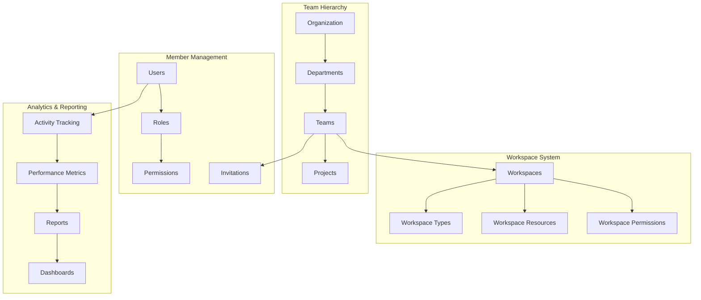

# Team Management System

Comprehensive team and workspace management for collaborative environments with hierarchical permissions, role-based access control, and team analytics.

## 🌟 Overview

The Team Management System provides:

- **Hierarchical Teams** - Nested team structures with inheritance
- **Workspace Organization** - Project-based collaboration spaces
- **Role-Based Access** - Granular permission control
- **Team Analytics** - Performance and activity insights
- **Member Management** - Invitation and onboarding workflows

## 🏗️ Architecture



## 🏢 Organization Structure

### Teams

Core team entity with hierarchical structure.

**Location:** `pgappforge/collaborative/core/team_manager.py`

```python
from pgappforge.collaborative.core.team_manager import TeamManager

team_manager = TeamManager(db.session)

# Create team
team = await team_manager.create_team(
    name="Engineering",
    description="Software engineering team",
    team_type="department",
    parent_team_id=None,  # Top-level team
    created_by=admin_user.id,
    settings={
        "visibility": "public",
        "auto_approval": False,
        "max_members": 50
    }
)

# Create sub-team
sub_team = await team_manager.create_team(
    name="Frontend Team",
    description="UI/UX development team",
    team_type="project",
    parent_team_id=team.id,
    created_by=admin_user.id
)
```

### Team Types

```python
TEAM_TYPES = {
    'organization': {
        'level': 0,
        'max_members': None,
        'can_have_children': True,
        'default_permissions': ['view_all', 'create_teams']
    },
    'department': {
        'level': 1,
        'max_members': 100,
        'can_have_children': True,
        'default_permissions': ['view_department', 'create_projects']
    },
    'project': {
        'level': 2,
        'max_members': 20,
        'can_have_children': False,
        'default_permissions': ['view_project', 'edit_project']
    }
}
```

### Team Model

```python
@dataclass
class Team:
    id: str
    name: str
    description: str
    team_type: str
    parent_team_id: Optional[str]
    created_by: int
    created_at: datetime
    updated_at: datetime
    settings: Dict[str, Any]
    is_active: bool = True
    member_count: int = 0
    metadata: Optional[Dict[str, Any]] = None
```

## 👥 Member Management

### Adding Members

```python
# Add member to team
await team_manager.add_member(
    team_id=team.id,
    user_id=user.id,
    role="member",
    added_by=admin_user.id,
    permissions=["read", "write"]
)

# Add member with custom role
await team_manager.add_member(
    team_id=team.id,
    user_id=user.id,
    role="lead",
    added_by=admin_user.id,
    permissions=["read", "write", "admin", "invite"]
)
```

### Member Roles

```python
TEAM_ROLES = {
    'owner': {
        'level': 100,
        'permissions': ['*'],  # All permissions
        'can_delete_team': True,
        'can_manage_members': True
    },
    'admin': {
        'level': 80,
        'permissions': ['read', 'write', 'admin', 'invite', 'manage'],
        'can_delete_team': False,
        'can_manage_members': True
    },
    'lead': {
        'level': 60,
        'permissions': ['read', 'write', 'invite'],
        'can_delete_team': False,
        'can_manage_members': True
    },
    'member': {
        'level': 40,
        'permissions': ['read', 'write'],
        'can_delete_team': False,
        'can_manage_members': False
    },
    'viewer': {
        'level': 20,
        'permissions': ['read'],
        'can_delete_team': False,
        'can_manage_members': False
    }
}
```

### Invitation System

```python
from pgappforge.collaborative.core.invitation_manager import InvitationManager

invitation_manager = InvitationManager(team_manager, email_service)

# Send invitation
invitation = await invitation_manager.send_invitation(
    team_id=team.id,
    email="new_member@company.com",
    role="member",
    invited_by=admin_user.id,
    message="Welcome to our engineering team!",
    expires_in_days=7
)

# Accept invitation
await invitation_manager.accept_invitation(
    invitation_token=invitation.token,
    user_id=new_user.id
)
```

## 🗂️ Workspace Management

### Workspaces

Project-specific collaboration environments.

```python
from pgappforge.collaborative.core.workspace_manager import WorkspaceManager

workspace_manager = WorkspaceManager(db.session, team_manager)

# Create workspace
workspace = await workspace_manager.create_workspace(
    name="Mobile App Project",
    description="iOS and Android app development",
    team_id=team.id,
    workspace_type="project",
    created_by=user.id,
    settings={
        "privacy": "team",
        "features": ["chat", "files", "kanban", "wiki"],
        "integrations": ["github", "slack"]
    }
)
```

### Workspace Types

```python
WORKSPACE_TYPES = {
    'project': {
        'features': ['chat', 'files', 'tasks', 'wiki', 'calendar'],
        'max_size_gb': 10,
        'retention_days': 365,
        'collaboration_tools': ['real_time_editing', 'comments', 'reviews']
    },
    'knowledge_base': {
        'features': ['wiki', 'search', 'ai_assistant'],
        'max_size_gb': 50,
        'retention_days': None,  # Permanent
        'collaboration_tools': ['comments', 'suggestions']
    },
    'communication': {
        'features': ['chat', 'video_calls', 'announcements'],
        'max_size_gb': 5,
        'retention_days': 90,
        'collaboration_tools': ['threads', 'reactions']
    }
}
```

### Workspace Permissions

```python
# Set workspace permissions
await workspace_manager.set_permissions(
    workspace_id=workspace.id,
    permissions={
        'team:engineering': ['read', 'write', 'admin'],
        'team:design': ['read', 'comment'],
        'user:john_doe': ['read', 'write'],
        'role:project_manager': ['read', 'write', 'admin']
    }
)

# Check permissions
can_edit = await workspace_manager.check_permission(
    workspace_id=workspace.id,
    user_id=user.id,
    permission='write'
)
```

## 🔐 Permission System

### Permission Hierarchy

```python
PERMISSION_HIERARCHY = {
    'read': 10,
    'comment': 20,
    'write': 30,
    'invite': 40,
    'manage': 50,
    'admin': 60,
    'owner': 100
}
```

### Permission Inheritance

```python
# Permissions are inherited from parent teams
class PermissionManager:
    async def get_effective_permissions(self, user_id: int, resource_id: str) -> List[str]:
        """Get effective permissions considering inheritance."""
        permissions = set()

        # Direct permissions
        direct_perms = await self.get_direct_permissions(user_id, resource_id)
        permissions.update(direct_perms)

        # Team permissions
        user_teams = await self.get_user_teams(user_id)
        for team in user_teams:
            team_perms = await self.get_team_permissions(team.id, resource_id)
            permissions.update(team_perms)

            # Parent team permissions
            if team.parent_team_id:
                parent_perms = await self.get_inherited_permissions(
                    team.parent_team_id, resource_id
                )
                permissions.update(parent_perms)

        return list(permissions)
```

### Role-Based Permissions

```python
# Assign role-based permissions
await team_manager.assign_role(
    team_id=team.id,
    user_id=user.id,
    role_name="project_manager",
    scope="workspace",
    resource_id=workspace.id
)

# Custom role definition
custom_role = {
    'name': 'senior_developer',
    'permissions': ['read', 'write', 'review', 'deploy'],
    'restrictions': {
        'cannot_delete': True,
        'max_workspace_count': 5
    },
    'metadata': {
        'requires_approval': False,
        'auto_expire_days': None
    }
}

await team_manager.create_custom_role(team.id, custom_role)
```

## 📊 Team Analytics

### Activity Tracking

```python
from pgappforge.collaborative.analytics.team_analytics import TeamAnalytics

analytics = TeamAnalytics(db.session)

# Get team activity summary
activity = await analytics.get_team_activity(
    team_id=team.id,
    period='last_30_days'
)

print(f"Total activities: {activity['total_count']}")
print(f"Active members: {activity['active_members']}")
print(f"Most active day: {activity['peak_day']}")
```

### Performance Metrics

```python
# Get team performance metrics
metrics = await analytics.get_team_metrics(
    team_id=team.id,
    metrics=['productivity', 'collaboration', 'engagement']
)

productivity = metrics['productivity']
print(f"Tasks completed: {productivity['tasks_completed']}")
print(f"Average completion time: {productivity['avg_completion_time']}")
print(f"Velocity trend: {productivity['velocity_trend']}")
```

### Member Analytics

```python
# Individual member analytics
member_stats = await analytics.get_member_analytics(
    team_id=team.id,
    user_id=user.id,
    period='last_quarter'
)

print(f"Contribution score: {member_stats['contribution_score']}")
print(f"Collaboration index: {member_stats['collaboration_index']}")
print(f"Skill development: {member_stats['skill_progress']}")
```

## 🎯 Team Views and UI

### Team Management Views

PgAppForge views for team management.

**Location:** `pgappforge/collaborative/views/team_view.py`

```python
from pgappforge.collaborative.views.team_view import TeamView

class TeamView(ModelView):
    route_base = "/teams"

    list_columns = ['name', 'team_type', 'member_count', 'created_at']
    show_columns = ['name', 'description', 'team_type', 'parent_team',
                   'member_count', 'settings', 'created_at']
    add_columns = ['name', 'description', 'team_type', 'parent_team']
    edit_columns = ['name', 'description', 'settings']

    @expose('/members/<team_id>')
    @has_access
    def team_members(self, team_id):
        """View team members"""
        team = self.datamodel.get(team_id)
        members = team_manager.get_team_members(team_id)

        return self.render_template(
            'collaborative/team_members.html',
            team=team,
            members=members
        )
```

### API Endpoints

```python
# REST API for team management
@app.route('/api/v1/teams', methods=['POST'])
@jwt_required
async def create_team():
    data = request.get_json()
    team = await team_manager.create_team(**data)
    return jsonify(team.to_dict())

@app.route('/api/v1/teams/<team_id>/members', methods=['POST'])
@jwt_required
async def add_team_member(team_id):
    data = request.get_json()
    await team_manager.add_member(team_id, **data)
    return jsonify({'status': 'success'})

@app.route('/api/v1/teams/<team_id>/analytics')
@jwt_required
async def get_team_analytics(team_id):
    analytics = await team_analytics.get_team_metrics(team_id)
    return jsonify(analytics)
```

## 🔄 Team Workflows

### Onboarding Workflow

```python
from pgappforge.collaborative.workflows.onboarding import OnboardingWorkflow

onboarding = OnboardingWorkflow(team_manager, notification_service)

# Start onboarding process
await onboarding.start_onboarding(
    team_id=team.id,
    new_member_id=user.id,
    buddy_id=mentor.id,
    onboarding_plan={
        'tasks': [
            'complete_profile',
            'join_team_channels',
            'review_team_docs',
            'meet_team_members'
        ],
        'timeline_days': 14,
        'check_in_schedule': [1, 3, 7, 14]
    }
)
```

### Team Rotation

```python
# Rotate team members between projects
await team_manager.rotate_member(
    from_team_id=team_a.id,
    to_team_id=team_b.id,
    user_id=user.id,
    rotation_period_months=6,
    maintain_access_to_previous=True
)
```

## 🔧 Configuration

### Team Settings

```python
# config.py

# Team management settings
TEAM_MAX_NESTING_LEVELS = 3
TEAM_DEFAULT_MAX_MEMBERS = 20
TEAM_AUTO_APPROVAL_DEFAULT = False
TEAM_INVITATION_EXPIRY_DAYS = 7

# Permission settings
PERMISSION_INHERITANCE_ENABLED = True
PERMISSION_CACHE_TTL = 300  # 5 minutes

# Analytics settings
ANALYTICS_RETENTION_DAYS = 365
ANALYTICS_BATCH_SIZE = 1000
ANALYTICS_REAL_TIME_UPDATES = True
```

### Database Configuration

```python
# Team-related database tables
TEAM_TABLES = [
    'fab_teams',
    'fab_team_members',
    'fab_team_roles',
    'fab_team_permissions',
    'fab_team_invitations',
    'fab_workspaces',
    'fab_workspace_permissions',
    'fab_team_activities'
]
```

## 🛡️ Security

### Access Control

```python
# Security checks for team operations
class TeamSecurityManager:
    async def can_create_team(self, user_id: int, parent_team_id: str = None) -> bool:
        """Check if user can create a team."""
        if parent_team_id:
            # Check if user has admin rights in parent team
            return await self.has_team_permission(
                user_id, parent_team_id, 'create_subteam'
            )

        # Check global team creation permission
        return await self.has_global_permission(user_id, 'create_team')

    async def can_invite_member(self, user_id: int, team_id: str) -> bool:
        """Check if user can invite members to team."""
        return await self.has_team_permission(user_id, team_id, 'invite')
```

### Audit Logging

```python
# Audit all team operations
@audit_log
async def add_member(self, team_id: str, user_id: int, **kwargs):
    """Add member with audit logging."""
    result = await self._add_member_internal(team_id, user_id, **kwargs)

    await self.audit_logger.log(
        action='team.member.added',
        team_id=team_id,
        target_user_id=user_id,
        performed_by=kwargs.get('added_by'),
        metadata=kwargs
    )

    return result
```

## 📱 Frontend Integration

### React Components

```jsx
import { TeamProvider, useTeam } from './contexts/TeamContext';

function TeamDashboard({ teamId }) {
    const {
        team,
        members,
        workspaces,
        analytics,
        loading
    } = useTeam(teamId);

    if (loading) return <LoadingSpinner />;

    return (
        <div className="team-dashboard">
            <TeamHeader team={team} />
            <div className="dashboard-grid">
                <MembersWidget members={members} />
                <WorkspacesWidget workspaces={workspaces} />
                <AnalyticsWidget data={analytics} />
                <ActivityFeed teamId={teamId} />
            </div>
        </div>
    );
}

function TeamMemberList({ teamId }) {
    const { members, addMember, removeMember } = useTeam(teamId);

    return (
        <div className="member-list">
            {members.map(member => (
                <MemberCard
                    key={member.id}
                    member={member}
                    onRemove={() => removeMember(member.id)}
                />
            ))}
            <AddMemberButton onClick={addMember} />
        </div>
    );
}
```

### Team Management UI

```javascript
// Team management utilities
class TeamManager {
    constructor(apiClient) {
        this.api = apiClient;
    }

    async createTeam(teamData) {
        const response = await this.api.post('/api/v1/teams', teamData);
        return response.data;
    }

    async inviteMember(teamId, email, role) {
        const response = await this.api.post(`/api/v1/teams/${teamId}/invite`, {
            email,
            role
        });
        return response.data;
    }

    async getTeamAnalytics(teamId, period = 'last_30_days') {
        const response = await this.api.get(
            `/api/v1/teams/${teamId}/analytics?period=${period}`
        );
        return response.data;
    }
}
```

## 🔍 Troubleshooting

### Common Issues

**1. Permission Inheritance Not Working**
```python
# Debug permission resolution
permissions = await permission_manager.debug_permissions(user_id, resource_id)
print(f"Direct permissions: {permissions['direct']}")
print(f"Team permissions: {permissions['team']}")
print(f"Inherited permissions: {permissions['inherited']}")
print(f"Final permissions: {permissions['effective']}")
```

**2. Team Member Count Mismatch**
```python
# Sync member counts
await team_manager.sync_member_counts()
```

**3. Invitation Emails Not Sending**
```python
# Check email service configuration
await invitation_manager.test_email_service()
```

## 📈 Performance Optimization

### Caching

```python
# Cache team permissions
@cache.memoize(timeout=300)
async def get_team_permissions(team_id: str, user_id: int):
    return await team_manager.get_permissions(team_id, user_id)

# Cache team hierarchies
@cache.memoize(timeout=600)
async def get_team_hierarchy(team_id: str):
    return await team_manager.get_hierarchy(team_id)
```

### Database Optimization

```sql
-- Optimized queries for team operations
CREATE INDEX idx_team_members_user_team ON fab_team_members(user_id, team_id);
CREATE INDEX idx_team_permissions_resource ON fab_team_permissions(resource_type, resource_id);
CREATE INDEX idx_team_activities_date ON fab_team_activities(created_at DESC);
```

## 🚀 Next Steps

1. **Team Setup** - Create organizational hierarchy
2. **Member Onboarding** - Set up invitation workflows
3. **Permission Configuration** - Define role-based access
4. **Analytics Setup** - Enable team performance tracking
5. **Integration** - Connect with existing systems

For more details, see:
- [Real-Time Collaboration](realtime_collaboration.md)
- [Communication API](communication_api.md)
- [Workspace Management](workspace_management.md)