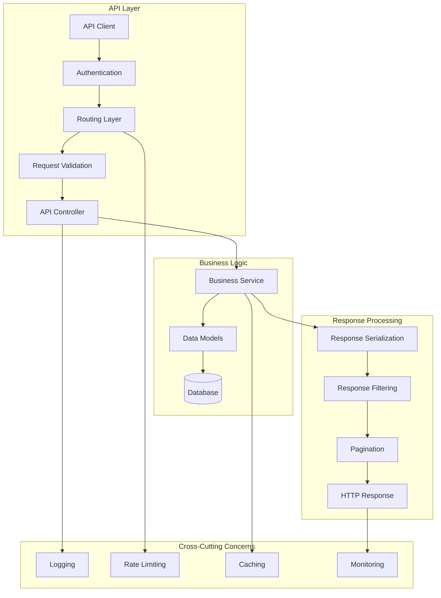

# API Development Guide

Complete guide for developing REST APIs with Flask-AppBuilder, including automatic API generation, custom endpoints, authentication, and best practices.

## 🚀 Overview

Flask-AppBuilder provides powerful API capabilities including:

- **Automatic REST API generation** from models
- **OpenAPI/Swagger integration** with interactive documentation
- **Multiple authentication methods** (JWT, API keys, OAuth)
- **Request/response validation** with marshmallow schemas
- **Rate limiting and throttling** for API protection
- **Versioning support** for API evolution
- **Custom endpoint development** for specialized functionality

## 🏗️ API Architecture



## 🔧 Automatic API Generation

### Basic Model API

```python
"""Automatic REST API generation from models."""
from flask_appbuilder import ModelRestApi
from flask_appbuilder.models.sqla.interface import SQLAInterface
from flask_appbuilder.api import BaseApi, expose

from app import appbuilder, db
from app.models import Employee, Department

class EmployeeApi(ModelRestApi):
    """Automatic REST API for Employee model."""

    resource_name = 'employee'
    datamodel = SQLAInterface(Employee)

    # API configuration
    allow_browser_login = True  # Allow session-based auth for testing
    class_permission_name = "EmployeeApi"

    # Customize exposed columns
    list_columns = [
        'id', 'first_name', 'last_name', 'email', 'employee_id',
        'job_title', 'hire_date', 'salary', 'department', 'is_active'
    ]
    show_columns = list_columns + ['created_on', 'changed_on']
    add_columns = [
        'first_name', 'last_name', 'email', 'employee_id',
        'job_title', 'hire_date', 'salary', 'department'
    ]
    edit_columns = add_columns + ['is_active']

    # Search and filtering
    search_columns = ['first_name', 'last_name', 'email', 'employee_id']
    filters_converter = {
        'department': lambda x: x.name if x else None
    }

    # Ordering and pagination
    order_columns = ['last_name', 'first_name', 'hire_date']
    page_size = 20
    max_page_size = 100

class DepartmentApi(ModelRestApi):
    """Automatic REST API for Department model."""

    resource_name = 'department'
    datamodel = SQLAInterface(Department)

    list_columns = ['id', 'name', 'description', 'budget', 'manager', 'is_active']
    show_columns = list_columns + ['employee_count']
    add_columns = ['name', 'description', 'budget', 'manager']
    edit_columns = add_columns + ['is_active']

# Register APIs
appbuilder.add_api(EmployeeApi)
appbuilder.add_api(DepartmentApi)
```

### Generated API Endpoints

The automatic API generation creates the following endpoints:

```python
# Employee API endpoints (all under /api/v1/employee/)
GET    /api/v1/employee/           # List employees with pagination/filtering
GET    /api/v1/employee/{id}       # Get specific employee
POST   /api/v1/employee/           # Create new employee
PUT    /api/v1/employee/{id}       # Update employee
DELETE /api/v1/employee/{id}       # Delete employee

# Additional endpoints
GET    /api/v1/employee/_info      # API schema information
GET    /api/v1/employee/_count     # Get record count
GET    /api/v1/employee/export/{format}  # Export data (CSV, JSON, Excel)

# Department API endpoints (all under /api/v1/department/)
GET    /api/v1/department/         # List departments
GET    /api/v1/department/{id}     # Get specific department
POST   /api/v1/department/         # Create new department
PUT    /api/v1/department/{id}     # Update department
DELETE /api/v1/department/{id}     # Delete department
```

## 🔒 API Authentication

### JWT Authentication

```python
"""JWT-based API authentication."""
from flask_jwt_extended import JWTManager, create_access_token, jwt_required, get_jwt_identity
from datetime import timedelta

# Configure JWT
app.config['JWT_SECRET_KEY'] = 'your-secret-key'  # Change this in production
app.config['JWT_ACCESS_TOKEN_EXPIRES'] = timedelta(hours=1)
app.config['JWT_REFRESH_TOKEN_EXPIRES'] = timedelta(days=30)

jwt = JWTManager(app)

class AuthApi(BaseApi):
    """Authentication API endpoints."""

    resource_name = 'auth'

    @expose('/login', methods=['POST'])
    def login(self):
        """Login endpoint to get JWT token."""
        if not request.is_json:
            return self.response_400(message="Missing JSON in request")

        username = request.json.get('username', None)
        password = request.json.get('password', None)

        if not username or not password:
            return self.response_400(message="Missing username or password")

        # Authenticate user
        user = appbuilder.sm.auth_user_db(username, password)
        if not user:
            return self.response_401(message="Invalid credentials")

        # Create access token
        access_token = create_access_token(
            identity=user.id,
            additional_claims={
                'username': user.username,
                'email': user.email,
                'roles': [role.name for role in user.roles]
            }
        )

        return self.response(200, result={
            'access_token': access_token,
            'user': {
                'id': user.id,
                'username': user.username,
                'email': user.email,
                'roles': [role.name for role in user.roles]
            }
        })

    @expose('/refresh', methods=['POST'])
    @jwt_required(refresh=True)
    def refresh(self):
        """Refresh JWT token."""
        current_user_id = get_jwt_identity()
        user = appbuilder.sm.get_user_by_id(current_user_id)

        if not user:
            return self.response_401(message="User not found")

        new_token = create_access_token(identity=current_user_id)
        return self.response(200, result={'access_token': new_token})

    @expose('/profile', methods=['GET'])
    @jwt_required()
    def profile(self):
        """Get current user profile."""
        current_user_id = get_jwt_identity()
        user = appbuilder.sm.get_user_by_id(current_user_id)

        if not user:
            return self.response_401(message="User not found")

        return self.response(200, result={
            'id': user.id,
            'username': user.username,
            'email': user.email,
            'first_name': user.first_name,
            'last_name': user.last_name,
            'roles': [role.name for role in user.roles],
            'active': user.active
        })

# Register authentication API
appbuilder.add_api(AuthApi)
```

### API Key Authentication

```python
"""API Key-based authentication."""
from functools import wraps
import secrets

class ApiKey(Model):
    """API key model for authentication."""
    __tablename__ = 'api_keys'

    id = Column(Integer, primary_key=True)
    name = Column(String(100), nullable=False)
    key_hash = Column(String(128), nullable=False, unique=True)
    user_id = Column(Integer, ForeignKey('ab_user.id'), nullable=False)
    user = relationship('User', backref='api_keys')

    # Key metadata
    created_at = Column(DateTime, default=datetime.utcnow)
    last_used = Column(DateTime)
    expires_at = Column(DateTime)
    is_active = Column(Boolean, default=True)

    # Access control
    allowed_ips = Column(Text)  # JSON array of allowed IPs
    rate_limit = Column(Integer, default=1000)  # Requests per hour

    @classmethod
    def generate_key(cls, user_id, name, expires_days=None):
        """Generate new API key."""
        key = secrets.token_urlsafe(32)
        key_hash = generate_password_hash(key)

        expires_at = None
        if expires_days:
            expires_at = datetime.utcnow() + timedelta(days=expires_days)

        api_key = cls(
            name=name,
            key_hash=key_hash,
            user_id=user_id,
            expires_at=expires_at
        )

        db.session.add(api_key)
        db.session.commit()

        return key, api_key

    def verify_key(self, key):
        """Verify API key."""
        return check_password_hash(self.key_hash, key)

    def is_valid(self):
        """Check if API key is valid."""
        if not self.is_active:
            return False

        if self.expires_at and datetime.utcnow() > self.expires_at:
            return False

        return True

def api_key_required(f):
    """Decorator for API key authentication."""
    @wraps(f)
    def decorated_function(*args, **kwargs):
        api_key = request.headers.get('X-API-Key')
        if not api_key:
            return jsonify({'error': 'API key required'}), 401

        # Find API key in database
        db_api_key = ApiKey.query.filter_by(is_active=True).all()
        valid_key = None

        for key_obj in db_api_key:
            if key_obj.verify_key(api_key) and key_obj.is_valid():
                valid_key = key_obj
                break

        if not valid_key:
            return jsonify({'error': 'Invalid API key'}), 401

        # Check IP restrictions
        if valid_key.allowed_ips:
            import json
            allowed_ips = json.loads(valid_key.allowed_ips)
            client_ip = request.remote_addr

            if client_ip not in allowed_ips:
                return jsonify({'error': 'IP not allowed'}), 403

        # Update last used timestamp
        valid_key.last_used = datetime.utcnow()
        db.session.commit()

        # Add user to request context
        g.current_user = valid_key.user
        g.api_key = valid_key

        return f(*args, **kwargs)
    return decorated_function

class ApiKeyManagementApi(BaseApi):
    """API key management endpoints."""

    resource_name = 'api-keys'

    @expose('/', methods=['GET'])
    @jwt_required()
    def list_keys(self):
        """List user's API keys."""
        user_id = get_jwt_identity()
        keys = ApiKey.query.filter_by(user_id=user_id).all()

        return self.response(200, result=[
            {
                'id': key.id,
                'name': key.name,
                'created_at': key.created_at.isoformat(),
                'last_used': key.last_used.isoformat() if key.last_used else None,
                'expires_at': key.expires_at.isoformat() if key.expires_at else None,
                'is_active': key.is_active
            }
            for key in keys
        ])

    @expose('/', methods=['POST'])
    @jwt_required()
    def create_key(self):
        """Create new API key."""
        user_id = get_jwt_identity()

        if not request.is_json:
            return self.response_400(message="Missing JSON in request")

        name = request.json.get('name')
        expires_days = request.json.get('expires_days')

        if not name:
            return self.response_400(message="Name is required")

        try:
            key, api_key_obj = ApiKey.generate_key(user_id, name, expires_days)

            return self.response(201, result={
                'id': api_key_obj.id,
                'name': api_key_obj.name,
                'key': key,  # Only returned once!
                'expires_at': api_key_obj.expires_at.isoformat() if api_key_obj.expires_at else None
            })

        except Exception as e:
            return self.response_500(message=str(e))

    @expose('/<int:key_id>', methods=['DELETE'])
    @jwt_required()
    def delete_key(self, key_id):
        """Delete API key."""
        user_id = get_jwt_identity()

        api_key = ApiKey.query.filter_by(id=key_id, user_id=user_id).first()
        if not api_key:
            return self.response_404(message="API key not found")

        db.session.delete(api_key)
        db.session.commit()

        return self.response(200, message="API key deleted")

appbuilder.add_api(ApiKeyManagementApi)
```

## 📝 Custom API Development

### Custom API Endpoints

```python
"""Custom API endpoints for specialized functionality."""
from flask import request, g
from flask_appbuilder.api import BaseApi, expose, safe
from marshmallow import Schema, fields, validate
from sqlalchemy import func, and_, or_

class EmployeeStatsSchema(Schema):
    """Schema for employee statistics."""
    total_employees = fields.Integer()
    active_employees = fields.Integer()
    departments_count = fields.Integer()
    average_salary = fields.Float()
    department_breakdown = fields.List(fields.Dict())

class EmployeeSearchSchema(Schema):
    """Schema for employee search parameters."""
    query = fields.String(required=True, validate=validate.Length(min=1))
    department_id = fields.Integer()
    active_only = fields.Boolean(default=True)
    limit = fields.Integer(default=10, validate=validate.Range(min=1, max=100))

class EmployeeBulkUpdateSchema(Schema):
    """Schema for bulk employee updates."""
    employee_ids = fields.List(fields.Integer(), required=True, validate=validate.Length(min=1))
    updates = fields.Dict(required=True)

class EmployeeCustomApi(BaseApi):
    """Custom employee API with advanced functionality."""

    resource_name = 'employee-custom'

    @expose('/stats', methods=['GET'])
    @safe
    def get_statistics(self):
        """Get employee statistics and metrics."""
        # Calculate statistics
        total_employees = db.session.query(Employee).count()
        active_employees = db.session.query(Employee).filter_by(is_active=True).count()
        departments_count = db.session.query(Department).filter_by(is_active=True).count()

        # Average salary (only active employees)
        avg_salary_result = db.session.query(
            func.avg(Employee.salary)
        ).filter_by(is_active=True).scalar()
        average_salary = float(avg_salary_result) if avg_salary_result else 0

        # Department breakdown
        dept_breakdown = db.session.query(
            Department.name,
            func.count(Employee.id).label('count'),
            func.avg(Employee.salary).label('avg_salary')
        ).join(Employee).filter(
            Employee.is_active == True
        ).group_by(Department.name).all()

        department_breakdown = [
            {
                'department': dept.name,
                'employee_count': dept.count,
                'average_salary': float(dept.avg_salary) if dept.avg_salary else 0
            }
            for dept in dept_breakdown
        ]

        stats = {
            'total_employees': total_employees,
            'active_employees': active_employees,
            'departments_count': departments_count,
            'average_salary': average_salary,
            'department_breakdown': department_breakdown
        }

        # Validate response
        schema = EmployeeStatsSchema()
        result = schema.dump(stats)

        return self.response(200, result=result)

    @expose('/search', methods=['POST'])
    @safe
    def search_employees(self):
        """Advanced employee search with full-text capabilities."""
        if not request.is_json:
            return self.response_400(message="JSON request required")

        # Validate input
        schema = EmployeeSearchSchema()
        try:
            data = schema.load(request.json)
        except ValidationError as err:
            return self.response_400(message="Validation error", errors=err.messages)

        # Build search query
        query = db.session.query(Employee)

        # Text search across multiple fields
        search_term = f"%{data['query']}%"
        query = query.filter(
            or_(
                Employee.first_name.ilike(search_term),
                Employee.last_name.ilike(search_term),
                Employee.email.ilike(search_term),
                Employee.employee_id.ilike(search_term),
                Employee.job_title.ilike(search_term)
            )
        )

        # Apply filters
        if data.get('department_id'):
            query = query.filter(Employee.department_id == data['department_id'])

        if data.get('active_only', True):
            query = query.filter(Employee.is_active == True)

        # Execute query with limit
        employees = query.limit(data['limit']).all()

        # Serialize results
        result = [
            {
                'id': emp.id,
                'full_name': emp.full_name,
                'email': emp.email,
                'employee_id': emp.employee_id,
                'job_title': emp.job_title,
                'department': emp.department.name if emp.department else None,
                'hire_date': emp.hire_date.isoformat() if emp.hire_date else None
            }
            for emp in employees
        ]

        return self.response(200, result=result, count=len(result))

    @expose('/bulk-update', methods=['POST'])
    @safe
    def bulk_update(self):
        """Bulk update multiple employees."""
        if not request.is_json:
            return self.response_400(message="JSON request required")

        # Validate input
        schema = EmployeeBulkUpdateSchema()
        try:
            data = schema.load(request.json)
        except ValidationError as err:
            return self.response_400(message="Validation error", errors=err.messages)

        employee_ids = data['employee_ids']
        updates = data['updates']

        # Validate that all employee IDs exist
        existing_employees = db.session.query(Employee.id).filter(
            Employee.id.in_(employee_ids)
        ).all()
        existing_ids = [emp.id for emp in existing_employees]

        if len(existing_ids) != len(employee_ids):
            missing_ids = set(employee_ids) - set(existing_ids)
            return self.response_400(
                message=f"Employees not found: {list(missing_ids)}"
            )

        # Perform bulk update
        try:
            # Only allow specific fields to be updated
            allowed_fields = ['job_title', 'salary', 'department_id', 'is_active']
            filtered_updates = {
                k: v for k, v in updates.items() if k in allowed_fields
            }

            if not filtered_updates:
                return self.response_400(message="No valid fields to update")

            # Execute bulk update
            result = db.session.query(Employee).filter(
                Employee.id.in_(employee_ids)
            ).update(filtered_updates, synchronize_session=False)

            db.session.commit()

            return self.response(200, result={
                'updated_count': result,
                'updated_fields': list(filtered_updates.keys())
            })

        except Exception as e:
            db.session.rollback()
            return self.response_500(message=f"Bulk update failed: {str(e)}")

    @expose('/export/<format>', methods=['GET'])
    @safe
    def export_employees(self, format):
        """Export employees in various formats."""
        supported_formats = ['csv', 'json', 'excel']
        if format not in supported_formats:
            return self.response_400(
                message=f"Unsupported format. Use: {', '.join(supported_formats)}"
            )

        # Get query parameters for filtering
        department_id = request.args.get('department_id', type=int)
        active_only = request.args.get('active_only', default='true').lower() == 'true'

        # Build query
        query = db.session.query(Employee)

        if department_id:
            query = query.filter(Employee.department_id == department_id)

        if active_only:
            query = query.filter(Employee.is_active == True)

        employees = query.all()

        # Export based on format
        if format == 'csv':
            return self._export_csv(employees)
        elif format == 'json':
            return self._export_json(employees)
        elif format == 'excel':
            return self._export_excel(employees)

    def _export_csv(self, employees):
        """Export to CSV format."""
        import csv
        from io import StringIO
        from flask import make_response

        output = StringIO()
        writer = csv.writer(output)

        # Write header
        writer.writerow([
            'ID', 'Employee ID', 'First Name', 'Last Name', 'Email',
            'Job Title', 'Department', 'Hire Date', 'Salary', 'Active'
        ])

        # Write data
        for emp in employees:
            writer.writerow([
                emp.id,
                emp.employee_id,
                emp.first_name,
                emp.last_name,
                emp.email,
                emp.job_title,
                emp.department.name if emp.department else '',
                emp.hire_date.isoformat() if emp.hire_date else '',
                emp.salary or '',
                emp.is_active
            ])

        response = make_response(output.getvalue())
        response.headers['Content-Type'] = 'text/csv'
        response.headers['Content-Disposition'] = 'attachment; filename=employees.csv'

        return response

    def _export_json(self, employees):
        """Export to JSON format."""
        data = [
            {
                'id': emp.id,
                'employee_id': emp.employee_id,
                'first_name': emp.first_name,
                'last_name': emp.last_name,
                'full_name': emp.full_name,
                'email': emp.email,
                'job_title': emp.job_title,
                'department': emp.department.name if emp.department else None,
                'hire_date': emp.hire_date.isoformat() if emp.hire_date else None,
                'salary': emp.salary,
                'is_active': emp.is_active,
                'years_of_service': emp.years_of_service
            }
            for emp in employees
        ]

        return self.response(200, result=data, count=len(data))

    def _export_excel(self, employees):
        """Export to Excel format."""
        try:
            import pandas as pd
            from io import BytesIO
            from flask import make_response

            # Create DataFrame
            data = []
            for emp in employees:
                data.append({
                    'ID': emp.id,
                    'Employee ID': emp.employee_id,
                    'First Name': emp.first_name,
                    'Last Name': emp.last_name,
                    'Email': emp.email,
                    'Job Title': emp.job_title,
                    'Department': emp.department.name if emp.department else '',
                    'Hire Date': emp.hire_date,
                    'Salary': emp.salary,
                    'Years of Service': emp.years_of_service,
                    'Active': emp.is_active
                })

            df = pd.DataFrame(data)

            # Create Excel file
            output = BytesIO()
            with pd.ExcelWriter(output, engine='openpyxl') as writer:
                df.to_excel(writer, index=False, sheet_name='Employees')

            output.seek(0)

            response = make_response(output.getvalue())
            response.headers['Content-Type'] = 'application/vnd.openxmlformats-officedocument.spreadsheetml.sheet'
            response.headers['Content-Disposition'] = 'attachment; filename=employees.xlsx'

            return response

        except ImportError:
            return self.response_400(message="Excel export requires pandas and openpyxl")

# Register custom API
appbuilder.add_api(EmployeeCustomApi)
```

## 📊 OpenAPI/Swagger Integration

### API Documentation Configuration

```python
"""OpenAPI/Swagger documentation setup."""
from flask_appbuilder.api import BaseApi
from apispec import APISpec
from apispec.ext.marshmallow import MarshmallowPlugin

# Configure API documentation
SWAGGER_CONFIG = {
    'title': 'Employee Management API',
    'version': 'v1.0.0',
    'description': 'REST API for Employee Management System',
    'contact': {
        'name': 'API Support',
        'email': 'api-support@company.com'
    },
    'license': {
        'name': 'MIT',
        'url': 'https://opensource.org/licenses/MIT'
    },
    'servers': [
        {
            'url': 'https://api.company.com',
            'description': 'Production server'
        },
        {
            'url': 'https://staging-api.company.com',
            'description': 'Staging server'
        },
        {
            'url': 'http://localhost:5000',
            'description': 'Development server'
        }
    ]
}

# Add to your config.py
FAB_API_SWAGGER_UI = True
FAB_API_SWAGGER_TEMPLATE = "appbuilder/swagger/swagger.html"

class DocumentedEmployeeApi(ModelRestApi):
    """Employee API with comprehensive documentation."""

    resource_name = 'employee'
    datamodel = SQLAInterface(Employee)

    # OpenAPI documentation
    openapi_spec_component_schemas = [
        EmployeeSchema,
        EmployeeCreateSchema,
        EmployeeUpdateSchema
    ]

    @expose('/', methods=['GET'])
    def get_list(self):
        """
        Get employee list
        ---
        get:
          summary: List all employees
          description: Retrieve a paginated list of employees with optional filtering
          parameters:
            - in: query
              name: page
              schema:
                type: integer
                minimum: 1
                default: 1
              description: Page number for pagination
            - in: query
              name: page_size
              schema:
                type: integer
                minimum: 1
                maximum: 100
                default: 20
              description: Number of records per page
            - in: query
              name: department_id
              schema:
                type: integer
              description: Filter by department ID
            - in: query
              name: active_only
              schema:
                type: boolean
                default: true
              description: Show only active employees
          responses:
            200:
              description: Employee list retrieved successfully
              content:
                application/json:
                  schema:
                    type: object
                    properties:
                      result:
                        type: array
                        items:
                          $ref: '#/components/schemas/Employee'
                      count:
                        type: integer
                      page:
                        type: integer
                      page_size:
                        type: integer
            400:
              description: Invalid request parameters
            401:
              description: Authentication required
            403:
              description: Permission denied
          security:
            - bearerAuth: []
            - apiKeyAuth: []
        """
        return super().get_list()

    @expose('/<int:pk>', methods=['GET'])
    def get(self, pk):
        """
        Get employee by ID
        ---
        get:
          summary: Get a specific employee
          description: Retrieve detailed information about a specific employee
          parameters:
            - in: path
              name: pk
              required: true
              schema:
                type: integer
              description: Employee ID
          responses:
            200:
              description: Employee retrieved successfully
              content:
                application/json:
                  schema:
                    type: object
                    properties:
                      result:
                        $ref: '#/components/schemas/Employee'
            404:
              description: Employee not found
            401:
              description: Authentication required
            403:
              description: Permission denied
          security:
            - bearerAuth: []
            - apiKeyAuth: []
        """
        return super().get(pk)

    @expose('/', methods=['POST'])
    def post(self):
        """
        Create new employee
        ---
        post:
          summary: Create a new employee
          description: Create a new employee record in the system
          requestBody:
            required: true
            content:
              application/json:
                schema:
                  $ref: '#/components/schemas/EmployeeCreate'
          responses:
            201:
              description: Employee created successfully
              content:
                application/json:
                  schema:
                    type: object
                    properties:
                      result:
                        $ref: '#/components/schemas/Employee'
                      message:
                        type: string
            400:
              description: Invalid input data
            401:
              description: Authentication required
            403:
              description: Permission denied
            409:
              description: Employee with same email/employee_id already exists
          security:
            - bearerAuth: []
            - apiKeyAuth: []
        """
        return super().post()
```

### Schema Definitions

```python
"""Marshmallow schemas for API serialization."""
from marshmallow import Schema, fields, validate, validates, ValidationError

class DepartmentSchema(Schema):
    """Department schema for API responses."""
    id = fields.Integer(dump_only=True)
    name = fields.String(required=True, validate=validate.Length(min=1, max=100))
    description = fields.String(allow_none=True)
    budget = fields.Float(validate=validate.Range(min=0))
    is_active = fields.Boolean(default=True)
    employee_count = fields.Integer(dump_only=True)
    created_on = fields.DateTime(dump_only=True, format='iso')
    changed_on = fields.DateTime(dump_only=True, format='iso')

class EmployeeSchema(Schema):
    """Employee schema for API responses."""
    id = fields.Integer(dump_only=True)
    employee_id = fields.String(required=True, validate=validate.Length(min=1, max=20))
    first_name = fields.String(required=True, validate=validate.Length(min=1, max=50))
    last_name = fields.String(required=True, validate=validate.Length(min=1, max=50))
    full_name = fields.String(dump_only=True)
    email = fields.Email(required=True)
    phone = fields.String(allow_none=True, validate=validate.Length(max=20))
    job_title = fields.String(required=True, validate=validate.Length(min=1, max=100))
    hire_date = fields.Date(required=True)
    salary = fields.Float(validate=validate.Range(min=0, max=1000000))
    is_active = fields.Boolean(default=True)
    years_of_service = fields.Float(dump_only=True)

    # Nested relationships
    department = fields.Nested(DepartmentSchema, exclude=['employee_count'], dump_only=True)
    department_id = fields.Integer(required=True, load_only=True)

    # Audit fields
    created_on = fields.DateTime(dump_only=True, format='iso')
    changed_on = fields.DateTime(dump_only=True, format='iso')
    created_by = fields.String(dump_only=True)
    changed_by = fields.String(dump_only=True)

    @validates('employee_id')
    def validate_employee_id(self, value):
        """Validate employee ID uniqueness."""
        if self.context.get('instance'):
            # Skip validation for updates
            return

        existing = Employee.query.filter_by(employee_id=value).first()
        if existing:
            raise ValidationError('Employee ID already exists')

    @validates('email')
    def validate_email_unique(self, value):
        """Validate email uniqueness."""
        if self.context.get('instance'):
            # Skip validation for updates
            return

        existing = Employee.query.filter_by(email=value).first()
        if existing:
            raise ValidationError('Email already exists')

class EmployeeCreateSchema(EmployeeSchema):
    """Schema for creating employees."""
    class Meta:
        exclude = ['id', 'full_name', 'years_of_service', 'created_on', 'changed_on', 'created_by', 'changed_by']

class EmployeeUpdateSchema(EmployeeSchema):
    """Schema for updating employees."""
    class Meta:
        exclude = ['id', 'full_name', 'years_of_service', 'created_on', 'changed_on', 'created_by', 'changed_by']

    # Make fields optional for updates
    employee_id = fields.String(validate=validate.Length(min=1, max=20))
    first_name = fields.String(validate=validate.Length(min=1, max=50))
    last_name = fields.String(validate=validate.Length(min=1, max=50))
    email = fields.Email()
    job_title = fields.String(validate=validate.Length(min=1, max=100))
    hire_date = fields.Date()
    department_id = fields.Integer()

class ErrorSchema(Schema):
    """Schema for error responses."""
    error = fields.String(required=True)
    message = fields.String(required=True)
    status_code = fields.Integer(required=True)
    details = fields.Dict(missing={})

# Register schemas with OpenAPI
SWAGGER_COMPONENTS = {
    'schemas': {
        'Employee': EmployeeSchema,
        'EmployeeCreate': EmployeeCreateSchema,
        'EmployeeUpdate': EmployeeUpdateSchema,
        'Department': DepartmentSchema,
        'Error': ErrorSchema
    },
    'securitySchemes': {
        'bearerAuth': {
            'type': 'http',
            'scheme': 'bearer',
            'bearerFormat': 'JWT'
        },
        'apiKeyAuth': {
            'type': 'apiKey',
            'in': 'header',
            'name': 'X-API-Key'
        }
    }
}
```

## 🔒 API Security and Rate Limiting

### Rate Limiting

```python
"""Rate limiting for API protection."""
from flask_limiter import Limiter
from flask_limiter.util import get_remote_address
import redis

# Configure rate limiter
limiter = Limiter(
    app,
    key_func=get_remote_address,
    storage_uri="redis://localhost:6379",
    default_limits=["1000 per hour", "100 per minute"]
)

class RateLimitedEmployeeApi(ModelRestApi):
    """Employee API with rate limiting."""

    resource_name = 'employee'
    datamodel = SQLAInterface(Employee)

    # Apply rate limits to specific endpoints
    decorators = [
        limiter.limit("10 per minute", methods=["POST"]),  # Limit creation
        limiter.limit("50 per minute", methods=["GET"]),   # Limit reads
        limiter.limit("20 per minute", methods=["PUT", "PATCH"]),  # Limit updates
        limiter.limit("5 per minute", methods=["DELETE"])  # Strict delete limit
    ]

# Custom rate limiting based on user roles
def user_role_limit():
    """Dynamic rate limiting based on user role."""
    if hasattr(g, 'current_user') and g.current_user:
        if g.current_user.has_role('Admin'):
            return "1000 per minute"
        elif g.current_user.has_role('Manager'):
            return "500 per minute"
        else:
            return "100 per minute"
    return "10 per minute"  # Anonymous users

@limiter.request_filter
def exempt_admin_from_limits():
    """Exempt admin users from rate limits."""
    if hasattr(g, 'current_user') and g.current_user:
        return g.current_user.has_role('SuperAdmin')
    return False

# API key-specific rate limiting
def api_key_limit():
    """Rate limit based on API key."""
    if hasattr(g, 'api_key') and g.api_key:
        return f"{g.api_key.rate_limit} per hour"
    return "100 per hour"
```

### Input Validation and Sanitization

```python
"""Comprehensive input validation."""
from marshmallow import pre_load, post_load
import bleach

class SecureEmployeeSchema(EmployeeSchema):
    """Employee schema with security validations."""

    @pre_load
    def sanitize_input(self, data, **kwargs):
        """Sanitize input data."""
        # HTML sanitization
        text_fields = ['first_name', 'last_name', 'job_title']
        for field in text_fields:
            if field in data and isinstance(data[field], str):
                data[field] = bleach.clean(data[field], tags=[], strip=True)

        # Email normalization
        if 'email' in data:
            data['email'] = data['email'].lower().strip()

        return data

    @validates('salary')
    def validate_salary_range(self, value):
        """Validate salary is within reasonable range."""
        if value is not None:
            if value < 20000:
                raise ValidationError('Salary must be at least $20,000')
            if value > 1000000:
                raise ValidationError('Salary cannot exceed $1,000,000')

    @validates('phone')
    def validate_phone_format(self, value):
        """Validate phone number format."""
        if value:
            import re
            phone_pattern = r'^\+?1?[2-9]\d{2}[2-9]\d{2}\d{4}$'
            if not re.match(phone_pattern, value.replace('-', '').replace(' ', '')):
                raise ValidationError('Invalid phone number format')

class SecureApiBase(BaseApi):
    """Base API class with security features."""

    def response_400(self, message=None, errors=None):
        """Standardized 400 response."""
        return self.response(400, message=message or "Bad Request", errors=errors)

    def response_401(self, message=None):
        """Standardized 401 response."""
        return self.response(401, message=message or "Unauthorized")

    def response_403(self, message=None):
        """Standardized 403 response."""
        return self.response(403, message=message or "Forbidden")

    def response_404(self, message=None):
        """Standardized 404 response."""
        return self.response(404, message=message or "Not Found")

    def response_500(self, message=None):
        """Standardized 500 response."""
        current_app.logger.error(f"API Error: {message}")
        return self.response(500, message=message or "Internal Server Error")

    def validate_json_request(self, schema):
        """Validate JSON request with schema."""
        if not request.is_json:
            return None, self.response_400("JSON request required")

        try:
            data = schema.load(request.json)
            return data, None
        except ValidationError as err:
            return None, self.response_400("Validation error", errors=err.messages)
```

## 📈 API Monitoring and Analytics

### Request Logging

```python
"""API request logging and monitoring."""
import time
from functools import wraps

class ApiMetrics(Model):
    """Model for API metrics tracking."""
    __tablename__ = 'api_metrics'

    id = Column(Integer, primary_key=True)
    endpoint = Column(String(200), nullable=False)
    method = Column(String(10), nullable=False)
    status_code = Column(Integer, nullable=False)
    response_time = Column(Float, nullable=False)
    user_id = Column(Integer, ForeignKey('ab_user.id'))
    ip_address = Column(String(45))
    user_agent = Column(Text)
    api_key_id = Column(Integer, ForeignKey('api_keys.id'))
    timestamp = Column(DateTime, default=datetime.utcnow)

def track_api_metrics(f):
    """Decorator to track API metrics."""
    @wraps(f)
    def decorated_function(*args, **kwargs):
        start_time = time.time()

        try:
            response = f(*args, **kwargs)
            status_code = response[1] if isinstance(response, tuple) else 200
        except Exception as e:
            status_code = 500
            current_app.logger.error(f"API Error in {f.__name__}: {str(e)}")
            raise

        # Calculate response time
        response_time = time.time() - start_time

        # Log metrics
        try:
            metric = ApiMetrics(
                endpoint=request.endpoint,
                method=request.method,
                status_code=status_code,
                response_time=response_time,
                user_id=getattr(g, 'current_user', {}).get('id') if hasattr(g, 'current_user') else None,
                ip_address=request.remote_addr,
                user_agent=request.headers.get('User-Agent'),
                api_key_id=getattr(g, 'api_key', {}).get('id') if hasattr(g, 'api_key') else None
            )
            db.session.add(metric)
            db.session.commit()
        except Exception as e:
            current_app.logger.error(f"Failed to log API metrics: {str(e)}")

        return response

    return decorated_function

class ApiMonitoringApi(BaseApi):
    """API for monitoring and analytics."""

    resource_name = 'api-monitoring'

    @expose('/metrics', methods=['GET'])
    @track_api_metrics
    def get_metrics(self):
        """Get API usage metrics."""
        # Date range filtering
        days = request.args.get('days', 7, type=int)
        start_date = datetime.utcnow() - timedelta(days=days)

        # Aggregate metrics
        total_requests = db.session.query(ApiMetrics).filter(
            ApiMetrics.timestamp >= start_date
        ).count()

        avg_response_time = db.session.query(
            func.avg(ApiMetrics.response_time)
        ).filter(
            ApiMetrics.timestamp >= start_date
        ).scalar() or 0

        # Status code breakdown
        status_breakdown = db.session.query(
            ApiMetrics.status_code,
            func.count(ApiMetrics.id).label('count')
        ).filter(
            ApiMetrics.timestamp >= start_date
        ).group_by(ApiMetrics.status_code).all()

        # Top endpoints
        top_endpoints = db.session.query(
            ApiMetrics.endpoint,
            func.count(ApiMetrics.id).label('count'),
            func.avg(ApiMetrics.response_time).label('avg_response_time')
        ).filter(
            ApiMetrics.timestamp >= start_date
        ).group_by(ApiMetrics.endpoint).order_by(
            desc('count')
        ).limit(10).all()

        return self.response(200, result={
            'total_requests': total_requests,
            'avg_response_time': round(avg_response_time, 3),
            'status_breakdown': [
                {'status_code': s.status_code, 'count': s.count}
                for s in status_breakdown
            ],
            'top_endpoints': [
                {
                    'endpoint': e.endpoint,
                    'request_count': e.count,
                    'avg_response_time': round(e.avg_response_time, 3)
                }
                for e in top_endpoints
            ]
        })

appbuilder.add_api(ApiMonitoringApi)
```

## 🚀 Best Practices

### API Design Guidelines

1. **RESTful Design**
   ```python
   # Good: Clear resource-based URLs
   GET    /api/v1/employees/          # List employees
   GET    /api/v1/employees/123/      # Get employee 123
   POST   /api/v1/employees/          # Create employee
   PUT    /api/v1/employees/123/      # Update employee 123
   DELETE /api/v1/employees/123/      # Delete employee 123

   # Avoid: Action-based URLs
   # GET /api/v1/get-employees/
   # POST /api/v1/create-employee/
   ```

2. **Consistent Response Format**
   ```python
   # Standard success response
   {
       "result": {...},           # Response data
       "message": "Success",      # Status message
       "status": 200,            # HTTP status code
       "count": 1,               # Record count (for lists)
       "page": 1,                # Current page
       "page_size": 20           # Page size
   }

   # Standard error response
   {
       "error": "ValidationError",
       "message": "Invalid input data",
       "status": 400,
       "details": {
           "field": ["Error message"]
       }
   }
   ```

3. **Versioning Strategy**
   ```python
   # URL versioning (recommended)
   /api/v1/employees/
   /api/v2/employees/

   # Header versioning (alternative)
   Accept: application/vnd.myapi.v1+json
   ```

### Security Best Practices

1. **Input Validation**
   - Validate all input data using schemas
   - Sanitize HTML content
   - Implement proper data type checking

2. **Authentication & Authorization**
   - Use JWT tokens with reasonable expiration
   - Implement API key management
   - Check permissions for each endpoint

3. **Rate Limiting**
   - Implement per-user rate limits
   - Use different limits for different operations
   - Provide clear error messages

4. **Error Handling**
   - Don't expose internal details in errors
   - Log security-related events
   - Use consistent error formats

### Performance Optimization

1. **Database Queries**
   ```python
   # Use eager loading for relationships
   employees = db.session.query(Employee).options(
       joinedload(Employee.department)
   ).all()

   # Implement pagination
   page = request.args.get('page', 1, type=int)
   per_page = min(request.args.get('per_page', 20, type=int), 100)

   employees = Employee.query.paginate(
       page=page, per_page=per_page, error_out=False
   )
   ```

2. **Caching**
   ```python
   from flask_caching import Cache

   cache = Cache(app, config={'CACHE_TYPE': 'redis'})

   @cache.memoize(timeout=300)  # 5 minutes
   def get_department_stats():
       return db.session.query(...).all()
   ```

3. **Response Compression**
   ```python
   from flask_compress import Compress

   Compress(app)
   ```

For more information, see:
- [Security Guide](../security/security_architecture.md)
- [Testing Guide](testing_guide.md)
- [Deployment Guide](../deployment/production_deployment.md)