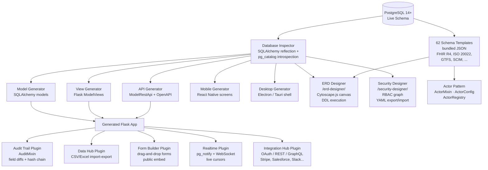

# Architecture

[Home](Home) > Architecture

---

## Overview

pgappforge is organised around a PostgreSQL-first inspection pipeline. The live database schema is the single source of truth; everything else — models, views, APIs, designers, plugins — is derived from or layered on top of it.

---

## Component Diagram

---

## Core Components

### Database Inspector

Reflects the live PostgreSQL schema using SQLAlchemy's `inspect()` plus direct `pg_catalog` and `information_schema` queries. Detects column types, foreign keys, indexes, check constraints, table comments (used for actor-pattern discovery), and PostgreSQL-specific features such as `GENERATED`, array columns, and `jsonb`.

### Generators

Five generators consume the Inspector output and emit source files:

| Generator | Command | Output |
|---|---|---|
| Model | `flask forge gen model` | `models.py` — SQLAlchemy ORM classes |
| View | `flask forge gen view` | `views.py` — `ModelView` subclasses |
| API | `flask forge gen api` | REST endpoints with OpenAPI spec |
| Mobile | `flask forge gen mobile` | React Native screen components |
| Desktop | `flask forge gen desktop` | Electron/Tauri application shell |

### ERD Designer

A Cytoscape.js-powered canvas mounted at `/erd-designer/`. Lets admins create tables, add columns, set foreign keys, and execute DDL directly against the connected PostgreSQL instance (opt-in via `FAB_ERD_DDL_ENABLED = True`). All mutations are logged in the `erd_migration_log` table.

### Security Designer

A graph-based RBAC editor at `/security-designer/`. Renders roles as nodes and permissions as edges. Supports YAML export/import for GitOps workflows and a built-in health-check diagnostic suite.

### Plugins

Five production-grade plugins ship with the framework. Each follows the same initialisation pattern: `plugin.initialize(app, appbuilder)` + `plugin.register_views(appbuilder)`.

| Plugin | Class | Mount |
|---|---|---|
| Audit Trail | `AuditPlugin` | `/compliance/audit-log/` |
| Data Hub | `DataHubPlugin` | `/tools/data-hub/` |
| Form Builder | `FormsPlugin` | `/tools/form-builder/` |
| Realtime | `RealtimePlugin` | `/socket.io/` |
| Integration Hub | `IntegrationHubPlugin` | `/tools/integration-hub/` |

### Schema Templates

62 bundled JSON templates organised across 15 domains (Healthcare, Finance, Government, IoT, etc.). The `TemplateRegistry` scans bundled, user-installed (`~/.pgappforge/templates/`), and project-local (`.pgappforge/templates/`) directories. Templates can declare an **actor** — a primary domain entity that drives code-generation hints and view labels.

---

## See also

- [Code Generator](Code-Generator)
- [ERD Designer](ERD-Designer)
- [Security Designer](Security-Designer)
- [Schema Templates](Schema-Templates)
- [Actor Pattern](Actor-Pattern)
