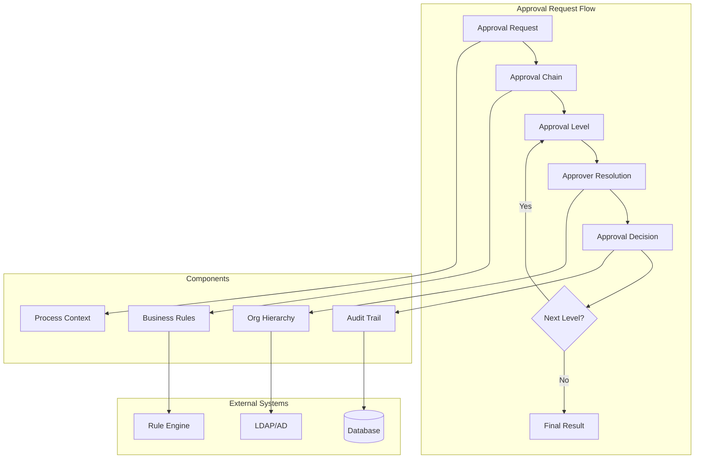

# Approval System Configuration

Comprehensive guide to configuring and customizing PgAppForge's multi-level approval system.

## 🎯 Overview

The approval system provides flexible, rule-based approval workflows with support for:

- **Multi-level approvals** with conditional routing
- **Delegation and substitution** for absent approvers
- **Escalation policies** for timeout handling
- **Parallel and sequential** approval patterns
- **Integration** with organizational hierarchy
- **Custom approval rules** and business logic

## 🏗️ Architecture



## ⚙️ Basic Configuration

### Enable Approval System

```python
# config.py

# Enable approval features
APPROVAL_SYSTEM_ENABLED = True
APPROVAL_AUDIT_ENABLED = True
APPROVAL_NOTIFICATIONS_ENABLED = True

# Default timeouts (in hours)
APPROVAL_DEFAULT_TIMEOUT = 72  # 3 days
APPROVAL_ESCALATION_TIMEOUT = 24  # 1 day
APPROVAL_REMINDER_INTERVAL = 24  # Daily reminders

# Delegation settings
APPROVAL_DELEGATION_ENABLED = True
APPROVAL_AUTO_DELEGATION = True  # Auto-delegate to manager when out of office

# Integration settings
APPROVAL_ORG_HIERARCHY_SOURCE = 'database'  # database, ldap, api
APPROVAL_EXTERNAL_APPROVAL_API = None  # Optional external system
```

### Database Setup

```python
# Initialize approval tables
from pgappforge.process.approval.models import (
    ApprovalChain, ApprovalLevel, ApprovalRequest, ApprovalDecision
)

# Create tables (done automatically with db.create_all())
```

## 🔗 Approval Chain Definition

### Simple Linear Chain

```python
from pgappforge.process.approval import ApprovalChainBuilder

# Create a simple 3-level approval chain
chain = ApprovalChainBuilder("expense_approval") \
    .set_description("Standard expense approval workflow") \
    .add_level(
        level_id="manager",
        name="Direct Manager Approval",
        approver_rule="user.manager",
        timeout_hours=48,
        required=True
    ) \
    .add_level(
        level_id="finance",
        name="Finance Team Approval",
        approver_rule="role:finance_manager",
        timeout_hours=72,
        required=True
    ) \
    .add_level(
        level_id="executive",
        name="Executive Approval",
        approver_rule="role:executive",
        timeout_hours=120,
        required=False,  # Only for high amounts
        condition="${amount >= 10000}"
    ) \
    .build()

# Register the chain
approval_manager.register_chain(chain)
```

### Conditional Chain with Parallel Approvals

```python
# Complex approval chain with conditions and parallel steps
chain = ApprovalChainBuilder("capital_expenditure") \
    .set_description("Capital expenditure approval process") \
    .add_level(
        level_id="department_head",
        name="Department Head",
        approver_rule="department.head",
        timeout_hours=48,
        required=True
    ) \
    .add_level(
        level_id="parallel_review",
        name="Parallel Finance & Legal Review",
        approver_rule=[
            "role:finance_director",
            "role:legal_counsel"
        ],
        approval_type="parallel",  # Both must approve
        timeout_hours=96,
        required=True
    ) \
    .add_level(
        level_id="ceo",
        name="CEO Final Approval",
        approver_rule="role:ceo",
        condition="${amount >= 50000}",
        timeout_hours=168,  # 1 week
        required=True
    ) \
    .set_escalation_policy(
        timeout_action="escalate_to_next",
        max_escalations=2
    ) \
    .build()
```

## 👥 Approver Rules

### Built-in Rule Types

#### User Hierarchy Rules
```python
# Direct manager
"user.manager"

# Skip-level manager (manager's manager)
"user.manager.manager"

# Department head
"user.department.head"

# Regional manager
"user.region.manager"
```

#### Role-Based Rules
```python
# Users with specific role
"role:finance_manager"

# Users with role in same department
"role:department_head@user.department"

# Users with role in specific location
"role:site_manager@location:headquarters"
```

#### Dynamic Rules with Expressions
```python
# Conditional approver based on amount
"${amount < 5000 ? 'role:supervisor' : 'role:manager'}"

# Department-specific approvers
"${department == 'IT' ? 'role:it_director' : 'role:operations_director'}"

# Multiple approvers based on risk level
"${risk_level == 'high' ? ['role:compliance', 'role:legal'] : 'role:manager'}"
```

#### Custom Rule Functions
```python
# Register custom approver resolution function
@approval_manager.approver_resolver('budget_owner')
def resolve_budget_owner(context, user):
    """Find the budget owner for the requested cost center."""
    cost_center = context.get('cost_center')
    return BudgetOwner.query.filter_by(cost_center=cost_center).first()

# Use in approval chain
approver_rule="budget_owner"
```

## 🔄 Advanced Configuration

### Delegation and Substitution

```python
# Automatic delegation configuration
APPROVAL_DELEGATION_RULES = {
    'out_of_office': {
        'enabled': True,
        'delegate_to': 'user.manager',  # Delegate to manager when OOO
        'check_calendar': True,
        'calendar_integration': 'outlook'  # outlook, google, caldav
    },
    'temporary_delegation': {
        'enabled': True,
        'max_duration_days': 30,
        'require_approval': True,  # Manager must approve delegation
        'audit_trail': True
    },
    'permanent_substitution': {
        'enabled': True,
        'roles': ['finance_manager', 'hr_director'],  # Roles that support substitution
        'require_executive_approval': True
    }
}

# Manual delegation API
await approval_manager.delegate_approval(
    approver_id=123,
    delegate_to_id=456,
    start_date=datetime.now(),
    end_date=datetime.now() + timedelta(days=14),
    reason="Vacation - two weeks"
)
```

### Escalation Policies

```python
# Define escalation behavior
APPROVAL_ESCALATION_POLICIES = {
    'standard': {
        'timeout_hours': 72,
        'reminder_intervals': [24, 48],  # Send reminders at 24h and 48h
        'escalation_action': 'escalate_to_manager',
        'max_escalations': 2,
        'final_action': 'auto_approve'  # or 'require_override'
    },
    'urgent': {
        'timeout_hours': 24,
        'reminder_intervals': [4, 12, 20],
        'escalation_action': 'escalate_to_next_level',
        'max_escalations': 1,
        'final_action': 'require_override'
    },
    'compliance': {
        'timeout_hours': 168,  # 1 week
        'reminder_intervals': [24, 72, 120],
        'escalation_action': 'add_additional_approver',
        'additional_approver_rule': 'role:compliance_officer',
        'max_escalations': 3,
        'final_action': 'auto_reject'
    }
}

# Apply escalation policy to approval level
.add_level(
    level_id="manager_approval",
    approver_rule="user.manager",
    escalation_policy="urgent",
    timeout_hours=24
)
```

### Business Rules Integration

```python
# Define approval rules
APPROVAL_BUSINESS_RULES = {
    'expense_approval_rules': [
        {
            'name': 'Low amount auto-approve',
            'condition': '${amount <= 100}',
            'action': 'auto_approve',
            'reason': 'Amount below approval threshold'
        },
        {
            'name': 'High amount requires CFO',
            'condition': '${amount >= 25000}',
            'action': 'add_approver',
            'approver': 'role:cfo',
            'level': 'final'
        },
        {
            'name': 'International requires compliance',
            'condition': '${vendor.country != "US"}',
            'action': 'add_approver',
            'approver': 'role:compliance_officer',
            'level': 'parallel_with_finance'
        }
    ],
    'contract_approval_rules': [
        {
            'name': 'Legal review for contracts',
            'condition': '${document_type == "contract"}',
            'action': 'require_approver',
            'approver': 'role:legal_counsel',
            'mandatory': True
        }
    ]
}

# Apply rules to approval request
request = approval_manager.create_request(
    chain_id="expense_approval",
    context={
        'amount': 15000,
        'vendor': {'country': 'Canada'},
        'category': 'software'
    },
    business_rules='expense_approval_rules'
)
```

## 📊 Approval Workflows

### Sequential Approval Pattern

```python
# Traditional linear approval flow
sequential_chain = ApprovalChainBuilder("sequential_approval") \
    .add_level("supervisor", "user.supervisor", required=True) \
    .add_level("manager", "user.manager", required=True) \
    .add_level("director", "user.director", required=True) \
    .set_flow_type("sequential") \
    .build()
```

### Parallel Approval Pattern

```python
# Multiple approvers must approve simultaneously
parallel_chain = ApprovalChainBuilder("parallel_approval") \
    .add_level("finance_and_legal",
        approver_rule=["role:finance_director", "role:legal_counsel"],
        approval_type="parallel",
        require_all=True  # Both must approve
    ) \
    .set_flow_type("parallel") \
    .build()
```

### Consensus Approval Pattern

```python
# Majority or unanimous consensus required
consensus_chain = ApprovalChainBuilder("consensus_approval") \
    .add_level("board_review",
        approver_rule="role:board_member",
        approval_type="consensus",
        consensus_type="majority",  # majority, unanimous, quorum
        minimum_votes=3,
        quorum_percentage=60
    ) \
    .build()
```

### Conditional Routing Pattern

```python
# Route based on context variables
conditional_chain = ApprovalChainBuilder("conditional_routing") \
    .add_conditional_level(
        condition="${risk_level == 'low'}",
        level_config={
            "level_id": "simple_approval",
            "approver_rule": "user.manager"
        }
    ) \
    .add_conditional_level(
        condition="${risk_level == 'medium'}",
        level_config={
            "level_id": "enhanced_approval",
            "approver_rule": ["user.manager", "role:risk_officer"]
        }
    ) \
    .add_conditional_level(
        condition="${risk_level == 'high'}",
        level_config={
            "level_id": "executive_approval",
            "approver_rule": ["role:executive", "role:compliance", "role:legal"]
        }
    ) \
    .build()
```

## 🔧 Integration Examples

### PgAppForge Model Integration

```python
# Automatic approval for model changes
class ExpenseReport(Model):
    __tablename__ = 'expense_reports'

    id = Column(Integer, primary_key=True)
    amount = Column(Float, nullable=False)
    status = Column(String(50), default='draft')

    @approval_required(chain_id='expense_approval')
    def submit(self):
        """Submit expense report for approval."""
        self.status = 'pending_approval'
        return {
            'amount': self.amount,
            'employee_id': self.employee_id,
            'category': self.category
        }

    @approval_callback
    def on_approved(self, approval_result):
        """Handle approval completion."""
        self.status = 'approved'
        self.approved_at = datetime.utcnow()
        self.approved_by = approval_result.final_approver_id

    @approval_callback
    def on_rejected(self, approval_result):
        """Handle approval rejection."""
        self.status = 'rejected'
        self.rejection_reason = approval_result.rejection_reason
```

### Custom Approval Views

```python
from pgappforge.process.views import ApprovalBaseView

class ExpenseApprovalView(ApprovalBaseView):
    """Custom view for expense approvals."""

    route_base = "/expense-approvals"
    approval_chain_id = "expense_approval"

    # Custom approval form
    approval_form = ExpenseApprovalForm

    # Custom approval logic
    def pre_approval_hook(self, request, decision_data):
        """Execute before approval decision."""
        if decision_data.get('decision') == 'approve':
            # Validate budget availability
            if not self.check_budget_availability(request):
                raise ApprovalError("Insufficient budget available")

    def post_approval_hook(self, request, decision_result):
        """Execute after approval decision."""
        if decision_result.final_status == 'approved':
            # Create accounting entry
            self.create_accounting_entry(request)

    @expose('/dashboard')
    @has_access
    def approval_dashboard(self):
        """Custom approval dashboard."""
        pending_approvals = self.get_user_pending_approvals()
        metrics = self.get_approval_metrics()

        return self.render_template(
            'approval_dashboard.html',
            pending=pending_approvals,
            metrics=metrics
        )

# Register the view
appbuilder.add_view(
    ExpenseApprovalView,
    "Expense Approvals",
    icon="fa-dollar",
    category="Approvals"
)
```

### External System Integration

```python
# SAP integration example
class SAPApprovalIntegration:
    def __init__(self, sap_client):
        self.sap_client = sap_client

    async def create_sap_approval(self, approval_request):
        """Create approval request in SAP."""
        sap_request = {
            'process_id': approval_request.id,
            'amount': approval_request.context['amount'],
            'cost_center': approval_request.context['cost_center'],
            'approver': approval_request.current_approver_id
        }

        response = await self.sap_client.create_approval_request(sap_request)

        # Store SAP reference
        approval_request.external_refs['sap_id'] = response['id']

    async def sync_approval_status(self, approval_request):
        """Sync approval status with SAP."""
        sap_id = approval_request.external_refs.get('sap_id')
        if sap_id:
            sap_status = await self.sap_client.get_approval_status(sap_id)

            if sap_status['status'] == 'approved':
                await approval_manager.external_approval(
                    request_id=approval_request.id,
                    approver_system='SAP',
                    decision='approve',
                    comments=sap_status.get('comments')
                )

# Register integration
approval_manager.register_integration('sap', SAPApprovalIntegration(sap_client))
```

## 📱 User Interface Customization

### Approval Dashboard Template

```html
<!-- templates/approval_dashboard.html -->



<div class="container-fluid">
    <div class="row">
        <div class="col-md-12">
            <div class="panel panel-default">
                <div class="panel-heading">
                    <h3 class="panel-title">
                        <i class="fa fa-check-circle"></i> Pending Approvals
                        <span class="badge">{{ pending|length }}</span>
                    </h3>
                </div>
                <div class="panel-body">
                    
                    <div class="approval-item" data-id="{{ approval.id }}">
                        <div class="row">
                            <div class="col-md-8">
                                <h4>{{ approval.title }}</h4>
                                <p class="text-muted">{{ approval.description }}</p>
                                <small>
                                    Requested by: {{ approval.requester.name }} |
                                    Amount: ${{ approval.context.amount|number_format }} |
                                    Due: {{ approval.due_date|datetime_format }}
                                </small>
                            </div>
                            <div class="col-md-4 text-right">
                                <div class="btn-group">
                                    <button class="btn btn-success approve-btn"
                                            data-id="{{ approval.id }}">
                                        <i class="fa fa-check"></i> Approve
                                    </button>
                                    <button class="btn btn-danger reject-btn"
                                            data-id="{{ approval.id }}">
                                        <i class="fa fa-times"></i> Reject
                                    </button>
                                    <button class="btn btn-info details-btn"
                                            data-id="{{ approval.id }}">
                                        <i class="fa fa-eye"></i> Details
                                    </button>
                                </div>
                            </div>
                        </div>
                    </div>
                    
                </div>
            </div>
        </div>
    </div>

    <!-- Approval Metrics -->
    <div class="row">
        <div class="col-md-3">
            <div class="small-box bg-green">
                <div class="inner">
                    <h3>{{ metrics.approved_today }}</h3>
                    <p>Approved Today</p>
                </div>
                <div class="icon">
                    <i class="fa fa-check"></i>
                </div>
            </div>
        </div>
        <div class="col-md-3">
            <div class="small-box bg-yellow">
                <div class="inner">
                    <h3>{{ metrics.pending_count }}</h3>
                    <p>Pending Approvals</p>
                </div>
                <div class="icon">
                    <i class="fa fa-clock-o"></i>
                </div>
            </div>
        </div>
        <div class="col-md-3">
            <div class="small-box bg-red">
                <div class="inner">
                    <h3>{{ metrics.overdue_count }}</h3>
                    <p>Overdue Items</p>
                </div>
                <div class="icon">
                    <i class="fa fa-exclamation-triangle"></i>
                </div>
            </div>
        </div>
        <div class="col-md-3">
            <div class="small-box bg-blue">
                <div class="inner">
                    <h3>{{ metrics.avg_approval_time }}h</h3>
                    <p>Avg Approval Time</p>
                </div>
                <div class="icon">
                    <i class="fa fa-clock-o"></i>
                </div>
            </div>
        </div>
    </div>
</div>

<script>
$(document).ready(function() {
    // Approve button handler
    $('.approve-btn').click(function() {
        var approvalId = $(this).data('id');
        showApprovalModal(approvalId, 'approve');
    });

    // Reject button handler
    $('.reject-btn').click(function() {
        var approvalId = $(this).data('id');
        showApprovalModal(approvalId, 'reject');
    });

    function showApprovalModal(approvalId, action) {
        // Show modal for approval/rejection with comments
        $('#approvalModal').modal('show');
        $('#approvalId').val(approvalId);
        $('#approvalAction').val(action);
    }
});
</script>

```

### Mobile-Friendly Approval Interface

```javascript
// static/js/mobile-approvals.js

class MobileApprovalInterface {
    constructor() {
        this.init();
    }

    init() {
        this.bindEvents();
        this.enableSwipeGestures();
        this.checkPushNotifications();
    }

    bindEvents() {
        // Quick approve/reject buttons
        $('.quick-approve').on('click', this.quickApprove.bind(this));
        $('.quick-reject').on('click', this.quickReject.bind(this));

        // Voice comments (if supported)
        if ('webkitSpeechRecognition' in window) {
            $('.voice-comment').on('click', this.startVoiceRecognition.bind(this));
        }
    }

    enableSwipeGestures() {
        // Swipe right to approve, left to reject
        $('.approval-card').on('swiperight', function() {
            $(this).find('.quick-approve').trigger('click');
        });

        $('.approval-card').on('swipeleft', function() {
            $(this).find('.quick-reject').trigger('click');
        });
    }

    async quickApprove(event) {
        const approvalId = $(event.target).data('approval-id');

        try {
            const result = await this.submitDecision(approvalId, 'approve', '');
            this.showSuccessMessage('Approved successfully');
            this.removeApprovalCard(approvalId);
        } catch (error) {
            this.showErrorMessage('Failed to approve: ' + error.message);
        }
    }

    async submitDecision(approvalId, decision, comments) {
        const response = await fetch(`/api/v1/approvals/${approvalId}/decide`, {
            method: 'POST',
            headers: {
                'Content-Type': 'application/json',
                'X-CSRFToken': this.getCSRFToken()
            },
            body: JSON.stringify({
                decision: decision,
                comments: comments
            })
        });

        if (!response.ok) {
            throw new Error(await response.text());
        }

        return await response.json();
    }
}

// Initialize on page load
$(document).ready(function() {
    new MobileApprovalInterface();
});
```

## 🔍 Monitoring and Analytics

### Approval Metrics Dashboard

```python
# Custom metrics for approval system
class ApprovalMetrics:
    def __init__(self, db_session):
        self.db = db_session

    def get_approval_metrics(self, timeframe='30d'):
        """Get comprehensive approval metrics."""
        start_date = datetime.now() - timedelta(days=int(timeframe[:-1]))

        metrics = {
            'total_requests': self.get_total_requests(start_date),
            'approval_rate': self.get_approval_rate(start_date),
            'avg_approval_time': self.get_avg_approval_time(start_date),
            'bottlenecks': self.identify_bottlenecks(start_date),
            'top_approvers': self.get_top_approvers(start_date),
            'escalation_rate': self.get_escalation_rate(start_date)
        }

        return metrics

    def get_approval_rate(self, start_date):
        """Calculate approval vs rejection rate."""
        total = self.db.query(ApprovalRequest)\
                      .filter(ApprovalRequest.created_at >= start_date)\
                      .filter(ApprovalRequest.status.in_(['approved', 'rejected']))\
                      .count()

        approved = self.db.query(ApprovalRequest)\
                         .filter(ApprovalRequest.created_at >= start_date)\
                         .filter(ApprovalRequest.status == 'approved')\
                         .count()

        return (approved / total * 100) if total > 0 else 0

    def identify_bottlenecks(self, start_date):
        """Identify approval bottlenecks."""
        # Find levels with longest average processing time
        slow_levels = self.db.query(
            ApprovalDecision.level_id,
            func.avg(ApprovalDecision.processing_time).label('avg_time')
        ).filter(
            ApprovalDecision.decided_at >= start_date
        ).group_by(
            ApprovalDecision.level_id
        ).order_by(
            desc('avg_time')
        ).limit(5).all()

        return [{'level': level, 'avg_hours': round(time/3600, 1)}
                for level, time in slow_levels]
```

### Real-time Approval Monitoring

```python
# WebSocket notifications for real-time approval updates
@approval_manager.on('approval_request_created')
async def notify_approvers(request):
    """Notify approvers of new requests."""
    approvers = await get_current_level_approvers(request)

    for approver in approvers:
        await websocket_manager.emit_to_user(
            approver.id,
            'new_approval_request',
            {
                'request_id': request.id,
                'title': request.title,
                'amount': request.context.get('amount'),
                'urgency': request.urgency_level,
                'due_date': request.due_date.isoformat()
            }
        )

@approval_manager.on('approval_decision_made')
async def update_dashboards(decision):
    """Update approval dashboards in real-time."""
    await websocket_manager.emit_to_room(
        f"approval_watchers_{decision.request_id}",
        'approval_updated',
        {
            'request_id': decision.request_id,
            'level': decision.level_id,
            'decision': decision.decision,
            'approver': decision.approver.name,
            'timestamp': decision.decided_at.isoformat()
        }
    )
```

## 🚀 Best Practices

### Design Principles
1. **Clear approval criteria** - Define explicit rules for when approval is required
2. **Minimize levels** - Use the fewest approval levels necessary
3. **Parallel when possible** - Run independent approvals in parallel
4. **Default timeouts** - Always set reasonable timeout periods
5. **Escalation paths** - Define clear escalation procedures

### Performance Optimization
1. **Index database queries** - Ensure approval queries are fast
2. **Cache approver resolution** - Cache organizational hierarchy lookups
3. **Batch notifications** - Send digest emails rather than individual messages
4. **Archive old requests** - Move completed approvals to archive storage
5. **Monitor bottlenecks** - Track and optimize slow approval levels

### Security Considerations
1. **Audit trail** - Log all approval decisions with full context
2. **Permission validation** - Verify approver permissions at decision time
3. **Data encryption** - Encrypt sensitive approval context data
4. **Access controls** - Restrict approval view access appropriately
5. **Delegation controls** - Monitor and audit approval delegations

### User Experience
1. **Mobile optimization** - Ensure approvals work well on mobile devices
2. **Clear notifications** - Provide actionable approval notifications
3. **Context visibility** - Show all relevant information for decisions
4. **Quick actions** - Enable one-click approve/reject for simple cases
5. **Progress tracking** - Show approval progress to requesters

For more information, see:
- [Process API Reference](process_api_reference.md)
- [Workflow Design Guide](workflow_design.md)
- [Process Tutorial](../tutorials/process_automation.md)