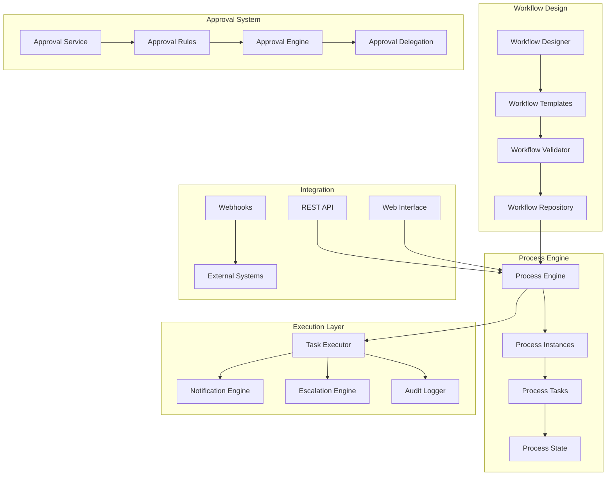

# Workflow Design Guide

Complete guide to designing and implementing approval workflows and business processes using PgAppForge's Process Engine.

## 🌟 Overview

The Process Engine provides enterprise-grade workflow capabilities with:

- **Visual Workflow Designer** - Drag-and-drop workflow creation
- **Multi-Step Approvals** - Sequential, parallel, and conditional flows
- **Dynamic Routing** - Rule-based approver assignment
- **Escalation & Delegation** - Automated escalation and manual delegation
- **Audit Trails** - Complete process history and compliance tracking

## 🏗️ Architecture



## 🎨 Workflow Design Patterns

### Sequential Approval

Linear approval chain where each step must complete before the next.

```python
from pgappforge.process.workflow import WorkflowBuilder

# Build sequential approval workflow
workflow = WorkflowBuilder() \
    .start('initiate_request') \
    .step('manager_approval',
          approver_rule='request.manager',
          timeout_hours=24) \
    .step('director_approval',
          approver_rule='request.director',
          timeout_hours=48) \
    .step('cfo_approval',
          approver_rule='role:cfo',
          timeout_hours=72,
          condition='request.amount > 10000') \
    .end('approved') \
    .build()
```

### Parallel Approval

Multiple approvers review simultaneously, with different completion rules.

```python
# Parallel approval with majority rule
workflow = WorkflowBuilder() \
    .start('initiate_request') \
    .parallel_group('technical_review',
                   completion_rule='majority',
                   participants=[
                       'role:tech_lead',
                       'role:senior_developer',
                       'role:architect'
                   ]) \
    .step('final_approval',
          approver_rule='role:engineering_manager') \
    .end('approved') \
    .build()
```

### Conditional Routing

Route approval based on request attributes.

```python
# Conditional workflow based on request amount
workflow = WorkflowBuilder() \
    .start('expense_request') \
    .condition('amount_check',
               conditions=[
                   {
                       'if': 'request.amount <= 500',
                       'then': 'auto_approve'
                   },
                   {
                       'if': 'request.amount <= 5000',
                       'then': 'manager_approval'
                   },
                   {
                       'if': 'request.amount > 5000',
                       'then': 'executive_approval'
                   }
               ]) \
    .step('manager_approval',
          approver_rule='request.manager') \
    .step('executive_approval',
          approver_rule='role:executive') \
    .step('auto_approve',
          action='approve_automatically') \
    .end('approved') \
    .build()
```

### Escalation Workflow

Automatic escalation when tasks are not completed on time.

```python
# Workflow with escalation rules
workflow = WorkflowBuilder() \
    .start('support_ticket') \
    .step('l1_support',
          approver_rule='role:l1_support',
          timeout_hours=2,
          escalation={
              'target': 'l2_support',
              'delay_hours': 2,
              'notification': 'sla_breach_warning'
          }) \
    .step('l2_support',
          approver_rule='role:l2_support',
          timeout_hours=4,
          escalation={
              'target': 'l3_support',
              'delay_hours': 4,
              'notification': 'critical_sla_breach'
          }) \
    .step('l3_support',
          approver_rule='role:l3_support') \
    .end('resolved') \
    .build()
```

## 🔧 Workflow Components

### Workflow Definition

```python
@dataclass
class WorkflowDefinition:
    id: str
    name: str
    description: str
    version: str
    steps: List[WorkflowStep]
    rules: Dict[str, Any]
    metadata: Dict[str, Any]
    is_active: bool = True
    created_by: int = None
    created_at: datetime = None
```

### Workflow Steps

```python
@dataclass
class WorkflowStep:
    id: str
    name: str
    step_type: str  # 'approval', 'task', 'condition', 'parallel'
    config: Dict[str, Any]
    next_steps: List[str]
    timeout_config: Optional[TimeoutConfig] = None
    escalation_config: Optional[EscalationConfig] = None
```

### Step Types

#### Approval Step

```python
approval_step = {
    'id': 'manager_approval',
    'name': 'Manager Approval',
    'step_type': 'approval',
    'config': {
        'approver_rule': 'request.manager',
        'required_votes': 1,
        'allow_delegation': True,
        'notification_template': 'approval_request',
        'form_fields': ['comments', 'priority']
    },
    'timeout_config': {
        'timeout_hours': 24,
        'action': 'escalate'
    }
}
```

#### Task Step

```python
task_step = {
    'id': 'document_review',
    'name': 'Document Review',
    'step_type': 'task',
    'config': {
        'assignee_rule': 'role:document_reviewer',
        'task_type': 'review',
        'required_fields': ['review_notes', 'recommendation'],
        'allow_reassignment': True
    }
}
```

#### Condition Step

```python
condition_step = {
    'id': 'amount_gate',
    'name': 'Amount-Based Routing',
    'step_type': 'condition',
    'config': {
        'conditions': [
            {
                'expression': 'request.amount > 10000',
                'next_step': 'executive_approval'
            },
            {
                'expression': 'request.amount <= 10000',
                'next_step': 'manager_approval'
            }
        ]
    }
}
```

#### Parallel Step

```python
parallel_step = {
    'id': 'multi_department_review',
    'name': 'Multi-Department Review',
    'step_type': 'parallel',
    'config': {
        'parallel_tasks': [
            {
                'id': 'legal_review',
                'assignee_rule': 'role:legal'
            },
            {
                'id': 'finance_review',
                'assignee_rule': 'role:finance'
            },
            {
                'id': 'hr_review',
                'assignee_rule': 'role:hr'
            }
        ],
        'completion_rule': 'all',  # 'all', 'majority', 'any', 'custom'
        'merge_strategy': 'consensus'
    }
}
```

## 🎯 Approver Rules

### Rule Types

#### Direct Assignment

```python
# Assign to specific user
approver_rule = 'user:john.doe'

# Assign to user by ID
approver_rule = 'user_id:123'
```

#### Role-Based Assignment

```python
# Assign to role
approver_rule = 'role:manager'

# Assign to multiple roles (any member)
approver_rule = 'role:manager,director'

# Require specific role combination
approver_rule = 'role:manager AND role:senior'
```

#### Dynamic Assignment

```python
# Use request attribute for approver
approver_rule = 'request.manager'

# Use department hierarchy
approver_rule = 'department.manager'

# Use reporting structure
approver_rule = 'reporting.supervisor'
```

#### Rule Expressions

```python
# Complex rule with conditions
approver_rule = {
    'type': 'expression',
    'expression': '''
        if request.amount > 50000:
            return role:cfo
        elif request.department == "IT":
            return role:it_manager
        else:
            return request.manager
    '''
}
```

### Rule Engine

```python
from pgappforge.process.rules import RuleEngine

rule_engine = RuleEngine()

# Register custom rule evaluator
@rule_engine.register('custom_approval_rule')
def evaluate_approval_rule(context, rule_config):
    request = context['request']
    user = context['user']

    # Custom logic to determine approver
    if request.risk_level == 'high':
        return get_users_by_role('risk_manager')
    elif request.amount > user.approval_limit:
        return get_users_by_role('senior_manager')
    else:
        return [request.manager]
```

## 🔄 Process Execution

### Starting a Process

```python
from pgappforge.process.engine import ProcessEngine

process_engine = ProcessEngine(db.session)

# Start workflow process
process_instance = await process_engine.start_process(
    workflow_id='expense_approval',
    initiated_by=user.id,
    context={
        'request': {
            'amount': 2500,
            'category': 'travel',
            'department': 'sales',
            'manager': 'jane.smith',
            'urgency': 'normal'
        },
        'metadata': {
            'source': 'web_form',
            'ip_address': '192.168.1.100'
        }
    }
)
```

### Process Context

The process context contains all data needed for workflow execution:

```python
process_context = {
    'request': {
        'id': 'REQ-2024-001',
        'amount': 2500.00,
        'category': 'travel',
        'description': 'Conference attendance',
        'requestor': user.id,
        'manager': manager.id,
        'department': 'sales',
        'priority': 'normal',
        'created_at': datetime.now()
    },
    'workflow': {
        'id': 'expense_approval',
        'version': '1.2',
        'initiated_by': user.id,
        'initiated_at': datetime.now()
    },
    'organization': {
        'department_budget': 50000,
        'approval_limits': {
            'manager': 5000,
            'director': 25000,
            'cfo': 100000
        }
    }
}
```

### Task Execution

```python
# Get pending tasks for user
pending_tasks = await process_engine.get_user_tasks(
    user_id=user.id,
    status='pending'
)

# Complete a task
await process_engine.complete_task(
    task_id=task.id,
    user_id=user.id,
    action='approve',
    data={
        'comments': 'Approved for business travel',
        'conditions': ['Submit receipts within 30 days']
    }
)
```

## 📋 Workflow Templates

### Template Library

Pre-built workflow templates for common business processes:

```python
WORKFLOW_TEMPLATES = {
    'expense_approval': {
        'name': 'Expense Approval Workflow',
        'description': 'Standard expense approval process',
        'category': 'finance',
        'complexity': 'simple',
        'steps': ['manager_approval', 'finance_review', 'approved']
    },
    'document_review': {
        'name': 'Document Review Workflow',
        'description': 'Multi-stage document review and approval',
        'category': 'content',
        'complexity': 'medium',
        'steps': ['author_review', 'peer_review', 'manager_approval', 'published']
    },
    'employee_onboarding': {
        'name': 'Employee Onboarding Workflow',
        'description': 'Complete employee onboarding process',
        'category': 'hr',
        'complexity': 'complex',
        'steps': [
            'hr_initial_setup',
            'it_account_creation',
            'equipment_assignment',
            'training_enrollment',
            'manager_introduction',
            'onboarding_completed'
        ]
    }
}
```

### Custom Templates

```python
from pgappforge.process.templates import WorkflowTemplateManager

template_manager = WorkflowTemplateManager()

# Create custom template
custom_template = await template_manager.create_template(
    name='Custom Approval Process',
    description='Organization-specific approval workflow',
    category='custom',
    definition=workflow_definition,
    variables={
        'approval_timeout': 24,
        'escalation_delay': 2,
        'notification_template': 'custom_approval'
    }
)

# Instantiate from template
workflow = await template_manager.instantiate_template(
    template_id=custom_template.id,
    variables={
        'approval_timeout': 48,  # Override default
        'department': 'engineering'
    }
)
```

## 🔔 Notifications & Escalations

### Notification Configuration

```python
notification_config = {
    'channels': ['email', 'in_app', 'slack'],
    'templates': {
        'task_assigned': {
            'subject': 'New approval task: {request.title}',
            'template': 'approval_task_assigned.html',
            'urgency': 'normal'
        },
        'task_overdue': {
            'subject': 'URGENT: Overdue approval task',
            'template': 'approval_task_overdue.html',
            'urgency': 'high'
        },
        'process_completed': {
            'subject': 'Process completed: {request.title}',
            'template': 'process_completed.html',
            'urgency': 'low'
        }
    },
    'schedules': {
        'reminder': {
            'frequency': 'daily',
            'time': '09:00',
            'conditions': ['task.status == pending', 'task.age > 1 day']
        }
    }
}
```

### Escalation Rules

```python
escalation_rules = {
    'manager_approval': {
        'triggers': [
            {
                'condition': 'task.age > 24 hours',
                'action': 'escalate',
                'target': 'task.assignee.manager',
                'notification': 'escalation_manager'
            },
            {
                'condition': 'task.age > 48 hours',
                'action': 'escalate',
                'target': 'role:director',
                'notification': 'escalation_director'
            }
        ],
        'max_escalations': 3,
        'escalation_delay': 24  # hours between escalations
    }
}
```

## 📊 Process Monitoring

### Process Analytics

```python
from pgappforge.process.analytics import ProcessAnalytics

analytics = ProcessAnalytics(db.session)

# Get process performance metrics
metrics = await analytics.get_process_metrics(
    workflow_id='expense_approval',
    period='last_30_days'
)

print(f"Average completion time: {metrics['avg_completion_time']}")
print(f"Success rate: {metrics['success_rate']}%")
print(f"Bottleneck step: {metrics['bottleneck_step']}")
```

### Real-Time Dashboard

```python
# Get real-time process status
dashboard_data = await analytics.get_dashboard_data()

dashboard_metrics = {
    'active_processes': dashboard_data['active_count'],
    'pending_tasks': dashboard_data['pending_tasks'],
    'overdue_tasks': dashboard_data['overdue_tasks'],
    'completion_rate_today': dashboard_data['completion_rate'],
    'average_cycle_time': dashboard_data['avg_cycle_time'],
    'top_bottlenecks': dashboard_data['bottlenecks'][:5]
}
```

## 🛠️ Advanced Features

### Workflow Versioning

```python
# Create new workflow version
new_version = await workflow_manager.create_version(
    workflow_id='expense_approval',
    changes={
        'steps.manager_approval.timeout_hours': 48,  # Increased timeout
        'steps.add': {  # Add new step
            'id': 'compliance_check',
            'name': 'Compliance Review',
            'step_type': 'approval',
            'config': {
                'approver_rule': 'role:compliance',
                'condition': 'request.amount > 5000'
            }
        }
    },
    migration_strategy='gradual'  # Migrate existing processes gradually
)
```

### A/B Testing

```python
# A/B test different workflow configurations
ab_test = await workflow_manager.create_ab_test(
    name='Approval Timeout Test',
    workflow_id='expense_approval',
    variants=[
        {
            'name': 'control',
            'config': {'timeout_hours': 24},
            'traffic_percentage': 50
        },
        {
            'name': 'extended',
            'config': {'timeout_hours': 48},
            'traffic_percentage': 50
        }
    ],
    metrics=['completion_rate', 'time_to_complete', 'user_satisfaction']
)
```

### Workflow Simulation

```python
# Simulate workflow execution
simulation_result = await workflow_manager.simulate_workflow(
    workflow_id='expense_approval',
    scenarios=[
        {
            'name': 'normal_expense',
            'context': {'request': {'amount': 500}},
            'iterations': 100
        },
        {
            'name': 'high_value_expense',
            'context': {'request': {'amount': 15000}},
            'iterations': 50
        }
    ]
)

print(f"Average completion time: {simulation_result['avg_completion_time']}")
print(f"Success rate: {simulation_result['success_rate']}")
print(f"Resource utilization: {simulation_result['resource_usage']}")
```

## 🔌 Integration Points

### REST API

```python
# Workflow management API endpoints
@app.route('/api/v1/workflows', methods=['POST'])
async def create_workflow():
    """Create new workflow definition"""

@app.route('/api/v1/workflows/<workflow_id>/start', methods=['POST'])
async def start_process():
    """Start workflow process instance"""

@app.route('/api/v1/tasks/<task_id>/complete', methods=['POST'])
async def complete_task():
    """Complete workflow task"""

@app.route('/api/v1/processes/<process_id>/status')
async def get_process_status():
    """Get process status and history"""
```

### Webhook Integration

```python
# External system integration via webhooks
webhook_config = {
    'events': [
        'process.started',
        'process.completed',
        'task.assigned',
        'task.completed',
        'process.escalated'
    ],
    'endpoints': {
        'process.completed': 'https://erp.company.com/webhooks/process-completed',
        'task.escalated': 'https://alerts.company.com/webhooks/escalation'
    },
    'authentication': {
        'type': 'bearer_token',
        'token': 'webhook_auth_token'
    }
}
```

## 🎨 Visual Workflow Designer

### Drag-and-Drop Interface

```javascript
// Frontend workflow designer
class WorkflowDesigner {
    constructor(container) {
        this.container = container;
        this.canvas = new WorkflowCanvas();
        this.toolbox = new WorkflowToolbox();
        this.properties = new PropertiesPanel();
    }

    // Add workflow step
    addStep(stepType, position) {
        const step = this.createStep(stepType);
        this.canvas.addElement(step, position);
        return step;
    }

    // Connect steps
    connectSteps(fromStep, toStep) {
        const connection = new WorkflowConnection(fromStep, toStep);
        this.canvas.addConnection(connection);
        return connection;
    }

    // Export workflow definition
    exportWorkflow() {
        return {
            id: this.workflow.id,
            name: this.workflow.name,
            steps: this.canvas.getSteps(),
            connections: this.canvas.getConnections(),
            properties: this.properties.getValues()
        };
    }
}
```

### Step Library

```javascript
const STEP_LIBRARY = {
    approval: {
        icon: 'fas fa-check-circle',
        color: '#28a745',
        properties: ['approver_rule', 'timeout', 'notification']
    },
    condition: {
        icon: 'fas fa-code-branch',
        color: '#17a2b8',
        properties: ['expression', 'conditions']
    },
    task: {
        icon: 'fas fa-tasks',
        color: '#ffc107',
        properties: ['assignee_rule', 'form_fields', 'deadline']
    },
    parallel: {
        icon: 'fas fa-sitemap',
        color: '#6f42c1',
        properties: ['parallel_tasks', 'completion_rule']
    }
};
```

## 🚀 Next Steps

1. **Design Your First Workflow** - Use the visual designer or code
2. **Set Up Approval Rules** - Configure approver assignment logic
3. **Test and Simulate** - Validate workflow behavior
4. **Deploy and Monitor** - Launch and track performance
5. **Iterate and Improve** - Optimize based on analytics

For implementation examples and tutorials, see:
- [Process Automation Guide](process_automation.md)
- [Approval Patterns](approval_patterns.md)
- [Process API Reference](process_api.md)