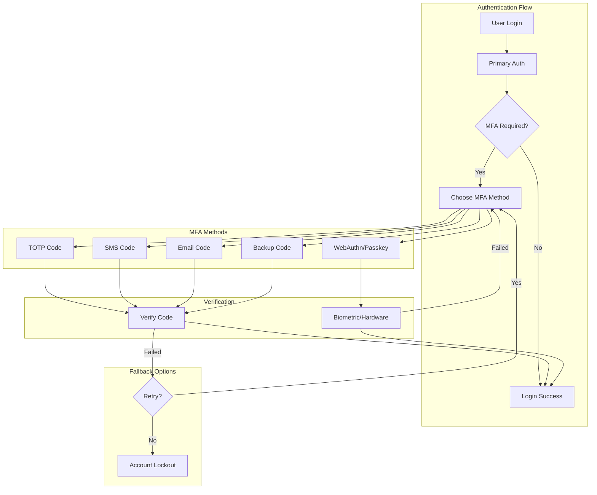

# Multi-Factor Authentication Configuration

Complete guide to configuring and customizing Flask-AppBuilder's Multi-Factor Authentication system with TOTP, SMS, email, and WebAuthn/Passkeys support.

## 🔐 Overview

Flask-AppBuilder's MFA system provides enterprise-grade second-factor authentication with support for:

- **TOTP (Time-based OTP)** - Google Authenticator, Authy, etc.
- **SMS Verification** - Text message codes via Twilio, AWS SNS
- **Email Codes** - Email-based verification codes
- **WebAuthn/Passkeys** - Hardware keys, biometric authentication
- **Backup Codes** - Recovery codes for account access
- **App Push Notifications** - Mobile app authentication

## 🏗️ MFA Architecture



## ⚙️ Basic MFA Configuration

### Enable MFA System

```python
# config.py

# Global MFA Settings
MFA_ENABLED = True
MFA_FORCE_ENABLED = True  # Require MFA for all users
MFA_ENROLLMENT_REQUIRED = True  # Force MFA setup on first login

# Grace period for MFA enrollment
MFA_GRACE_PERIOD_DAYS = 7
MFA_GRACE_PERIOD_LOGINS = 3  # Allow 3 logins without MFA during grace period

# MFA policy settings
MFA_REQUIRED_ROLES = ['Admin', 'Privileged_User']  # Specific roles requiring MFA
MFA_EXEMPT_IPS = ['192.168.1.0/24']  # Internal networks exempt from MFA
MFA_REMEMBER_DEVICE = True  # Remember trusted devices
MFA_REMEMBER_DEVICE_DAYS = 30  # Trust device for 30 days

# MFA attempt limits
MFA_MAX_ATTEMPTS = 3
MFA_LOCKOUT_DURATION = 1800  # 30 minutes
MFA_PROGRESSIVE_LOCKOUT = True  # Increase lockout time with repeated failures
```

### Database Configuration

```python
# MFA-related database models are automatically created
from flask_appbuilder.security.mfa.models import (
    MFAUser, TOTPDevice, SMSDevice, EmailDevice,
    WebAuthnCredential, BackupCode, TrustedDevice
)

# Custom MFA user model (optional)
class CustomMFAUser(MFAUser):
    __tablename__ = 'custom_mfa_user'

    # Add custom fields
    mfa_policy = Column(String(50), default='standard')
    mfa_exempt = Column(Boolean, default=False)
    last_mfa_challenge = Column(DateTime)

    # Custom MFA requirements
    def requires_mfa(self):
        if self.mfa_exempt:
            return False
        return super().requires_mfa()
```

## 📱 TOTP Configuration

### TOTP Settings

```python
# TOTP Configuration
MFA_TOTP_ENABLED = True
MFA_TOTP_ISSUER = "My Application"
MFA_TOTP_ALGORITHM = "SHA1"  # SHA1, SHA256, SHA512
MFA_TOTP_DIGITS = 6  # 6 or 8 digits
MFA_TOTP_INTERVAL = 30  # 30 seconds
MFA_TOTP_WINDOW = 1  # Allow 1 interval tolerance

# QR Code settings
MFA_TOTP_QR_CODE_ENABLED = True
MFA_TOTP_QR_CODE_SIZE = 200  # pixels
MFA_TOTP_QR_CODE_BORDER = 4

# Backup settings
MFA_TOTP_BACKUP_CODES = 10
MFA_TOTP_BACKUP_CODE_LENGTH = 8
MFA_TOTP_BACKUP_CODES_REGENERATE = True  # Allow regeneration
```

### TOTP Setup Flow

```python
# TOTP device setup
class TOTPSetupView(BaseView):
    """Custom TOTP setup view with enhanced UX."""

    @expose('/setup-totp')
    @has_access
    def setup_totp(self):
        # Generate secret
        secret = pyotp.random_base32()

        # Create TOTP URI for QR code
        totp_uri = pyotp.totp.TOTP(secret).provisioning_uri(
            name=g.user.email,
            issuer_name=current_app.config.get('MFA_TOTP_ISSUER', 'Flask-AppBuilder')
        )

        # Generate QR code
        qr_code_data = self.generate_qr_code(totp_uri)

        return self.render_template(
            'mfa/totp_setup.html',
            secret=secret,
            qr_code=qr_code_data,
            manual_entry_key=secret
        )

    def generate_qr_code(self, uri):
        """Generate QR code for TOTP setup."""
        import qrcode
        from io import BytesIO
        import base64

        qr = qrcode.QRCode(version=1, box_size=10, border=5)
        qr.add_data(uri)
        qr.make(fit=True)

        img = qr.make_image(fill_color="black", back_color="white")
        buffer = BytesIO()
        img.save(buffer, format='PNG')
        buffer.seek(0)

        return base64.b64encode(buffer.getvalue()).decode()
```

### TOTP Verification

```python
# TOTP verification service
class TOTPService:
    def __init__(self):
        self.algorithm = current_app.config.get('MFA_TOTP_ALGORITHM', 'SHA1')
        self.digits = current_app.config.get('MFA_TOTP_DIGITS', 6)
        self.interval = current_app.config.get('MFA_TOTP_INTERVAL', 30)
        self.window = current_app.config.get('MFA_TOTP_WINDOW', 1)

    def verify_token(self, secret, token, user_id=None):
        """Verify TOTP token with replay protection."""
        totp = pyotp.TOTP(secret, interval=self.interval, digits=self.digits)

        # Check current time window and adjacent windows
        current_time = int(time.time())
        for i in range(-self.window, self.window + 1):
            test_time = current_time + (i * self.interval)
            if totp.verify(token, test_time):
                # Check for replay attacks
                if user_id and self.is_token_used(user_id, token, test_time):
                    return False

                # Mark token as used
                if user_id:
                    self.mark_token_used(user_id, token, test_time)

                return True

        return False

    def is_token_used(self, user_id, token, timestamp):
        """Check if token was already used (replay protection)."""
        # Implementation depends on your token tracking strategy
        # Could use Redis, database, or in-memory cache
        pass

    def mark_token_used(self, user_id, token, timestamp):
        """Mark token as used to prevent replay."""
        pass
```

## 📧 SMS Configuration

### SMS Provider Setup

```python
# SMS MFA Configuration
MFA_SMS_ENABLED = True
MFA_SMS_PROVIDER = "twilio"  # twilio, aws_sns, nexmo, custom
MFA_SMS_CODE_LENGTH = 6
MFA_SMS_CODE_EXPIRY = 300  # 5 minutes
MFA_SMS_RATE_LIMIT = 3  # Max 3 SMS per hour per user

# Twilio Configuration
TWILIO_ACCOUNT_SID = os.environ.get('TWILIO_ACCOUNT_SID')
TWILIO_AUTH_TOKEN = os.environ.get('TWILIO_AUTH_TOKEN')
TWILIO_PHONE_NUMBER = os.environ.get('TWILIO_PHONE_NUMBER')

# AWS SNS Configuration
AWS_SNS_REGION = os.environ.get('AWS_SNS_REGION', 'us-east-1')
AWS_ACCESS_KEY_ID = os.environ.get('AWS_ACCESS_KEY_ID')
AWS_SECRET_ACCESS_KEY = os.environ.get('AWS_SECRET_ACCESS_KEY')

# Nexmo Configuration
NEXMO_API_KEY = os.environ.get('NEXMO_API_KEY')
NEXMO_API_SECRET = os.environ.get('NEXMO_API_SECRET')
NEXMO_FROM_NUMBER = os.environ.get('NEXMO_FROM_NUMBER')

# International SMS settings
SMS_INTERNATIONAL_ENABLED = True
SMS_COUNTRY_WHITELIST = ['US', 'CA', 'GB', 'DE', 'FR']  # ISO country codes
SMS_COST_THRESHOLD = 0.10  # Maximum cost per SMS in USD
```

### SMS Service Implementation

```python
# SMS service with multiple provider support
class SMSService:
    def __init__(self, provider='twilio'):
        self.provider = provider
        self.client = self._initialize_client()

    def _initialize_client(self):
        """Initialize SMS provider client."""
        if self.provider == 'twilio':
            from twilio.rest import Client
            return Client(
                current_app.config['TWILIO_ACCOUNT_SID'],
                current_app.config['TWILIO_AUTH_TOKEN']
            )
        elif self.provider == 'aws_sns':
            import boto3
            return boto3.client(
                'sns',
                region_name=current_app.config['AWS_SNS_REGION'],
                aws_access_key_id=current_app.config['AWS_ACCESS_KEY_ID'],
                aws_secret_access_key=current_app.config['AWS_SECRET_ACCESS_KEY']
            )
        # Add other providers...

    def send_verification_code(self, phone_number, code):
        """Send SMS verification code."""
        message = f"Your verification code is: {code}. Valid for 5 minutes."

        try:
            if self.provider == 'twilio':
                response = self.client.messages.create(
                    body=message,
                    from_=current_app.config['TWILIO_PHONE_NUMBER'],
                    to=phone_number
                )
                return {'success': True, 'message_sid': response.sid}

            elif self.provider == 'aws_sns':
                response = self.client.publish(
                    PhoneNumber=phone_number,
                    Message=message
                )
                return {'success': True, 'message_id': response['MessageId']}

        except Exception as e:
            current_app.logger.error(f"SMS send failed: {str(e)}")
            return {'success': False, 'error': str(e)}

    def validate_phone_number(self, phone_number):
        """Validate phone number format and carrier."""
        # Use phone number validation library
        import phonenumbers
        from phonenumbers import carrier, geocoder

        try:
            parsed = phonenumbers.parse(phone_number, None)
            if not phonenumbers.is_valid_number(parsed):
                return False, "Invalid phone number format"

            # Check if it's a mobile number
            number_type = phonenumbers.number_type(parsed)
            if number_type not in [phonenumbers.PhoneNumberType.MOBILE,
                                 phonenumbers.PhoneNumberType.FIXED_LINE_OR_MOBILE]:
                return False, "SMS can only be sent to mobile numbers"

            # Check carrier (optional)
            carrier_name = carrier.name_for_number(parsed, "en")
            if carrier_name in ['Google Voice', 'TextNow']:  # Block VoIP numbers
                return False, "VoIP numbers not supported"

            return True, None

        except Exception as e:
            return False, f"Phone validation error: {str(e)}"
```

## ✉️ Email MFA Configuration

### Email MFA Settings

```python
# Email MFA Configuration
MFA_EMAIL_ENABLED = True
MFA_EMAIL_CODE_LENGTH = 6
MFA_EMAIL_CODE_EXPIRY = 600  # 10 minutes
MFA_EMAIL_RATE_LIMIT = 5  # Max 5 emails per hour per user

# Email templates
MFA_EMAIL_TEMPLATE = 'mfa/verification_email.html'
MFA_EMAIL_SUBJECT = "Your verification code"

# Email content customization
MFA_EMAIL_FROM = os.environ.get('MFA_EMAIL_FROM', 'noreply@company.com')
MFA_EMAIL_REPLY_TO = os.environ.get('MFA_EMAIL_REPLY_TO', 'support@company.com')

# Security settings
MFA_EMAIL_REQUIRE_VERIFIED = True  # Only send to verified email addresses
MFA_EMAIL_LOG_ATTEMPTS = True  # Log all MFA email attempts
```

### Email MFA Service

```python
# Email MFA service
class EmailMFAService:
    def __init__(self, mail_service):
        self.mail = mail_service

    def send_verification_code(self, user, code):
        """Send email verification code."""
        try:
            # Generate secure email with code
            html_content = self.render_email_template(user, code)

            # Send email with security headers
            message = Message(
                subject=current_app.config.get('MFA_EMAIL_SUBJECT', 'Your verification code'),
                sender=current_app.config.get('MFA_EMAIL_FROM'),
                recipients=[user.email],
                html=html_content
            )

            # Add security headers
            message.extra_headers = {
                'X-MFA-Type': 'verification',
                'X-Auto-Response-Suppress': 'All',
                'Precedence': 'bulk'
            }

            self.mail.send(message)

            # Log successful send
            current_app.logger.info(f"MFA email sent to user {user.id}")

            return True

        except Exception as e:
            current_app.logger.error(f"Failed to send MFA email: {str(e)}")
            return False

    def render_email_template(self, user, code):
        """Render MFA email template with security considerations."""
        return render_template(
            'mfa/verification_email.html',
            user=user,
            code=code,
            expires_minutes=current_app.config.get('MFA_EMAIL_CODE_EXPIRY', 600) // 60,
            company_name=current_app.config.get('APP_NAME', 'Your Application'),
            support_email=current_app.config.get('MFA_EMAIL_REPLY_TO')
        )
```

## 🔐 WebAuthn/Passkeys Configuration

### WebAuthn Settings

```python
# WebAuthn/Passkeys Configuration
MFA_WEBAUTHN_ENABLED = True
WEBAUTHN_RP_ID = "myapp.company.com"  # Your domain
WEBAUTHN_RP_NAME = "My Application"
WEBAUTHN_RP_ICON = "https://myapp.company.com/static/icon.png"

# Authentication requirements
WEBAUTHN_USER_VERIFICATION = "preferred"  # required, preferred, discouraged
WEBAUTHN_REQUIRE_RESIDENT_KEY = False  # True for passwordless
WEBAUTHN_AUTHENTICATOR_ATTACHMENT = "cross-platform"  # platform, cross-platform

# Algorithm preferences (in order of preference)
WEBAUTHN_ALGORITHMS = [
    {"type": "public-key", "alg": -7},   # ES256
    {"type": "public-key", "alg": -35},  # ES384
    {"type": "public-key", "alg": -36},  # ES512
    {"type": "public-key", "alg": -257}, # RS256
]

# Timeout settings
WEBAUTHN_TIMEOUT = 60000  # 60 seconds in milliseconds
WEBAUTHN_CHALLENGE_SIZE = 64  # bytes

# Advanced settings
WEBAUTHN_ATTESTATION = "none"  # none, indirect, direct
WEBAUTHN_EXTENSIONS = {
    "credProps": True,
    "uvm": True
}
```

### WebAuthn Service Implementation

```python
# WebAuthn service for passkey management
from webauthn import generate_registration_options, verify_registration_response
from webauthn import generate_authentication_options, verify_authentication_response
from webauthn.helpers.structs import (
    AuthenticatorSelectionCriteria, UserVerificationRequirement,
    AttestationConveyancePreference, PublicKeyCredentialDescriptor
)

class WebAuthnService:
    def __init__(self):
        self.rp_id = current_app.config['WEBAUTHN_RP_ID']
        self.rp_name = current_app.config['WEBAUTHN_RP_NAME']
        self.origin = f"https://{self.rp_id}"

    def generate_registration_options(self, user):
        """Generate WebAuthn registration options."""
        # Get existing credentials to exclude
        existing_credentials = self.get_user_credentials(user.id)
        exclude_credentials = [
            PublicKeyCredentialDescriptor(id=cred.credential_id)
            for cred in existing_credentials
        ]

        options = generate_registration_options(
            rp_id=self.rp_id,
            rp_name=self.rp_name,
            user_id=str(user.id).encode(),
            user_name=user.username,
            user_display_name=user.get_full_name(),
            exclude_credentials=exclude_credentials,
            authenticator_selection=AuthenticatorSelectionCriteria(
                authenticator_attachment=current_app.config.get('WEBAUTHN_AUTHENTICATOR_ATTACHMENT'),
                require_resident_key=current_app.config.get('WEBAUTHN_REQUIRE_RESIDENT_KEY', False),
                user_verification=UserVerificationRequirement(
                    current_app.config.get('WEBAUTHN_USER_VERIFICATION', 'preferred')
                )
            ),
            attestation=AttestationConveyancePreference(
                current_app.config.get('WEBAUTHN_ATTESTATION', 'none')
            ),
            supported_pub_key_algs=current_app.config.get('WEBAUTHN_ALGORITHMS', []),
            timeout=current_app.config.get('WEBAUTHN_TIMEOUT', 60000)
        )

        # Store challenge for verification
        session['webauthn_challenge'] = options.challenge

        return options

    def verify_registration(self, credential, user):
        """Verify WebAuthn registration response."""
        challenge = session.get('webauthn_challenge')
        if not challenge:
            raise ValueError("No challenge found in session")

        verification = verify_registration_response(
            credential=credential,
            expected_challenge=challenge,
            expected_origin=self.origin,
            expected_rp_id=self.rp_id
        )

        if verification.verified:
            # Store credential
            webauthn_credential = WebAuthnCredential(
                user_id=user.id,
                credential_id=verification.credential_id,
                credential_public_key=verification.credential_public_key,
                sign_count=verification.sign_count,
                credential_device_type=verification.credential_device_type,
                credential_backed_up=verification.credential_backed_up,
                transports=credential.response.transports if hasattr(credential.response, 'transports') else None
            )

            db.session.add(webauthn_credential)
            db.session.commit()

            # Clear challenge
            session.pop('webauthn_challenge', None)

            return webauthn_credential

        return None

    def generate_authentication_options(self, user=None):
        """Generate WebAuthn authentication options."""
        allow_credentials = []

        if user:
            # User-specific authentication
            credentials = self.get_user_credentials(user.id)
            allow_credentials = [
                PublicKeyCredentialDescriptor(
                    id=cred.credential_id,
                    transports=cred.transports or []
                )
                for cred in credentials
            ]

        options = generate_authentication_options(
            rp_id=self.rp_id,
            allow_credentials=allow_credentials,
            user_verification=UserVerificationRequirement(
                current_app.config.get('WEBAUTHN_USER_VERIFICATION', 'preferred')
            ),
            timeout=current_app.config.get('WEBAUTHN_TIMEOUT', 60000)
        )

        # Store challenge for verification
        session['webauthn_auth_challenge'] = options.challenge

        return options

    def verify_authentication(self, credential, user=None):
        """Verify WebAuthn authentication response."""
        challenge = session.get('webauthn_auth_challenge')
        if not challenge:
            raise ValueError("No authentication challenge found in session")

        # Find the credential
        stored_credential = WebAuthnCredential.query.filter_by(
            credential_id=credential.id
        ).first()

        if not stored_credential:
            raise ValueError("Credential not found")

        verification = verify_authentication_response(
            credential=credential,
            expected_challenge=challenge,
            expected_origin=self.origin,
            expected_rp_id=self.rp_id,
            credential_public_key=stored_credential.credential_public_key,
            credential_current_sign_count=stored_credential.sign_count
        )

        if verification.verified:
            # Update sign count
            stored_credential.sign_count = verification.new_sign_count
            db.session.commit()

            # Clear challenge
            session.pop('webauthn_auth_challenge', None)

            return stored_credential.user_id

        return None

    def get_user_credentials(self, user_id):
        """Get all WebAuthn credentials for a user."""
        return WebAuthnCredential.query.filter_by(user_id=user_id).all()
```

## 🔑 Backup Codes Configuration

### Backup Code Settings

```python
# Backup Codes Configuration
MFA_BACKUP_CODES_ENABLED = True
MFA_BACKUP_CODES_COUNT = 10  # Number of backup codes to generate
MFA_BACKUP_CODES_LENGTH = 8  # Length of each code
MFA_BACKUP_CODES_REGENERATE = True  # Allow regeneration
MFA_BACKUP_CODES_WARN_THRESHOLD = 3  # Warn when ≤3 codes remain

# Code format
MFA_BACKUP_CODE_FORMAT = "XXXX-XXXX"  # Format pattern
MFA_BACKUP_CODE_CHARSET = "23456789ABCDEFGHJKLMNPQRSTUVWXYZ"  # Exclude confusing chars

# Security settings
MFA_BACKUP_CODES_HASH_ALGORITHM = "pbkdf2_sha256"
MFA_BACKUP_CODES_HASH_ITERATIONS = 100000
```

### Backup Code Service

```python
# Backup codes service
import secrets
import string
from werkzeug.security import generate_password_hash, check_password_hash

class BackupCodeService:
    def __init__(self):
        self.count = current_app.config.get('MFA_BACKUP_CODES_COUNT', 10)
        self.length = current_app.config.get('MFA_BACKUP_CODES_LENGTH', 8)
        self.charset = current_app.config.get(
            'MFA_BACKUP_CODE_CHARSET',
            '23456789ABCDEFGHJKLMNPQRSTUVWXYZ'  # No 0,1,I,O to avoid confusion
        )

    def generate_backup_codes(self, user_id):
        """Generate new backup codes for user."""
        # Remove existing codes
        BackupCode.query.filter_by(user_id=user_id).delete()

        codes = []
        for _ in range(self.count):
            # Generate random code
            raw_code = ''.join(secrets.choice(self.charset) for _ in range(self.length))

            # Format code (e.g., XXXX-XXXX)
            formatted_code = self.format_code(raw_code)

            # Hash code for storage
            hashed_code = generate_password_hash(
                raw_code,
                method=current_app.config.get('MFA_BACKUP_CODES_HASH_ALGORITHM', 'pbkdf2:sha256'),
                salt_length=16
            )

            # Store hashed version
            backup_code = BackupCode(
                user_id=user_id,
                code_hash=hashed_code,
                used=False,
                created_at=datetime.utcnow()
            )
            db.session.add(backup_code)

            # Keep plain text for display to user (only once)
            codes.append(formatted_code)

        db.session.commit()
        return codes

    def format_code(self, code):
        """Format backup code for display."""
        format_pattern = current_app.config.get('MFA_BACKUP_CODE_FORMAT', 'XXXX-XXXX')

        if '-' in format_pattern:
            # Split code into chunks
            chunk_size = len(format_pattern.split('-')[0])
            chunks = [code[i:i+chunk_size] for i in range(0, len(code), chunk_size)]
            return '-'.join(chunks)

        return code

    def verify_backup_code(self, user_id, code):
        """Verify and consume backup code."""
        # Remove formatting
        clean_code = code.replace('-', '').upper()

        # Find matching unused code
        backup_codes = BackupCode.query.filter_by(
            user_id=user_id,
            used=False
        ).all()

        for backup_code in backup_codes:
            if check_password_hash(backup_code.code_hash, clean_code):
                # Mark as used
                backup_code.used = True
                backup_code.used_at = datetime.utcnow()
                db.session.commit()

                # Check remaining codes and warn user
                remaining = BackupCode.query.filter_by(
                    user_id=user_id,
                    used=False
                ).count()

                warn_threshold = current_app.config.get('MFA_BACKUP_CODES_WARN_THRESHOLD', 3)
                if remaining <= warn_threshold:
                    self.warn_low_backup_codes(user_id, remaining)

                return True

        return False

    def get_remaining_codes_count(self, user_id):
        """Get count of remaining unused backup codes."""
        return BackupCode.query.filter_by(
            user_id=user_id,
            used=False
        ).count()

    def warn_low_backup_codes(self, user_id, remaining_count):
        """Send warning about low backup code count."""
        # Implementation depends on notification system
        pass
```

## 🔧 Advanced MFA Features

### Adaptive MFA

```python
# Adaptive MFA based on risk assessment
class AdaptiveMFAService:
    def __init__(self):
        self.risk_factors = {
            'new_device': 0.3,
            'new_location': 0.4,
            'suspicious_ip': 0.5,
            'off_hours_access': 0.2,
            'failed_attempts': 0.6,
            'privilege_escalation': 0.8
        }

    def assess_login_risk(self, user, request_context):
        """Assess risk level for login attempt."""
        risk_score = 0.0
        factors = []

        # Device fingerprinting
        if self.is_new_device(user, request_context):
            risk_score += self.risk_factors['new_device']
            factors.append('new_device')

        # Geolocation
        if self.is_new_location(user, request_context):
            risk_score += self.risk_factors['new_location']
            factors.append('new_location')

        # IP reputation
        if self.is_suspicious_ip(request_context['ip_address']):
            risk_score += self.risk_factors['suspicious_ip']
            factors.append('suspicious_ip')

        # Time-based
        if self.is_off_hours_access(user, request_context):
            risk_score += self.risk_factors['off_hours_access']
            factors.append('off_hours_access')

        # Recent failed attempts
        if self.has_recent_failed_attempts(user):
            risk_score += self.risk_factors['failed_attempts']
            factors.append('failed_attempts')

        return {
            'risk_score': min(risk_score, 1.0),  # Cap at 1.0
            'risk_level': self.get_risk_level(risk_score),
            'factors': factors
        }

    def get_risk_level(self, score):
        """Convert risk score to level."""
        if score >= 0.7:
            return 'high'
        elif score >= 0.4:
            return 'medium'
        else:
            return 'low'

    def get_required_mfa_methods(self, risk_level, user):
        """Determine required MFA methods based on risk."""
        if risk_level == 'high':
            return ['webauthn', 'totp']  # Require hardware key + TOTP
        elif risk_level == 'medium':
            return ['totp', 'sms', 'email']  # Any strong method
        else:
            return ['totp', 'sms', 'email', 'backup']  # Any method including backup
```

### MFA Analytics and Reporting

```python
# MFA analytics service
class MFAAnalyticsService:
    def __init__(self, db_session):
        self.db = db_session

    def get_mfa_adoption_stats(self):
        """Get MFA adoption statistics."""
        total_users = self.db.query(User).count()
        mfa_enabled_users = self.db.query(User).join(MFAUser).count()

        adoption_by_method = self.db.query(
            func.count(TOTPDevice.id).label('totp'),
            func.count(SMSDevice.id).label('sms'),
            func.count(WebAuthnCredential.id).label('webauthn')
        ).outerjoin(TOTPDevice).outerjoin(SMSDevice).outerjoin(WebAuthnCredential).first()

        return {
            'total_users': total_users,
            'mfa_enabled': mfa_enabled_users,
            'adoption_rate': (mfa_enabled_users / total_users * 100) if total_users > 0 else 0,
            'methods': {
                'totp': adoption_by_method.totp or 0,
                'sms': adoption_by_method.sms or 0,
                'webauthn': adoption_by_method.webauthn or 0
            }
        }

    def get_mfa_usage_trends(self, days=30):
        """Get MFA usage trends over time."""
        start_date = datetime.now() - timedelta(days=days)

        daily_stats = self.db.query(
            func.date(MFAAttempt.created_at).label('date'),
            func.count(MFAAttempt.id).label('total_attempts'),
            func.sum(case([(MFAAttempt.success == True, 1)], else_=0)).label('successful'),
            func.sum(case([(MFAAttempt.method == 'totp', 1)], else_=0)).label('totp_attempts'),
            func.sum(case([(MFAAttempt.method == 'sms', 1)], else_=0)).label('sms_attempts'),
            func.sum(case([(MFAAttempt.method == 'webauthn', 1)], else_=0)).label('webauthn_attempts')
        ).filter(
            MFAAttempt.created_at >= start_date
        ).group_by(
            func.date(MFAAttempt.created_at)
        ).all()

        return [
            {
                'date': stat.date.isoformat(),
                'total_attempts': stat.total_attempts,
                'successful': stat.successful,
                'success_rate': (stat.successful / stat.total_attempts * 100) if stat.total_attempts > 0 else 0,
                'methods': {
                    'totp': stat.totp_attempts,
                    'sms': stat.sms_attempts,
                    'webauthn': stat.webauthn_attempts
                }
            }
            for stat in daily_stats
        ]

    def identify_mfa_issues(self):
        """Identify common MFA issues and failures."""
        # High failure rate users
        problem_users = self.db.query(
            MFAAttempt.user_id,
            func.count(MFAAttempt.id).label('total_attempts'),
            func.sum(case([(MFAAttempt.success == False, 1)], else_=0)).label('failures')
        ).filter(
            MFAAttempt.created_at >= datetime.now() - timedelta(days=7)
        ).group_by(
            MFAAttempt.user_id
        ).having(
            func.sum(case([(MFAAttempt.success == False, 1)], else_=0)) > 5
        ).all()

        # Method-specific failure rates
        method_failures = self.db.query(
            MFAAttempt.method,
            func.count(MFAAttempt.id).label('total'),
            func.sum(case([(MFAAttempt.success == False, 1)], else_=0)).label('failures')
        ).filter(
            MFAAttempt.created_at >= datetime.now() - timedelta(days=7)
        ).group_by(
            MFAAttempt.method
        ).all()

        return {
            'problem_users': [
                {
                    'user_id': user.user_id,
                    'total_attempts': user.total_attempts,
                    'failures': user.failures,
                    'failure_rate': (user.failures / user.total_attempts * 100)
                }
                for user in problem_users
            ],
            'method_failures': [
                {
                    'method': method.method,
                    'total_attempts': method.total,
                    'failures': method.failures,
                    'failure_rate': (method.failures / method.total * 100) if method.total > 0 else 0
                }
                for method in method_failures
            ]
        }
```

## 🎯 User Experience Enhancements

### Progressive MFA Setup

```python
# Progressive MFA setup wizard
class MFASetupWizard:
    def __init__(self, user):
        self.user = user
        self.setup_steps = [
            'backup_codes',
            'primary_method',
            'secondary_method',
            'test_methods'
        ]

    def get_setup_progress(self):
        """Get user's MFA setup progress."""
        progress = {
            'completed_steps': [],
            'current_step': None,
            'total_steps': len(self.setup_steps),
            'completion_percentage': 0
        }

        # Check backup codes
        if BackupCode.query.filter_by(user_id=self.user.id, used=False).count() > 0:
            progress['completed_steps'].append('backup_codes')

        # Check primary method (TOTP or WebAuthn)
        if (TOTPDevice.query.filter_by(user_id=self.user.id, confirmed=True).first() or
            WebAuthnCredential.query.filter_by(user_id=self.user.id).first()):
            progress['completed_steps'].append('primary_method')

        # Check secondary method
        if len(progress['completed_steps']) >= 2:
            progress['completed_steps'].append('secondary_method')

        # Check if tested
        if MFAAttempt.query.filter_by(user_id=self.user.id, success=True).first():
            progress['completed_steps'].append('test_methods')

        # Determine current step
        for step in self.setup_steps:
            if step not in progress['completed_steps']:
                progress['current_step'] = step
                break

        progress['completion_percentage'] = (
            len(progress['completed_steps']) / progress['total_steps'] * 100
        )

        return progress

    def get_recommended_next_action(self):
        """Get personalized recommendation for next MFA setup step."""
        progress = self.get_setup_progress()

        if progress['current_step'] == 'backup_codes':
            return {
                'action': 'generate_backup_codes',
                'title': 'Generate Backup Codes',
                'description': 'Create recovery codes in case you lose access to your devices',
                'urgency': 'high'
            }
        elif progress['current_step'] == 'primary_method':
            return {
                'action': 'setup_authenticator',
                'title': 'Set Up Authenticator App',
                'description': 'Use Google Authenticator or similar app for secure login codes',
                'urgency': 'high'
            }
        elif progress['current_step'] == 'secondary_method':
            return {
                'action': 'add_phone_number',
                'title': 'Add Phone Number',
                'description': 'Add SMS as a backup authentication method',
                'urgency': 'medium'
            }
        else:
            return {
                'action': 'test_mfa',
                'title': 'Test Your Setup',
                'description': 'Verify your MFA methods work correctly',
                'urgency': 'low'
            }
```

For more information, see:
- [Security Architecture](security_architecture.md)
- [RBAC Configuration](rbac_configuration.md)
- [Security API Reference](security_api_reference.md)
- [MFA Tutorial](../tutorials/mfa_setup.md)