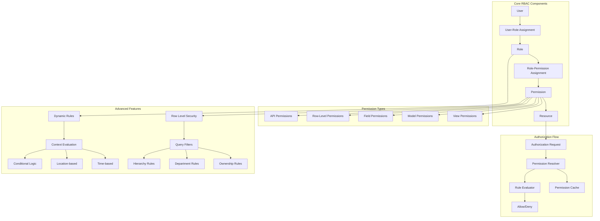

# RBAC Configuration Guide

Complete guide to configuring Role-Based Access Control (RBAC) in Flask-AppBuilder with advanced permission management, dynamic authorization, and row-level security.

## 🎭 Overview

Flask-AppBuilder's RBAC system provides enterprise-grade authorization with:

- **Hierarchical Roles** with inheritance and delegation
- **Fine-Grained Permissions** at view, model, field, and row levels
- **Dynamic Authorization** with context-aware rules
- **Row-Level Security (RLS)** for data isolation
- **Resource-Based Permissions** with conditions
- **Audit Trail** for permission changes and access

## 🏗️ RBAC Architecture



## ⚙️ Basic RBAC Configuration

### Enable RBAC System

```python
# config.py

# RBAC Core Settings
RBAC_ENABLED = True
AUTH_ROLE_ADMIN = 'Admin'
AUTH_ROLE_PUBLIC = 'Public'

# Permission auto-generation
AUTH_AUTO_CREATE_PERMISSIONS = True
AUTH_UPDATE_PERMS = True  # Update permissions on app start

# Role management
AUTH_ROLES_SYNC_AT_LOGIN = True  # Sync roles from external systems
AUTH_ROLES_MAPPING = {}  # External role mapping

# Permission caching
RBAC_PERMISSION_CACHE_ENABLED = True
RBAC_PERMISSION_CACHE_TTL = 300  # 5 minutes
RBAC_CACHE_BACKEND = 'redis'  # memory, redis, database

# Advanced features
RBAC_ROW_LEVEL_SECURITY = True
RBAC_DYNAMIC_PERMISSIONS = True
RBAC_FIELD_LEVEL_SECURITY = True
RBAC_AUDIT_PERMISSION_CHANGES = True
```

### Built-in Roles

```python
# Default system roles
BUILTIN_ROLES = {
    'Admin': {
        'description': 'System Administrator with full access',
        'permissions': ['all'],
        'is_admin': True,
        'can_edit_roles': True
    },
    'Viewer': {
        'description': 'Read-only access to data',
        'permissions': ['can_list', 'can_show'],
        'is_admin': False
    },
    'User': {
        'description': 'Standard user with basic permissions',
        'permissions': ['can_list', 'can_show', 'can_edit_own'],
        'is_admin': False
    },
    'Manager': {
        'description': 'Department manager with team access',
        'permissions': ['can_list', 'can_show', 'can_edit', 'can_add'],
        'is_admin': False,
        'can_manage_department': True
    },
    'Public': {
        'description': 'Anonymous/unauthenticated users',
        'permissions': ['can_list_public'],
        'is_admin': False
    }
}

# Role hierarchy (inheritance)
ROLE_HIERARCHY = {
    'Admin': ['Manager', 'User', 'Viewer'],
    'Manager': ['User', 'Viewer'],
    'User': ['Viewer'],
    'Viewer': []
}
```

## 🔑 Permission System

### Permission Types and Structure

```python
# Permission naming conventions
PERMISSION_PATTERNS = {
    # View permissions
    'view': 'can_{action}_{view_name}',
    # Model permissions
    'model': 'can_{action}_{model_name}',
    # Field permissions
    'field': 'can_{action}_{model_name}_{field_name}',
    # API permissions
    'api': 'can_{action}_api_{endpoint}',
    # Custom permissions
    'custom': 'can_{custom_permission_name}'
}

# Standard actions
STANDARD_ACTIONS = [
    'list',      # View list of records
    'show',      # View individual record
    'add',       # Create new record
    'edit',      # Modify existing record
    'delete',    # Remove record
    'download',  # Download/export data
    'upload',    # Upload/import data
    'approve',   # Approval workflow actions
    'audit'      # View audit trails
]

# Permission metadata
class Permission(Model):
    __tablename__ = 'ab_permission'

    id = Column(Integer, primary_key=True)
    name = Column(String(100), unique=True, nullable=False)
    display_name = Column(String(100))
    description = Column(Text)

    # Permission categorization
    permission_type = Column(String(50))  # view, model, field, api, custom
    resource_type = Column(String(50))    # table, endpoint, function
    resource_name = Column(String(100))   # specific resource identifier

    # Conditional permissions
    condition_rule = Column(Text)         # JSON rule for dynamic evaluation
    context_required = Column(Boolean, default=False)

    # Audit and lifecycle
    created_by_id = Column(Integer, ForeignKey('ab_user.id'))
    created_at = Column(DateTime, default=datetime.utcnow)
    is_active = Column(Boolean, default=True)
```

### Automatic Permission Generation

```python
# Automatic permission generation for views
class AutoPermissionMixin:
    """Mixin to automatically generate permissions for views."""

    # Override to customize generated permissions
    base_permissions = ['can_list', 'can_show', 'can_add', 'can_edit', 'can_delete']

    # Custom permission definitions
    extra_permissions = []

    # Exclude specific permissions
    excluded_permissions = []

    @classmethod
    def generate_permissions(cls):
        """Generate permissions for this view."""
        permissions = []

        for action in cls.base_permissions:
            if action not in cls.excluded_permissions:
                perm_name = f"{action}_{cls.__name__}"
                permissions.append({
                    'name': perm_name,
                    'display_name': f"{action.replace('can_', '').title()} {cls.__name__}",
                    'permission_type': 'view',
                    'resource_type': 'view',
                    'resource_name': cls.__name__
                })

        # Add extra permissions
        for extra_perm in cls.extra_permissions:
            permissions.append(extra_perm)

        return permissions

# Example view with custom permissions
class EmployeeModelView(ModelView, AutoPermissionMixin):
    datamodel = SQLAInterface(Employee)

    # Custom permissions beyond CRUD
    extra_permissions = [
        {
            'name': 'can_approve_employee',
            'display_name': 'Approve Employee Records',
            'description': 'Approve employee data changes',
            'permission_type': 'custom'
        },
        {
            'name': 'can_export_employee_data',
            'display_name': 'Export Employee Data',
            'description': 'Export employee information to external formats',
            'permission_type': 'custom'
        }
    ]

    # Exclude delete permission
    excluded_permissions = ['can_delete']
```

### Field-Level Permissions

```python
# Field-level permission configuration
class FieldLevelPermissionMixin:
    """Mixin for field-level access control."""

    # Define field permissions
    field_permissions = {
        'salary': ['can_view_salary', 'can_edit_salary'],
        'ssn': ['can_view_ssn'],
        'performance_rating': ['can_view_performance', 'can_edit_performance'],
        'medical_info': ['can_view_medical', 'can_edit_medical']
    }

    # Role-based field visibility
    field_visibility_by_role = {
        'HR': ['salary', 'ssn', 'medical_info'],
        'Manager': ['salary', 'performance_rating'],
        'User': ['name', 'email', 'department'],
        'Viewer': ['name', 'department']
    }

    def get_accessible_fields(self, user, action='view'):
        """Get list of fields accessible to user for given action."""
        accessible_fields = []

        for field_name, required_perms in self.field_permissions.items():
            # Check if user has required permission for this field
            action_perm = f'can_{action}_{field_name}'
            if action_perm in required_perms:
                if user.has_permission(action_perm):
                    accessible_fields.append(field_name)
            else:
                # Check role-based visibility
                for role in user.roles:
                    if role.name in self.field_visibility_by_role:
                        if field_name in self.field_visibility_by_role[role.name]:
                            accessible_fields.append(field_name)
                            break

        return accessible_fields

    def filter_form_fields(self, form, user, action='edit'):
        """Filter form fields based on user permissions."""
        accessible_fields = self.get_accessible_fields(user, action)

        # Remove inaccessible fields from form
        for field_name in list(form._fields.keys()):
            if field_name not in accessible_fields and field_name not in ['csrf_token', 'submit']:
                delattr(form, field_name)

        return form

# Enhanced ModelView with field permissions
class SecureEmployeeView(ModelView, FieldLevelPermissionMixin):
    datamodel = SQLAInterface(Employee)

    def edit_form(self):
        """Override to apply field-level permissions."""
        form = super().edit_form()
        return self.filter_form_fields(form, g.user, 'edit')

    def show_form(self):
        """Override to apply field-level permissions."""
        form = super().show_form()
        return self.filter_form_fields(form, g.user, 'view')
```

## 🔒 Row-Level Security (RLS)

### RLS Configuration

```python
# Row-level security configuration
RLS_RULES = {
    'department_isolation': {
        'enabled': True,
        'description': 'Users can only access records from their department',
        'applies_to': ['Employee', 'Project', 'Budget'],
        'rule': 'record.department_id == user.department_id'
    },
    'ownership_based': {
        'enabled': True,
        'description': 'Users can only access records they created or own',
        'applies_to': ['Document', 'Report', 'Request'],
        'rule': 'record.created_by_id == user.id OR record.owner_id == user.id'
    },
    'hierarchical_access': {
        'enabled': True,
        'description': 'Managers can access their team members\' records',
        'applies_to': ['Employee', 'TimeEntry', 'ExpenseReport'],
        'rule': 'user.is_manager_of(record.employee_id) OR record.employee_id == user.id'
    },
    'temporal_access': {
        'enabled': True,
        'description': 'Access to records based on time windows',
        'applies_to': ['FinancialReport'],
        'rule': 'record.fiscal_year >= user.access_start_year'
    }
}

# RLS exemptions
RLS_EXEMPTIONS = {
    'roles': ['Admin', 'Auditor'],  # Roles that bypass RLS
    'permissions': ['can_access_all_data'],  # Permissions that bypass RLS
    'emergency_access': True  # Allow emergency override
}
```

### RLS Implementation

```python
# Row-level security engine
class RowLevelSecurityEngine:
    def __init__(self, db_session):
        self.db = db_session
        self.rules = current_app.config.get('RLS_RULES', {})
        self.exemptions = current_app.config.get('RLS_EXEMPTIONS', {})

    def apply_rls_filter(self, query, model_class, user, action='list'):
        """Apply row-level security filters to query."""

        # Check if user is exempt from RLS
        if self.is_user_exempt(user):
            return query

        model_name = model_class.__name__
        applicable_rules = [
            rule for rule_name, rule in self.rules.items()
            if rule.get('enabled', False) and model_name in rule.get('applies_to', [])
        ]

        for rule_config in applicable_rules:
            rule_expression = rule_config['rule']
            filter_condition = self.evaluate_rule(rule_expression, model_class, user)

            if filter_condition is not None:
                query = query.filter(filter_condition)

        return query

    def is_user_exempt(self, user):
        """Check if user is exempt from RLS."""
        # Check role exemptions
        exempt_roles = self.exemptions.get('roles', [])
        if any(user.has_role(role) for role in exempt_roles):
            return True

        # Check permission exemptions
        exempt_permissions = self.exemptions.get('permissions', [])
        if any(user.has_permission(perm) for perm in exempt_permissions):
            return True

        return False

    def evaluate_rule(self, rule_expression, model_class, user):
        """Evaluate RLS rule expression to SQLAlchemy filter."""

        # Department-based filtering
        if 'department_id' in rule_expression:
            if hasattr(model_class, 'department_id') and hasattr(user, 'department_id'):
                return model_class.department_id == user.department_id

        # Ownership-based filtering
        if 'created_by_id' in rule_expression:
            if hasattr(model_class, 'created_by_id'):
                conditions = [model_class.created_by_id == user.id]

                if 'owner_id' in rule_expression and hasattr(model_class, 'owner_id'):
                    conditions.append(model_class.owner_id == user.id)

                return or_(*conditions)

        # Hierarchical access (managers accessing team records)
        if 'is_manager_of' in rule_expression:
            if hasattr(model_class, 'employee_id'):
                # Get user's direct reports
                subordinate_ids = self.get_subordinate_ids(user)
                subordinate_ids.append(user.id)  # Include user's own records

                return model_class.employee_id.in_(subordinate_ids)

        # Temporal access
        if 'fiscal_year' in rule_expression and 'access_start_year' in rule_expression:
            if hasattr(model_class, 'fiscal_year') and hasattr(user, 'access_start_year'):
                return model_class.fiscal_year >= user.access_start_year

        return None

    def get_subordinate_ids(self, user):
        """Get IDs of users who report to this user."""
        # Implementation depends on your org chart structure
        from .models import Employee

        subordinates = self.db.query(Employee.id).filter(
            Employee.manager_id == user.id
        ).all()

        return [sub.id for sub in subordinates]

    def check_record_access(self, user, record, action='view'):
        """Check if user can access specific record."""
        model_class = record.__class__

        # Create a query for just this record
        query = self.db.query(model_class).filter(
            model_class.id == record.id
        )

        # Apply RLS filters
        filtered_query = self.apply_rls_filter(query, model_class, user, action)

        # Check if record is still accessible after filtering
        return filtered_query.first() is not None
```

### ModelView Integration with RLS

```python
# Enhanced ModelView with RLS
class SecureModelView(ModelView):
    """ModelView with automatic RLS enforcement."""

    def __init__(self, datamodel, security_manager=None):
        super().__init__(datamodel)
        self.rls_engine = RowLevelSecurityEngine(self.datamodel.session)
        self.security_manager = security_manager or current_app.appbuilder.sm

    def get_query(self):
        """Override to apply RLS filters."""
        query = super().get_query()

        if hasattr(g, 'user') and g.user:
            query = self.rls_engine.apply_rls_filter(
                query,
                self.datamodel.obj,
                g.user,
                'list'
            )

        return query

    def get_show_query(self, id):
        """Override show query with RLS."""
        query = super().get_show_query(id)

        if hasattr(g, 'user') and g.user:
            query = self.rls_engine.apply_rls_filter(
                query,
                self.datamodel.obj,
                g.user,
                'show'
            )

        return query

    def pre_update(self, item):
        """Check RLS permissions before update."""
        if hasattr(g, 'user') and g.user:
            if not self.rls_engine.check_record_access(g.user, item, 'edit'):
                raise Unauthorized("You don't have permission to edit this record")

    def pre_delete(self, item):
        """Check RLS permissions before delete."""
        if hasattr(g, 'user') and g.user:
            if not self.rls_engine.check_record_access(g.user, item, 'delete'):
                raise Unauthorized("You don't have permission to delete this record")
```

## 🔄 Dynamic Permissions

### Context-Aware Authorization

```python
# Dynamic permission rules
DYNAMIC_PERMISSION_RULES = {
    'time_based_access': {
        'name': 'Business Hours Access',
        'description': 'Restrict access to business hours only',
        'condition': '''
            import datetime
            now = datetime.datetime.now()
            return (9 <= now.hour <= 17) and (now.weekday() < 5)
        ''',
        'applies_to': ['sensitive_data_view', 'financial_reports'],
        'failure_message': 'Access restricted to business hours (9 AM - 5 PM, weekdays)'
    },
    'location_based_access': {
        'name': 'Office Network Access',
        'description': 'Require access from office network',
        'condition': '''
            allowed_networks = ['192.168.1.0/24', '10.0.0.0/8', '172.16.0.0/12']
            import ipaddress
            user_ip = context.get('ip_address')
            if not user_ip:
                return False
            for network in allowed_networks:
                if ipaddress.ip_address(user_ip) in ipaddress.ip_network(network):
                    return True
            return False
        ''',
        'applies_to': ['admin_panel', 'user_management'],
        'failure_message': 'Access restricted to office network'
    },
    'device_trust_level': {
        'name': 'Trusted Device Requirement',
        'description': 'Require access from trusted/managed devices',
        'condition': '''
            device_trust = context.get('device_trust_level', 0)
            return device_trust >= 80  # Require 80% trust score
        ''',
        'applies_to': ['confidential_documents', 'employee_records'],
        'failure_message': 'Access requires a trusted device'
    },
    'concurrent_session_limit': {
        'name': 'Concurrent Session Limit',
        'description': 'Limit number of concurrent sessions',
        'condition': '''
            max_sessions = context.get('max_concurrent_sessions', 3)
            active_sessions = context.get('active_session_count', 0)
            return active_sessions < max_sessions
        ''',
        'applies_to': ['all'],
        'failure_message': 'Maximum concurrent sessions exceeded'
    }
}

# Dynamic permission evaluator
class DynamicPermissionEvaluator:
    def __init__(self):
        self.rules = current_app.config.get('DYNAMIC_PERMISSION_RULES', {})
        self.compiled_rules = {}
        self._compile_rules()

    def _compile_rules(self):
        """Pre-compile Python code for rule conditions."""
        for rule_name, rule_config in self.rules.items():
            try:
                compiled_code = compile(rule_config['condition'], f'<rule:{rule_name}>', 'eval')
                self.compiled_rules[rule_name] = compiled_code
            except SyntaxError as e:
                current_app.logger.error(f"Syntax error in rule {rule_name}: {e}")

    def evaluate_permission(self, user, permission_name, context=None):
        """Evaluate dynamic permission with context."""
        context = context or {}

        # Add user context
        context.update({
            'user': user,
            'user_id': user.id,
            'user_roles': [role.name for role in user.roles],
            'user_permissions': [perm.name for perm in user.permissions]
        })

        # Find applicable rules
        applicable_rules = [
            (rule_name, rule_config)
            for rule_name, rule_config in self.rules.items()
            if permission_name in rule_config.get('applies_to', []) or 'all' in rule_config.get('applies_to', [])
        ]

        # Evaluate each applicable rule
        for rule_name, rule_config in applicable_rules:
            if rule_name in self.compiled_rules:
                try:
                    result = eval(self.compiled_rules[rule_name], {'context': context})
                    if not result:
                        return {
                            'allowed': False,
                            'reason': rule_config.get('failure_message', f'Rule {rule_name} failed'),
                            'rule': rule_name
                        }
                except Exception as e:
                    current_app.logger.error(f"Error evaluating rule {rule_name}: {e}")
                    # Fail secure - deny access if rule evaluation fails
                    return {
                        'allowed': False,
                        'reason': 'Permission evaluation failed',
                        'rule': rule_name
                    }

        return {'allowed': True}

# Integration with permission checking
def enhanced_has_permission(user, permission_name, context=None):
    """Enhanced permission check with dynamic rules."""

    # First check static RBAC permissions
    if not user.has_permission(permission_name):
        return False

    # Then evaluate dynamic rules
    evaluator = DynamicPermissionEvaluator()
    result = evaluator.evaluate_permission(user, permission_name, context)

    if not result['allowed']:
        # Log dynamic permission denial
        current_app.logger.info(
            f"Dynamic permission denied for user {user.id}, "
            f"permission {permission_name}: {result['reason']}"
        )

    return result['allowed']
```

### Conditional Resource Access

```python
# Resource-based conditional permissions
class ConditionalResourceManager:
    def __init__(self):
        self.resource_conditions = {}

    def register_resource_condition(self, resource_type, condition_func):
        """Register a condition function for a resource type."""
        self.resource_conditions[resource_type] = condition_func

    def check_resource_access(self, user, resource, action, context=None):
        """Check if user can perform action on specific resource."""
        resource_type = resource.__class__.__name__

        if resource_type in self.resource_conditions:
            condition_func = self.resource_conditions[resource_type]
            return condition_func(user, resource, action, context or {})

        # Default to standard permission check
        permission_name = f"can_{action}_{resource_type}"
        return enhanced_has_permission(user, permission_name, context)

# Example resource conditions
def employee_record_condition(user, employee, action, context):
    """Conditional access to employee records."""

    # Admins and HR can access all records
    if user.has_role('Admin') or user.has_role('HR'):
        return True

    # Managers can access their direct reports
    if user.has_role('Manager') and employee.manager_id == user.id:
        return True

    # Users can access their own records
    if employee.user_id == user.id:
        # But editing may be restricted based on fields
        if action == 'edit':
            restricted_fields = ['salary', 'performance_rating', 'hire_date']
            editing_fields = context.get('editing_fields', [])
            if any(field in restricted_fields for field in editing_fields):
                return False
        return True

    # Special case: during open enrollment, employees can view benefit info
    if action == 'view' and context.get('is_open_enrollment', False):
        if user.department_id == employee.department_id:
            return True

    return False

def financial_report_condition(user, report, action, context):
    """Conditional access to financial reports."""

    # CFO and Finance team always have access
    if user.has_role('CFO') or user.has_role('Finance'):
        return True

    # Department heads can access their department's reports
    if user.has_role('Department_Head'):
        if report.department_id == user.department_id:
            return True

    # During budget season, managers can view (but not edit) reports
    if context.get('is_budget_season', False) and user.has_role('Manager'):
        if action == 'view':
            return True

    # Auditors can access historical reports (older than 1 year)
    if user.has_role('Auditor') and action == 'view':
        if report.created_at < datetime.now() - timedelta(days=365):
            return True

    return False

# Register conditions
resource_manager = ConditionalResourceManager()
resource_manager.register_resource_condition('Employee', employee_record_condition)
resource_manager.register_resource_condition('FinancialReport', financial_report_condition)
```

## 🔍 Permission Management

### Role Management Interface

```python
# Enhanced role management view
class RoleManagementView(ModelView):
    datamodel = SQLAInterface(Role)

    # Custom form for role editing
    edit_form_extra_fields = {
        'inherited_roles': QuerySelectMultipleField(
            'Inherited Roles',
            query_factory=lambda: db.session.query(Role).filter(Role.name != 'Admin'),
            get_label='name'
        ),
        'permission_groups': QuerySelectMultipleField(
            'Permission Groups',
            query_factory=lambda: db.session.query(PermissionGroup),
            get_label='name'
        )
    }

    # Role validation
    def pre_update(self, item):
        """Validate role changes."""
        self.validate_role_hierarchy(item)
        self.validate_admin_role_protection(item)

    def validate_role_hierarchy(self, role):
        """Prevent circular role inheritance."""
        if self.has_circular_inheritance(role):
            raise ValidationError("Circular role inheritance detected")

    def validate_admin_role_protection(self, role):
        """Protect admin role from being disabled."""
        if role.name == 'Admin' and not role.is_active:
            raise ValidationError("Admin role cannot be disabled")

    def has_circular_inheritance(self, role, visited=None):
        """Check for circular inheritance in role hierarchy."""
        if visited is None:
            visited = set()

        if role.id in visited:
            return True

        visited.add(role.id)

        for inherited_role in role.inherited_roles:
            if self.has_circular_inheritance(inherited_role, visited.copy()):
                return True

        return False

# Permission group management
class PermissionGroup(Model):
    __tablename__ = 'ab_permission_group'

    id = Column(Integer, primary_key=True)
    name = Column(String(100), unique=True, nullable=False)
    description = Column(Text)

    # Group permissions
    permissions = relationship(
        'Permission',
        secondary='ab_permission_group_permission',
        backref='permission_groups'
    )

    # Metadata
    created_by_id = Column(Integer, ForeignKey('ab_user.id'))
    created_at = Column(DateTime, default=datetime.utcnow)
    is_active = Column(Boolean, default=True)

# Permission assignment helpers
class PermissionAssignmentService:
    def __init__(self, db_session):
        self.db = db_session

    def bulk_assign_permissions(self, role_id, permission_ids):
        """Bulk assign permissions to role."""
        try:
            # Remove existing permissions
            self.db.execute(
                delete(role_permission_table).where(
                    role_permission_table.c.role_id == role_id
                )
            )

            # Add new permissions
            for permission_id in permission_ids:
                self.db.execute(
                    role_permission_table.insert().values(
                        role_id=role_id,
                        permission_id=permission_id
                    )
                )

            self.db.commit()
            return True

        except Exception as e:
            self.db.rollback()
            current_app.logger.error(f"Bulk permission assignment failed: {e}")
            return False

    def copy_role_permissions(self, source_role_id, target_role_id):
        """Copy permissions from one role to another."""
        source_permissions = self.db.query(Permission).join(
            role_permission_table
        ).filter(
            role_permission_table.c.role_id == source_role_id
        ).all()

        permission_ids = [perm.id for perm in source_permissions]
        return self.bulk_assign_permissions(target_role_id, permission_ids)

    def get_role_permission_diff(self, role1_id, role2_id):
        """Get permission differences between two roles."""
        role1_perms = set(
            self.db.query(Permission.id).join(role_permission_table)
            .filter(role_permission_table.c.role_id == role1_id)
            .scalars().all()
        )

        role2_perms = set(
            self.db.query(Permission.id).join(role_permission_table)
            .filter(role_permission_table.c.role_id == role2_id)
            .scalars().all()
        )

        return {
            'only_in_role1': role1_perms - role2_perms,
            'only_in_role2': role2_perms - role1_perms,
            'common': role1_perms & role2_perms
        }
```

## 📊 RBAC Analytics and Monitoring

### Permission Usage Analytics

```python
# RBAC analytics service
class RBACAnalyticsService:
    def __init__(self, db_session):
        self.db = db_session

    def get_permission_usage_stats(self, timeframe_days=30):
        """Get permission usage statistics."""
        start_date = datetime.now() - timedelta(days=timeframe_days)

        # Permission usage by frequency
        permission_usage = self.db.query(
            AuditLog.permission_name,
            func.count(AuditLog.id).label('usage_count'),
            func.count(func.distinct(AuditLog.user_id)).label('unique_users')
        ).filter(
            AuditLog.created_at >= start_date,
            AuditLog.permission_name.isnot(None)
        ).group_by(
            AuditLog.permission_name
        ).order_by(
            desc('usage_count')
        ).all()

        # Unused permissions
        all_permissions = set(
            self.db.query(Permission.name).scalars().all()
        )

        used_permissions = set(
            usage.permission_name for usage in permission_usage
        )

        unused_permissions = all_permissions - used_permissions

        return {
            'usage_stats': [
                {
                    'permission': usage.permission_name,
                    'usage_count': usage.usage_count,
                    'unique_users': usage.unique_users
                }
                for usage in permission_usage
            ],
            'unused_permissions': list(unused_permissions),
            'total_permissions': len(all_permissions),
            'usage_rate': len(used_permissions) / len(all_permissions) * 100
        }

    def get_role_distribution(self):
        """Get role distribution across users."""
        role_stats = self.db.query(
            Role.name,
            func.count(user_role_table.c.user_id).label('user_count')
        ).outerjoin(
            user_role_table
        ).group_by(
            Role.id, Role.name
        ).all()

        total_users = self.db.query(User).count()

        return [
            {
                'role': stat.name,
                'user_count': stat.user_count,
                'percentage': (stat.user_count / total_users * 100) if total_users > 0 else 0
            }
            for stat in role_stats
        ]

    def identify_permission_anomalies(self):
        """Identify potential permission anomalies."""
        anomalies = []

        # Users with excessive permissions
        high_permission_users = self.db.query(
            User.id, User.username,
            func.count(Permission.id).label('permission_count')
        ).join(
            user_role_table
        ).join(
            Role, user_role_table.c.role_id == Role.id
        ).join(
            role_permission_table
        ).join(
            Permission, role_permission_table.c.permission_id == Permission.id
        ).group_by(
            User.id, User.username
        ).having(
            func.count(Permission.id) > 100  # Threshold for "excessive"
        ).all()

        for user in high_permission_users:
            anomalies.append({
                'type': 'excessive_permissions',
                'user_id': user.id,
                'username': user.username,
                'permission_count': user.permission_count,
                'severity': 'medium'
            })

        # Dormant users with elevated privileges
        dormant_threshold = datetime.now() - timedelta(days=90)
        dormant_privileged_users = self.db.query(
            User.id, User.username, User.last_login
        ).join(
            user_role_table
        ).join(
            Role, user_role_table.c.role_id == Role.id
        ).filter(
            or_(User.last_login < dormant_threshold, User.last_login.is_(None)),
            Role.name.in_(['Admin', 'Manager', 'Privileged_User'])
        ).all()

        for user in dormant_privileged_users:
            anomalies.append({
                'type': 'dormant_privileged_user',
                'user_id': user.id,
                'username': user.username,
                'last_login': user.last_login,
                'severity': 'high'
            })

        return anomalies

    def generate_access_certification_report(self, department_id=None):
        """Generate access certification report for compliance."""
        query = self.db.query(
            User.id, User.username, User.email, User.department_id,
            func.group_concat(Role.name).label('roles'),
            func.count(Permission.id).label('permission_count')
        ).join(
            user_role_table
        ).join(
            Role, user_role_table.c.role_id == Role.id
        ).join(
            role_permission_table
        ).join(
            Permission, role_permission_table.c.permission_id == Permission.id
        )

        if department_id:
            query = query.filter(User.department_id == department_id)

        users_access = query.group_by(
            User.id, User.username, User.email, User.department_id
        ).all()

        certification_data = []
        for user_access in users_access:
            certification_data.append({
                'user_id': user_access.id,
                'username': user_access.username,
                'email': user_access.email,
                'department_id': user_access.department_id,
                'roles': user_access.roles.split(',') if user_access.roles else [],
                'permission_count': user_access.permission_count,
                'requires_review': user_access.permission_count > 50,  # Flag for review
                'last_certified': None,  # To be filled from certification table
                'certification_due': True
            })

        return certification_data
```

## 🚀 Best Practices

### RBAC Design Principles

1. **Principle of Least Privilege**
   ```python
   # Start with minimal permissions and add as needed
   DEFAULT_USER_PERMISSIONS = [
       'can_list_own_records',
       'can_show_own_records'
   ]
   ```

2. **Role-Based Design**
   ```python
   # Design roles around job functions, not individuals
   JOB_FUNCTION_ROLES = {
       'sales_rep': ['can_list_customers', 'can_edit_opportunities'],
       'sales_manager': ['sales_rep', 'can_approve_discounts'],
       'finance_analyst': ['can_view_financial_reports', 'can_export_data']
   }
   ```

3. **Regular Access Reviews**
   ```python
   # Implement regular access certification
   ACCESS_REVIEW_SCHEDULE = {
       'quarterly': ['Admin', 'Manager'],
       'annually': ['User', 'Viewer'],
       'on_role_change': ['all']
   }
   ```

### Security Considerations

1. **Defense in Depth**
   - Multiple layers of authorization checks
   - Both preventive and detective controls
   - Regular security assessments

2. **Audit Everything**
   ```python
   # Comprehensive audit logging
   @audit_permission_change
   def assign_role(user_id, role_id, assigned_by):
       # Implementation with full audit trail
       pass
   ```

3. **Fail Secure**
   ```python
   # Default to deny access when in doubt
   def check_permission(user, permission, context=None):
       try:
           return evaluate_permission(user, permission, context)
       except Exception:
           # Log error and deny access
           return False
   ```

For more information, see:
- [Security Architecture](security_architecture.md)
- [MFA Configuration](mfa_configuration.md)
- [Security API Reference](security_api_reference.md)
- [RBAC Tutorial](../tutorials/rbac_setup.md)