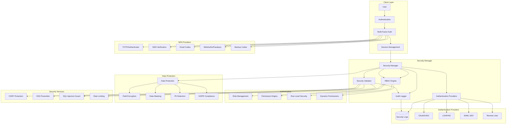
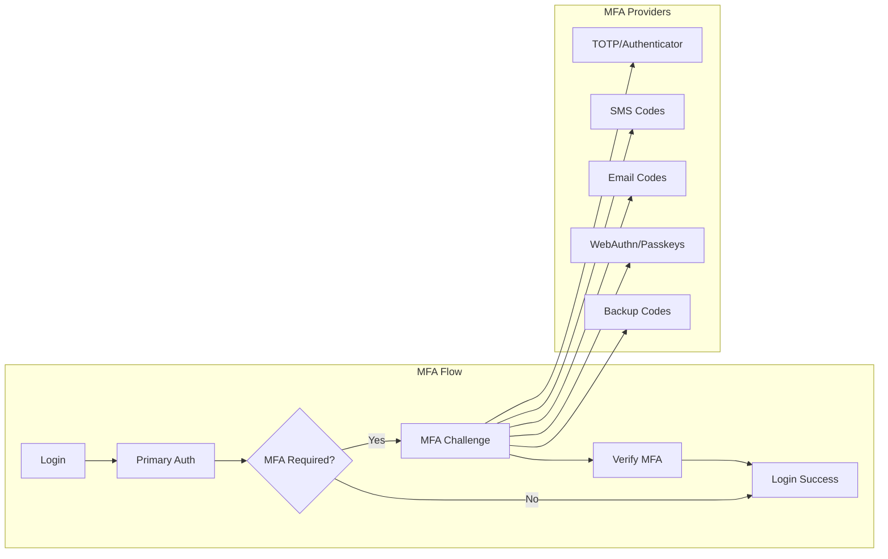
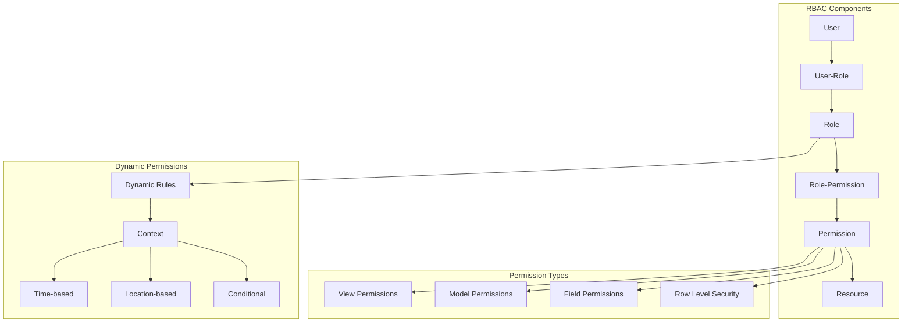

# Security Architecture

Comprehensive security architecture for PgAppForge with advanced authentication, authorization, and protection features.

## 🛡️ Overview

PgAppForge provides enterprise-grade security with multiple layers of protection:

- **Multi-Factor Authentication (MFA)** with TOTP, SMS, and WebAuthn/Passkeys
- **Role-Based Access Control (RBAC)** with fine-grained permissions
- **OAuth 2.0 & OpenID Connect** integration
- **LDAP/Active Directory** synchronization
- **Security validation** and audit logging
- **Data protection** with encryption and masking
- **Session management** with security controls

## 🏗️ Architecture Overview



## 🔐 Authentication System

### Core Authentication Architecture

```python
# Security Manager - Central security orchestrator
class SecurityManager:
    """
    Central security management with pluggable authentication providers.
    """

    def __init__(self, app=None):
        self.app = app
        self.auth_providers = {}
        self.mfa_providers = {}
        self.permission_manager = None
        self.audit_logger = None

    def authenticate_user(self, username, password, provider='db'):
        """Multi-provider authentication with MFA support."""

    def authorize_user(self, user, resource, action):
        """RBAC authorization with dynamic permissions."""

    def validate_session(self, session_id):
        """Session validation with security checks."""
```

### Authentication Providers

#### 1. Database Authentication
```python
# Built-in database authentication
AUTH_TYPE = AUTH_DB
AUTH_USER_REGISTRATION = True
AUTH_USER_REGISTRATION_ROLE = "Public"

# Password policies
AUTH_PASSWORD_MIN_LENGTH = 12
AUTH_PASSWORD_REQUIRE_UPPERCASE = True
AUTH_PASSWORD_REQUIRE_LOWERCASE = True
AUTH_PASSWORD_REQUIRE_NUMBERS = True
AUTH_PASSWORD_REQUIRE_SPECIAL = True
AUTH_PASSWORD_HISTORY_SIZE = 5
AUTH_PASSWORD_EXPIRY_DAYS = 90

# Account lockout
AUTH_LOCKOUT_ATTEMPTS = 5
AUTH_LOCKOUT_DURATION = 1800  # 30 minutes
AUTH_LOCKOUT_PROGRESSIVE = True  # Increase lockout time with repeated failures
```

#### 2. OAuth 2.0 / OpenID Connect
```python
# OAuth configuration
AUTH_TYPE = AUTH_OAUTH
OAUTH_PROVIDERS = [
    {
        'name': 'google',
        'token_key': 'access_token',
        'icon': 'fa-google',
        'remote_app': {
            'client_id': os.environ.get('GOOGLE_CLIENT_ID'),
            'client_secret': os.environ.get('GOOGLE_CLIENT_SECRET'),
            'server_metadata_url': 'https://accounts.google.com/.well-known/openid-configuration',
            'client_kwargs': {'scope': 'openid email profile'}
        }
    },
    {
        'name': 'azure',
        'token_key': 'access_token',
        'icon': 'fa-microsoft',
        'remote_app': {
            'client_id': os.environ.get('AZURE_CLIENT_ID'),
            'client_secret': os.environ.get('AZURE_CLIENT_SECRET'),
            'server_metadata_url': f'https://login.microsoftonline.com/{AZURE_TENANT_ID}/v2.0/.well-known/openid-configuration',
            'client_kwargs': {'scope': 'openid email profile'}
        }
    },
    {
        'name': 'okta',
        'token_key': 'access_token',
        'icon': 'fa-key',
        'remote_app': {
            'client_id': os.environ.get('OKTA_CLIENT_ID'),
            'client_secret': os.environ.get('OKTA_CLIENT_SECRET'),
            'server_metadata_url': f'https://{OKTA_DOMAIN}/.well-known/openid-configuration'
        }
    }
]

# JWT configuration for API access
JWT_SECRET_KEY = os.environ.get('JWT_SECRET_KEY')
JWT_ACCESS_TOKEN_EXPIRES = timedelta(hours=1)
JWT_REFRESH_TOKEN_EXPIRES = timedelta(days=30)
```

#### 3. LDAP/Active Directory
```python
# LDAP configuration
AUTH_TYPE = AUTH_LDAP
AUTH_LDAP_SERVER = "ldap://ldap.company.com:389"
AUTH_LDAP_USE_TLS = True
AUTH_LDAP_BIND_USER = "cn=fab_bind,ou=service_accounts,dc=company,dc=com"
AUTH_LDAP_BIND_PASSWORD = os.environ.get('LDAP_BIND_PASSWORD')

# User search configuration
AUTH_LDAP_SEARCH = "ou=users,dc=company,dc=com"
AUTH_LDAP_SEARCH_FILTER = "(sAMAccountName={0})"
AUTH_LDAP_UID_FIELD = "sAMAccountName"
AUTH_LDAP_FIRSTNAME_FIELD = "givenName"
AUTH_LDAP_LASTNAME_FIELD = "sn"
AUTH_LDAP_EMAIL_FIELD = "mail"

# Group mapping
AUTH_LDAP_GROUP_FIELD = "memberOf"
AUTH_ROLES_MAPPING = {
    "cn=fab_admins,ou=groups,dc=company,dc=com": ["Admin"],
    "cn=fab_users,ou=groups,dc=company,dc=com": ["User"],
    "cn=fab_viewers,ou=groups,dc=company,dc=com": ["Viewer"]
}

# Synchronization settings
AUTH_LDAP_SYNC_AT_LOGIN = True
AUTH_LDAP_SYNC_INTERVAL = 3600  # 1 hour
AUTH_LDAP_CACHE_GROUPS = True
```

#### 4. SAML SSO
```python
# SAML configuration
AUTH_TYPE = AUTH_SAML
SAML_METADATA_URL = "https://identity.company.com/metadata"
SAML_ENTITY_ID = "https://myapp.company.com"
SAML_ACS_URL = "https://myapp.company.com/acs"

# Attribute mapping
SAML_ATTRIBUTES_MAP = {
    'username': 'http://schemas.xmlsoap.org/ws/2005/05/identity/claims/name',
    'email': 'http://schemas.xmlsoap.org/ws/2005/05/identity/claims/emailaddress',
    'first_name': 'http://schemas.xmlsoap.org/ws/2005/05/identity/claims/givenname',
    'last_name': 'http://schemas.xmlsoap.org/ws/2005/05/identity/claims/surname',
    'groups': 'http://schemas.microsoft.com/ws/2008/06/identity/claims/groups'
}
```

## 🔐 Multi-Factor Authentication

### MFA Architecture



### MFA Configuration

```python
# MFA Settings
MFA_ENABLED = True
MFA_FORCE_ENABLED = True  # Require MFA for all users
MFA_GRACE_PERIOD_DAYS = 7  # Grace period for MFA setup

# TOTP Configuration
MFA_TOTP_ENABLED = True
MFA_TOTP_ISSUER = "MyApp"
MFA_TOTP_DIGITS = 6
MFA_TOTP_INTERVAL = 30
MFA_TOTP_BACKUP_CODES = 10

# SMS Configuration
MFA_SMS_ENABLED = True
MFA_SMS_PROVIDER = "twilio"  # twilio, nexmo, aws_sns
MFA_SMS_FROM_NUMBER = "+1234567890"

# Twilio settings
TWILIO_ACCOUNT_SID = os.environ.get('TWILIO_ACCOUNT_SID')
TWILIO_AUTH_TOKEN = os.environ.get('TWILIO_AUTH_TOKEN')

# Email MFA
MFA_EMAIL_ENABLED = True
MFA_EMAIL_CODE_LENGTH = 6
MFA_EMAIL_CODE_EXPIRY = 300  # 5 minutes

# WebAuthn/Passkeys Configuration
MFA_WEBAUTHN_ENABLED = True
WEBAUTHN_RP_ID = "myapp.company.com"
WEBAUTHN_RP_NAME = "My Application"
WEBAUTHN_REQUIRE_RESIDENT_KEY = False
WEBAUTHN_USER_VERIFICATION = "preferred"  # required, preferred, discouraged

# Backup Codes
MFA_BACKUP_CODES_ENABLED = True
MFA_BACKUP_CODES_COUNT = 10
MFA_BACKUP_CODES_LENGTH = 8
```

### WebAuthn/Passkeys Implementation

```python
# WebAuthn service for passkey support
class WebAuthnService:
    def __init__(self, rp_id, rp_name, origin):
        self.rp_id = rp_id
        self.rp_name = rp_name
        self.origin = origin

    def generate_registration_options(self, user):
        """Generate options for passkey registration."""
        return generate_registration_options(
            rp_id=self.rp_id,
            rp_name=self.rp_name,
            user_id=user.id.encode(),
            user_name=user.username,
            user_display_name=user.get_full_name()
        )

    def verify_registration(self, credential, expected_challenge):
        """Verify passkey registration."""
        verification = verify_registration_response(
            credential=credential,
            expected_challenge=expected_challenge,
            expected_origin=self.origin,
            expected_rp_id=self.rp_id
        )
        return verification.verified

    def generate_authentication_options(self, user=None):
        """Generate options for passkey authentication."""
        return generate_authentication_options(
            rp_id=self.rp_id,
            allow_credentials=[
                PublicKeyCredentialDescriptor(id=cred.credential_id)
                for cred in user.webauthn_credentials
            ] if user else None
        )
```

## 🎭 Role-Based Access Control

### RBAC Architecture



### Permission System

```python
# Role and Permission Management
class PermissionManager:
    """Advanced permission management with dynamic rules."""

    def __init__(self, security_manager):
        self.sm = security_manager

    def has_permission(self, user, permission_name, resource=None):
        """Check if user has specific permission."""

    def check_row_level_access(self, user, model_instance):
        """Row-level security check."""

    def get_accessible_records(self, user, model_class):
        """Get records accessible to user."""

# Built-in Permissions
BUILTIN_PERMISSIONS = [
    # View permissions
    "can_list", "can_show", "can_edit", "can_add", "can_delete",

    # Model permissions
    "can_list_<ModelName>", "can_show_<ModelName>",
    "can_edit_<ModelName>", "can_add_<ModelName>", "can_delete_<ModelName>",

    # Field permissions
    "can_edit_<ModelName>_<field_name>",
    "can_view_<ModelName>_<field_name>",

    # Admin permissions
    "can_userinfo", "can_download", "can_export",

    # API permissions
    "can_get", "can_post", "can_put", "can_delete_api"
]

# Custom Permission Decorators
from pgappforge.security.decorators import has_access, protect

@has_access
def protected_view(self):
    """View requiring authentication."""

@protect()
def api_endpoint(self):
    """API endpoint with permission check."""

@has_access_api
def api_view(self):
    """API view with API-specific permissions."""
```

### Dynamic Permissions

```python
# Dynamic permission rules
DYNAMIC_PERMISSION_RULES = {
    'time_based_access': {
        'business_hours_only': {
            'condition': 'current_time.hour >= 9 and current_time.hour <= 17',
            'weekdays_only': 'current_time.weekday() < 5'
        }
    },
    'location_based_access': {
        'office_network_only': {
            'condition': 'user_ip in allowed_networks',
            'allowed_networks': ['192.168.1.0/24', '10.0.0.0/8']
        }
    },
    'context_based_access': {
        'department_records_only': {
            'condition': 'record.department_id == user.department_id'
        },
        'own_records_only': {
            'condition': 'record.created_by_id == user.id'
        }
    }
}

# Row Level Security (RLS)
class RowLevelSecurity:
    def apply_rls_filter(self, query, user, model_class):
        """Apply row-level security filters to query."""

        # Department-based filtering
        if hasattr(model_class, 'department_id'):
            if not user.has_role('Admin'):
                query = query.filter(
                    model_class.department_id == user.department_id
                )

        # Owner-based filtering
        if hasattr(model_class, 'created_by_id'):
            if user.has_role('User') and not user.has_role('Manager'):
                query = query.filter(
                    model_class.created_by_id == user.id
                )

        # Time-based filtering
        if hasattr(model_class, 'created_at'):
            retention_days = self.get_retention_policy(user, model_class)
            if retention_days:
                cutoff_date = datetime.now() - timedelta(days=retention_days)
                query = query.filter(
                    model_class.created_at >= cutoff_date
                )

        return query
```

## 🔍 Security Validation

### Input Validation and Sanitization

```python
# Security Validator
class SecurityValidator:
    """Comprehensive security validation and protection."""

    def __init__(self, app):
        self.app = app
        self.csrf_protect = CSRFProtect(app)
        self.rate_limiter = self.init_rate_limiter()

    def validate_input(self, data, validation_rules):
        """Validate and sanitize user input."""

    def check_sql_injection(self, query):
        """SQL injection detection."""

    def validate_file_upload(self, file):
        """Secure file upload validation."""

    def check_xss_payload(self, content):
        """XSS payload detection."""

# Input validation rules
VALIDATION_RULES = {
    'username': {
        'pattern': r'^[a-zA-Z0-9_]{3,20}$',
        'sanitize': True,
        'required': True
    },
    'email': {
        'pattern': r'^[a-zA-Z0-9._%+-]+@[a-zA-Z0-9.-]+\.[a-zA-Z]{2,}$',
        'sanitize': True,
        'required': True
    },
    'phone': {
        'pattern': r'^\+?1?[2-9]\d{2}[2-9]\d{2}\d{4}$',
        'sanitize': True
    },
    'safe_text': {
        'max_length': 1000,
        'disallow_html': True,
        'sanitize': True
    }
}

# File upload security
UPLOAD_SECURITY = {
    'allowed_extensions': ['.jpg', '.jpeg', '.png', '.gif', '.pdf', '.doc', '.docx'],
    'max_file_size': 10 * 1024 * 1024,  # 10MB
    'scan_for_malware': True,
    'quarantine_suspicious': True,
    'virus_scanner': 'clamav'
}
```

### CSRF and XSS Protection

```python
# CSRF Protection
CSRF_ENABLED = True
WTF_CSRF_ENABLED = True
WTF_CSRF_TIME_LIMIT = 3600  # 1 hour
WTF_CSRF_SSL_STRICT = True

# XSS Protection
XSS_PROTECTION_ENABLED = True
CONTENT_SECURITY_POLICY = {
    'default-src': "'self'",
    'script-src': "'self' 'unsafe-inline' https://cdn.jsdelivr.net",
    'style-src': "'self' 'unsafe-inline' https://fonts.googleapis.com",
    'font-src': "'self' https://fonts.gstatic.com",
    'img-src': "'self' data: https:",
    'connect-src': "'self'",
    'frame-ancestors': "'none'"
}

# Security Headers
SECURITY_HEADERS = {
    'X-Content-Type-Options': 'nosniff',
    'X-Frame-Options': 'DENY',
    'X-XSS-Protection': '1; mode=block',
    'Strict-Transport-Security': 'max-age=31536000; includeSubDomains',
    'Referrer-Policy': 'strict-origin-when-cross-origin'
}
```

## 🔒 Data Protection

### Field-Level Encryption

```python
# Encrypted fields for sensitive data
from pgappforge.models.mixins import EncryptedFieldMixin

class User(Model, EncryptedFieldMixin):
    __tablename__ = 'ab_user'

    id = Column(Integer, primary_key=True)
    username = Column(String(64), unique=True, nullable=False)
    email = Column(String(64), unique=True, nullable=False)

    # Encrypted fields
    ssn = Column(EncryptedType(String(11), secret_key=SECRET_KEY))
    phone = Column(EncryptedType(String(20), secret_key=SECRET_KEY))

    # PII fields with masking
    first_name = Column(String(64), info={'pii': True, 'mask_pattern': '*'})
    last_name = Column(String(64), info={'pii': True, 'mask_pattern': '*'})

# Data masking configuration
DATA_MASKING_RULES = {
    'ssn': {'pattern': 'XXX-XX-{last_4}', 'roles_exempt': ['Admin', 'HR']},
    'credit_card': {'pattern': 'XXXX-XXXX-XXXX-{last_4}', 'roles_exempt': ['Admin']},
    'phone': {'pattern': 'XXX-XXX-{last_4}', 'roles_exempt': ['Admin', 'Sales']},
    'email': {'pattern': '{first_3}***@{domain}', 'roles_exempt': ['Admin']}
}

# GDPR Compliance
GDPR_ENABLED = True
GDPR_DATA_RETENTION_DAYS = 2555  # 7 years
GDPR_AUTO_DELETE_INACTIVE_USERS = True
GDPR_EXPORT_USER_DATA = True
GDPR_ANONYMIZE_DATA = True
```

### Audit Logging

```python
# Comprehensive audit logging
class AuditLogger:
    """Security audit logging with tamper protection."""

    def __init__(self, db_session):
        self.db = db_session

    def log_security_event(self, event_type, user_id, details, ip_address=None):
        """Log security events with integrity protection."""

    def log_data_access(self, user_id, table_name, record_id, action):
        """Log data access for compliance."""

    def log_privilege_escalation(self, user_id, old_roles, new_roles):
        """Log privilege changes."""

# Audit configuration
AUDIT_ENABLED = True
AUDIT_ALL_VIEWS = True
AUDIT_DATA_ACCESS = True
AUDIT_RETENTION_DAYS = 2555  # 7 years

# Events to audit
AUDIT_EVENTS = [
    'user_login', 'user_logout', 'user_login_failed',
    'user_created', 'user_updated', 'user_deleted',
    'role_assigned', 'role_removed', 'permission_granted',
    'data_export', 'bulk_delete', 'configuration_change',
    'security_violation', 'mfa_enabled', 'mfa_disabled'
]

# Audit log structure
class AuditLog(Model):
    __tablename__ = 'security_audit_log'

    id = Column(Integer, primary_key=True)
    timestamp = Column(DateTime, default=datetime.utcnow)
    event_type = Column(String(50), nullable=False)
    user_id = Column(Integer, ForeignKey('ab_user.id'))
    ip_address = Column(String(45))
    user_agent = Column(Text)
    details = Column(JSON)
    checksum = Column(String(64))  # Integrity protection
```

## 🔐 Session Management

### Secure Session Configuration

```python
# Session security settings
SESSION_COOKIE_SECURE = True  # HTTPS only
SESSION_COOKIE_HTTPONLY = True  # No JavaScript access
SESSION_COOKIE_SAMESITE = 'Lax'  # CSRF protection
SESSION_COOKIE_NAME = 'fab_session'

# Session timeout
PERMANENT_SESSION_LIFETIME = timedelta(hours=8)  # 8 hours
SESSION_TIMEOUT_WARNING = 300  # 5 minutes warning
SESSION_REFRESH_EACH_REQUEST = True

# Session validation
SESSION_PROTECTION = 'strong'  # 'basic', 'strong', or None
SESSION_IP_BINDING = True  # Bind session to IP
SESSION_USER_AGENT_BINDING = True  # Bind to user agent

# Concurrent session limits
MAX_CONCURRENT_SESSIONS = 3
FORCE_LOGOUT_OTHER_SESSIONS = True  # When limit exceeded
```

### Session Monitoring

```python
# Session monitoring and management
class SessionManager:
    def __init__(self, redis_client):
        self.redis = redis_client

    def track_user_session(self, user_id, session_id, ip_address, user_agent):
        """Track active user sessions."""

    def get_user_sessions(self, user_id):
        """Get all active sessions for user."""

    def revoke_session(self, session_id):
        """Revoke specific session."""

    def revoke_all_user_sessions(self, user_id, except_current=None):
        """Revoke all user sessions."""

    def cleanup_expired_sessions(self):
        """Clean up expired sessions."""

# Session anomaly detection
ANOMALY_DETECTION = {
    'enabled': True,
    'check_location_change': True,
    'check_device_change': True,
    'check_impossible_travel': True,
    'alert_thresholds': {
        'location_distance_km': 1000,
        'time_window_hours': 2
    }
}
```

## 🚨 Security Monitoring

### Real-time Security Monitoring

```python
# Security event monitoring
class SecurityMonitor:
    def __init__(self, notification_manager):
        self.notifications = notification_manager

    def detect_brute_force(self, ip_address, failed_attempts):
        """Detect brute force attacks."""

    def detect_privilege_escalation(self, user_id, action):
        """Detect privilege escalation attempts."""

    def detect_unusual_access(self, user_id, access_pattern):
        """Detect unusual access patterns."""

    def alert_security_team(self, alert_type, details):
        """Send security alerts."""

# Security metrics and dashboards
SECURITY_METRICS = {
    'failed_login_threshold': 5,
    'account_lockout_alert': True,
    'privilege_change_alert': True,
    'after_hours_access_alert': True,
    'bulk_data_export_alert': True,
    'new_device_login_alert': True
}

# Integration with SIEM systems
SIEM_INTEGRATION = {
    'enabled': True,
    'siem_type': 'splunk',  # splunk, elasticsearch, qradar
    'endpoint': 'https://siem.company.com/api/events',
    'api_key': os.environ.get('SIEM_API_KEY'),
    'event_format': 'json'
}
```

For more detailed information, see:
- [MFA Configuration Guide](mfa_configuration.md)
- [RBAC Setup Guide](rbac_configuration.md)
- [Security Best Practices](security_best_practices.md)
- [Security API Reference](security_api_reference.md)